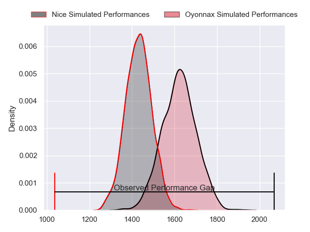
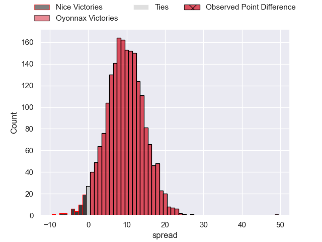
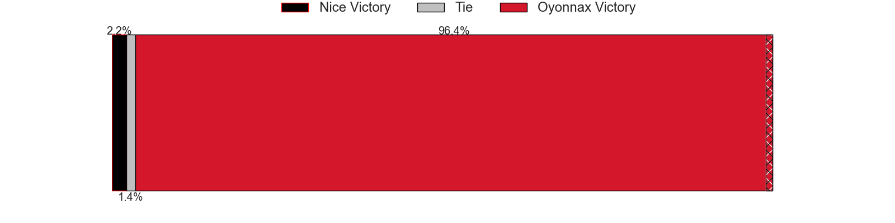
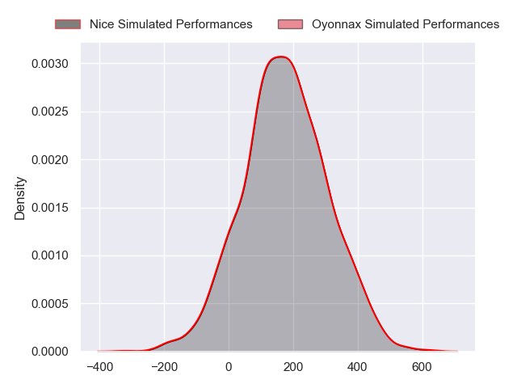
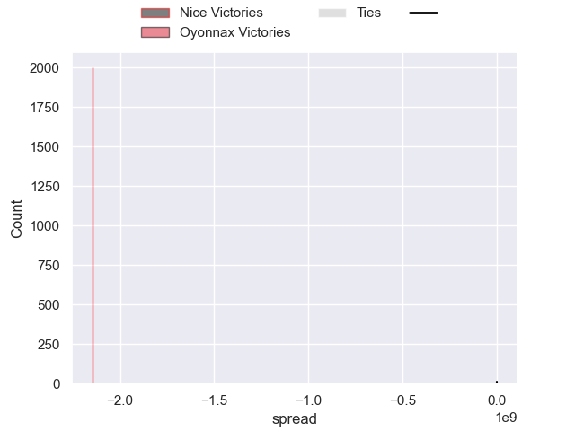

---  
layout: page  
title: Nice at Oyonnax; 3-52  
date: 2024-09-20 18:00:00 -0500  
categories: "Pro D2 2024" match review  
---
# Nice at Oyonnax; 3-52

# Club Level Predictions

The first set of predictions treats a club as the smallest object, as the club develops its members, organizes a gameplan, and deploys its players as needed for each match. This club model has a prediction of 0.744, which translates to predicting Oyonnax to win by 9.4.

Our Over/Under is 34.5 - and combined with the spread above, we have a predicted scoreline of 13 to 22

Each club has a rating and a rating deviation (similar to a Glicko rating), and expected performances can be generated. This allows for simulated matches and spreads like the ones below.
## Projected Performances - Club Model

## Projected Spreads - Club Model

## Projected Results - Club Model

# Player Level Predictions

Treating teams instead as an entity made up of the currently active players, I have ratings for each player in an altogether different system. These can be combined to form team ratings once teamsheets are announced, weighting starters a bit higher than the reserves. After the match is played, players can be weighted by their minutes on the field, allowing for an accurate measure of the team's composition. With these compiled team ratings, we can make predictions, measure inaccuracy, and update the individual player ratings.
## Prediction without Player Minutes: Nice by 3.8

Nice by 11.6 on a neutral pitch

## Projected Performances - Player Model

## Projected Spreads - Player Model

## Projected Results - Player Model

|   Away Minutes | Away Player              |   Away Percentile |   Number |   Home Percentile | Home Player       |   Home Minutes |
|---------------:|:-------------------------|------------------:|---------:|------------------:|:------------------|---------------:|
|             80 | Julien Beaufils          |            nan    |        1 |            nan    | Oli Kebble        |             23 |
|             80 | Pierre Strippoli         |            nan    |        2 |            nan    | Teddy Durand      |             40 |
|             53 | Nicolas Ciancio          |            nan    |        3 |            nan    | Paulo Tafili      |             80 |
|             24 | Tom Murday               |            nan    |        4 |            nan    | Phoenix Battye    |             24 |
|             80 | Clément Chartier         |            nan    |        5 |            nan    | Manuel Leindekar  |             24 |
|             28 | Joris Sylvestre Simon    |            nan    |        6 |            nan    | Kevin Lebreton    |             53 |
|             22 | Bastien Berenguel        |            nan    |        7 |            nan    | Antoine Miquel    |             49 |
|             33 | Ramiha Tarrel Tia Smiler |            nan    |        8 |            nan    | Loic Godener      |             57 |
|             80 | Thibault Dufau           |            nan    |        9 |            nan    | Vasil Lobzhanidze |             49 |
|             80 | Romain Riguet            |            nan    |       10 |            nan    | Justin Bouraux    |             27 |
|             31 | Andrzej Charlat          |            nan    |       11 |            nan    | Karim Qadiri      |             41 |
|             31 | Alban Conduche           |            nan    |       12 |            nan    | Lucas Mensa       |             33 |
|             58 | Tom Daly                 |            nan    |       13 |             37.24 | Maelan Rabut      |             29 |
|             80 | Corentin Penc'hoat       |            nan    |       14 |            nan    | Maxime Salles     |             29 |
|             58 | Paul Auradou             |            nan    |       15 |             78.49 | Darren Sweetnam   |             59 |
|             31 | Arthur Vignolles         |            nan    |       16 |            nan    | Edward Sawailau   |             51 |
|             28 | Kevin Yameogo            |            nan    |       17 |            nan    | Hugo Hermet       |             80 |
|             55 | Fabio Gonzalez           |            nan    |       18 |            nan    | Hugo Fabregue     |             32 |
|             27 | Sacha Idoumi             |             36.69 |       19 |            nan    | Ali Oz            |             27 |
|             80 | Mathis Viard             |            nan    |       20 |            nan    | Antoine Abraham   |             29 |
|             80 | Adrien Vigne             |             92.43 |       21 |            nan    | Peniami Narisia   |             27 |
|             80 | Thibault Rey             |              2.18 |       22 |            nan    | Chris Smith       |             27 |
|             80 | Jules Solinas            |            nan    |       23 |            nan    | Yvan David        |             80 |

