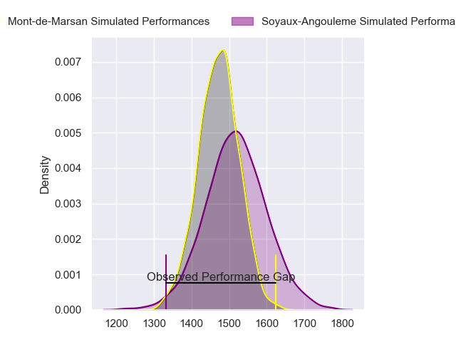
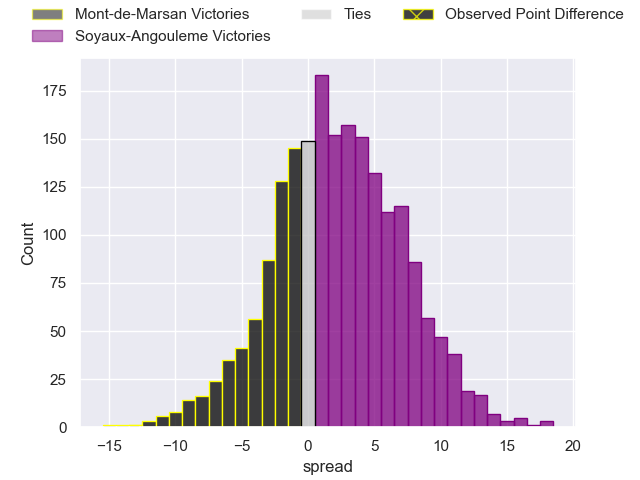
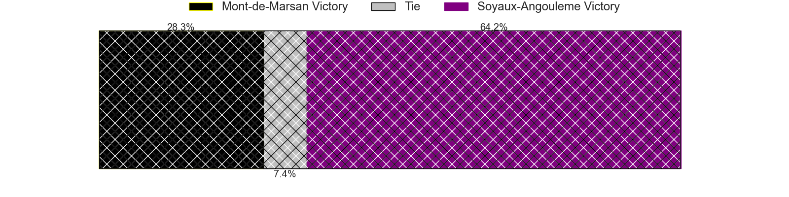
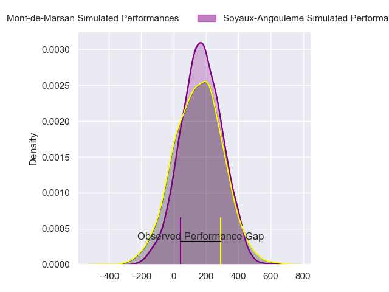
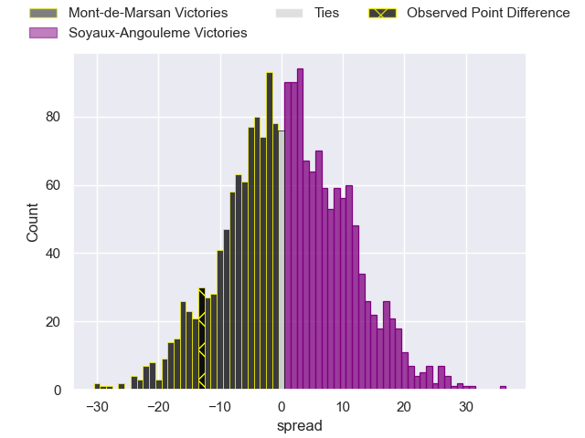
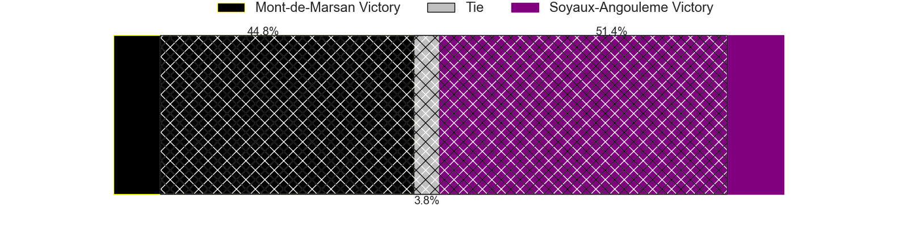

---  
layout: page  
title: Mont-de-Marsan at Soyaux-Angouleme; 32-19  
date: 2024-09-20 18:00:00 -0500  
categories: "Pro D2 2024" match review  
---
# Mont-de-Marsan at Soyaux-Angouleme; 32-19

# Club Level Predictions

The first set of predictions treats a club as the smallest object, as the club develops its members, organizes a gameplan, and deploys its players as needed for each match. This club model has a prediction of 0.564, which translates to predicting Soyaux-Angouleme to win by 2.3.

Our Over/Under is 33.5 - and combined with the spread above, we have a predicted scoreline of 15 to 18

Each club has a rating and a rating deviation (similar to a Glicko rating), and expected performances can be generated. This allows for simulated matches and spreads like the ones below.
## Projected Performances - Club Model

## Projected Spreads - Club Model

## Projected Results - Club Model

# Player Level Predictions

Treating teams instead as an entity made up of the currently active players, I have ratings for each player in an altogether different system. These can be combined to form team ratings once teamsheets are announced, weighting starters a bit higher than the reserves. After the match is played, players can be weighted by their minutes on the field, allowing for an accurate measure of the team's composition. With these compiled team ratings, we can make predictions, measure inaccuracy, and update the individual player ratings.
## Prediction without Player Minutes: Soyaux-Angouleme by 3.3

Mont-de-Marsan by 0.8 on a neutral pitch

## Projected Performances - Player Model

## Projected Spreads - Player Model

## Projected Results - Player Model

|   Away Minutes | Away Player          |   Away Percentile |   Number |   Home Percentile | Home Player        |   Home Minutes |
|---------------:|:---------------------|------------------:|---------:|------------------:|:-------------------|---------------:|
|             50 | Thomas Bultel        |             40.87 |        1 |            nan    | Vivien Devisme     |             24 |
|             78 | Samuel Lagrange      |            nan    |        2 |            nan    | Motu Matu'u        |             80 |
|             80 | Mattéo Lalanne       |             66.13 |        3 |             12.07 | Seydou Diakité     |             80 |
|             80 | Romain Durand        |             81.9  |        4 |            nan    | Ian Kitwanga       |             38 |
|             80 | Aston Fortuin        |            nan    |        5 |              7.45 | Matthew Dalton     |             61 |
|             54 | Aurélien Laforgue    |            nan    |        6 |            nan    | Maxence Lemardelet |             80 |
|             80 | Raphaël Robic        |             77.91 |        7 |             21.58 | Samuel Nollet      |             15 |
|             64 | Mike Faleafa         |            nan    |        8 |            nan    | Alexander Masibaka |             80 |
|             39 | Nicolas Darquier     |            nan    |        9 |            nan    | Adrien Bau         |             65 |
|             80 | Willie du Plessis    |            nan    |       10 |            nan    | Ben Botica         |             24 |
|             80 | Eroni Sau            |             75.18 |       11 |            nan    | Jonny May          |             56 |
|             80 | Nacani Wakaya        |            nan    |       12 |            nan    | George Tilsley     |             80 |
|             80 | Semi Lagivala        |            nan    |       13 |            nan    | Arthur Proult      |             45 |
|             80 | Pierre Sayerse       |             79.93 |       14 |             66.39 | Eoghan Barrett     |             56 |
|             80 | Alexandre de Nardi   |            nan    |       15 |            nan    | Rémi Brosset       |             24 |
|             35 | Christophe Loustalot |            nan    |       16 |             36.41 | Mathis Lafon       |             80 |
|             35 | Théo Cortes          |            nan    |       17 |              8.79 | Gautier Gibouin    |             56 |
|             24 | Anthony Alves        |            nan    |       18 |             85.32 | Rayne Barka        |             80 |
|             80 | Ioane Iashagashvili  |            nan    |       19 |            nan    | Enzo Morand-Bruyat |             22 |
|             80 | Jules Dussutour      |             45.57 |       20 |             50.86 | Alexis Levron      |             80 |
|             58 | Jean-Luc Innocente   |              5.27 |       21 |             30.52 | Nathan Farissier   |             56 |
|             80 | Luka Begic           |             44.86 |       22 |            nan    | Yassine Boutemane  |             80 |
|             41 | Gatien Masse         |            nan    |       23 |            nan    | Georgy Balakarev   |             58 |

