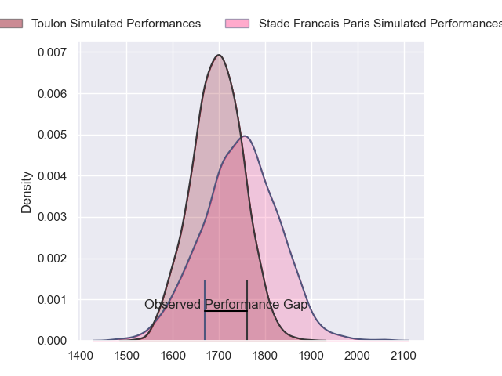
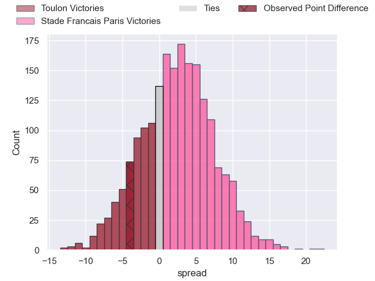
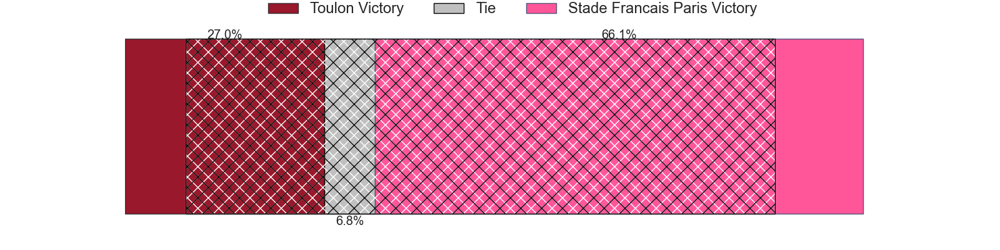
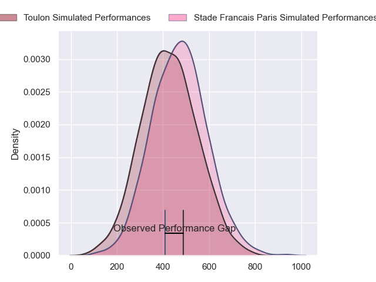
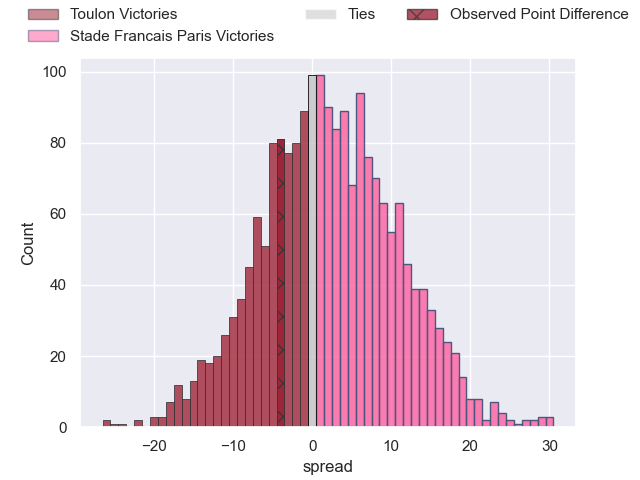
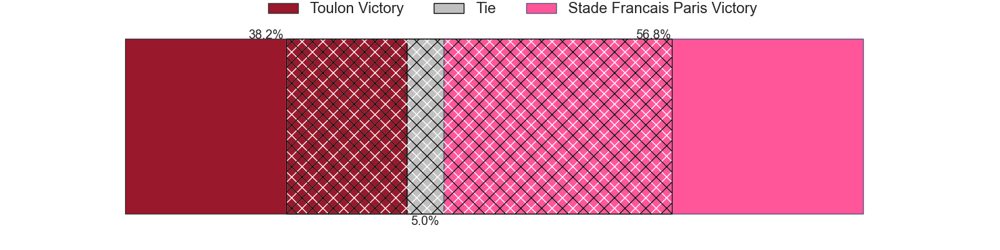

---  
layout: page  
title: Toulon at Stade Francais Paris; 14-10  
date: 2024-09-22 18:00:00 -0500  
categories: "Top 14 Orange 2024" match review  
---
# Toulon at Stade Francais Paris; 14-10

# Club Level Predictions

The first set of predictions treats a club as the smallest object, as the club develops its members, organizes a gameplan, and deploys its players as needed for each match. This club model has a prediction of 0.567, which translates to predicting Stade Francais Paris to win by 2.4.

Our Over/Under is 41.5 - and combined with the spread above, we have a predicted scoreline of 20 to 22

Each club has a rating and a rating deviation (similar to a Glicko rating), and expected performances can be generated. This allows for simulated matches and spreads like the ones below.
## Projected Performances - Club Model

## Projected Spreads - Club Model

## Projected Results - Club Model

# Player Level Predictions

Treating teams instead as an entity made up of the currently active players, I have ratings for each player in an altogether different system. These can be combined to form team ratings once teamsheets are announced, weighting starters a bit higher than the reserves. After the match is played, players can be weighted by their minutes on the field, allowing for an accurate measure of the team's composition. With these compiled team ratings, we can make predictions, measure inaccuracy, and update the individual player ratings.
## Prediction without Player Minutes: Stade Francais Paris by 4.2

Toulon by 4.2 on a neutral pitch

## Projected Performances - Player Model

## Projected Spreads - Player Model

## Projected Results - Player Model

|   Away Minutes | Away Player        |   Away Percentile |   Number |   Home Percentile | Home Player            |   Home Minutes |
|---------------:|:-------------------|------------------:|---------:|------------------:|:-----------------------|---------------:|
|             49 | Jean-Baptiste Gros |             98.78 |        1 |            nan    | Moses Alo-Emile        |             80 |
|             49 | Gianmarco Lucchesi |             91.4  |        2 |            nan    | Giacomo Nicotera       |             57 |
|             57 | Kyle Sinckler      |            nan    |        3 |            nan    | Francisco Gomez Kodela |             57 |
|             49 | Corentin Mezou     |             57.25 |        4 |            nan    | Paul Gabrillagues      |             80 |
|             80 | David Ribbans      |            nan    |        5 |            nan    | JJ van der Mescht      |             45 |
|             72 | Esteban Abadie     |            nan    |        6 |            nan    | Pierre Huguet          |             76 |
|             80 | Charles Ollivon    |            nan    |        7 |            nan    | Romain Briatte         |             80 |
|             64 | Facundo Isa        |             91.11 |        8 |            nan    | Sekou Macalou          |             41 |
|             52 | Ben White          |             88.84 |        9 |            nan    | Brad Weber             |             80 |
|             52 | Paolo Garbisi      |             85.75 |       10 |            nan    | Louis Carbonel         |             41 |
|             80 | Jiuta Wainiqolo    |             95.25 |       11 |            nan    | Lester Etien           |             80 |
|             80 | Antoine Frisch     |             96.28 |       12 |            nan    | Julien Delbouis        |             71 |
|             80 | Seta Tuicuvu       |            nan    |       13 |             75.03 | Jeremy Ward            |             80 |
|             80 | Rayan Rebbadj      |             27.79 |       14 |            nan    | Joe Marchant           |             80 |
|             80 | Marius Domon       |             51.68 |       15 |            nan    | Leo Barre              |             80 |
|             31 | Teddy Baubigny     |            nan    |       16 |            nan    | Lucas Peyresblanques   |             23 |
|             31 | Dany Priso         |            nan    |       17 |            nan    | Clement Castets        |              0 |
|             31 | Yannick Youyoutte  |            nan    |       18 |            nan    | Tanginoa Halaifonua    |             39 |
|             16 | Selevasio Tolofua  |             92.25 |       19 |            nan    | Yoan Tanga             |             39 |
|             28 | Enzo Herve         |             84.92 |       20 |            nan    | Jules Gimbert          |              0 |
|             28 | Baptiste Serin     |            nan    |       21 |             84.36 | Zack Henry             |             39 |
|              8 | Matteo Le Corvec   |             76.49 |       22 |            nan    | Samuel Ezeala          |              9 |
|             23 | Emerick Setiano    |             95.44 |       23 |            nan    | Hugo Ndiaye            |              0 |

