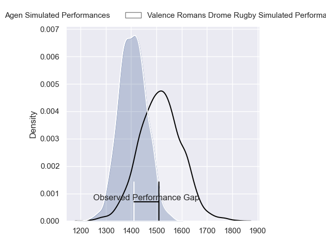
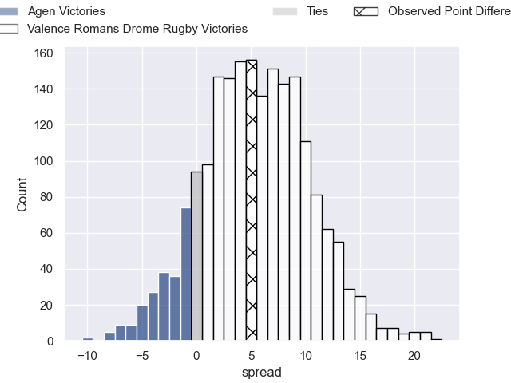
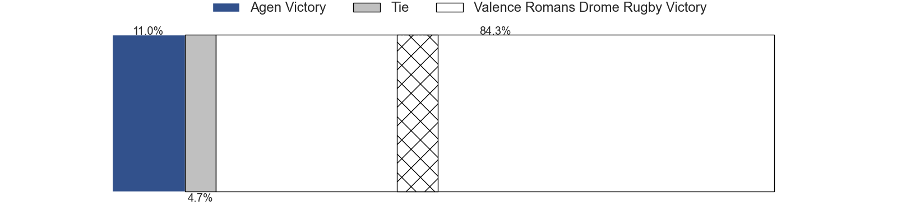
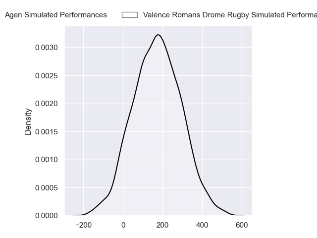
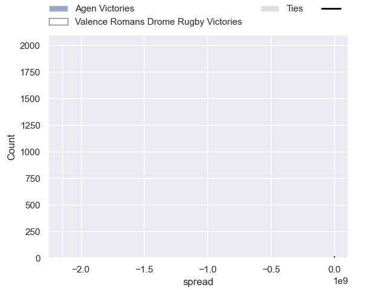

---  
layout: page  
title: Agen at Valence Romans Drome Rugby; 25-30  
date: 2024-09-27 18:00:00 -0500  
categories: "Pro D2 2024" match review  
---
# Agen at Valence Romans Drome Rugby; 25-30

# Club Level Predictions

The first set of predictions treats a club as the smallest object, as the club develops its members, organizes a gameplan, and deploys its players as needed for each match. This club model has a prediction of 0.65, which translates to predicting Valence Romans Drome Rugby to win by 5.5.

Our Over/Under is 38.5 - and combined with the spread above, we have a predicted scoreline of 16 to 22

Each club has a rating and a rating deviation (similar to a Glicko rating), and expected performances can be generated. This allows for simulated matches and spreads like the ones below.
## Projected Performances - Club Model

## Projected Spreads - Club Model

## Projected Results - Club Model

# Player Level Predictions

Treating teams instead as an entity made up of the currently active players, I have ratings for each player in an altogether different system. These can be combined to form team ratings once teamsheets are announced, weighting starters a bit higher than the reserves. After the match is played, players can be weighted by their minutes on the field, allowing for an accurate measure of the team's composition. With these compiled team ratings, we can make predictions, measure inaccuracy, and update the individual player ratings.
## Prediction without Player Minutes: Valence Romans Drome Rugby by 3.6

Valence Romans Drome Rugby by 0.6 on a neutral pitch

## Projected Performances - Player Model

## Projected Spreads - Player Model

## Projected Results - Player Model

|   Away Minutes | Away Player           |   Away Percentile |   Number |   Home Percentile | Home Player         |   Home Minutes |
|---------------:|:----------------------|------------------:|---------:|------------------:|:--------------------|---------------:|
|             23 | Hans Lombard-Buret    |            nan    |        1 |               nan | Andréa Pontanier    |             21 |
|             27 | Santiago Socino       |            nan    |        2 |               nan | Cyril Deligny       |             25 |
|              0 | Alex Burin            |            nan    |        3 |               nan | Gareth Milasinovich |             56 |
|             32 | Mathieu De Giovanni   |            nan    |        4 |               nan | Ryan Mccauley       |             22 |
|              8 | John Madigan          |            nan    |        5 |               nan | Darren O'Shea       |             49 |
|             50 | Julien Lebian         |            nan    |        6 |               nan | Adrien Roux         |             18 |
|             58 | Valentin Gayraud      |            nan    |        7 |               nan | Loan Réal           |             53 |
|              0 | Matthieu Bonnet       |             47.77 |        8 |               nan | Matthieu Vachon     |             65 |
|             56 | Dorian Bellot         |            nan    |        9 |               nan | Tim Menzel          |             30 |
|             65 | Billy Searle          |            nan    |       10 |               nan | Joris De Moura      |             27 |
|             62 | Lucas Martins         |            nan    |       11 |               nan | Thomas Roziere      |             51 |
|             80 | Clément Garrigues     |            nan    |       12 |               nan | Louis Marrou        |             80 |
|              5 | Théo Belan            |             45.06 |       13 |               nan | Ben Neiceru         |             80 |
|             80 | Thibaud Mazzoléni     |             49.12 |       14 |               nan | Adam Vargas         |             60 |
|             80 | Jean-Marcellin Buttin |             41.45 |       15 |               nan | George Worth        |             71 |
|             47 | Pierre Jouvin         |            nan    |       16 |               nan | Dorian Marco-Pena   |             53 |
|             64 | Mamuka Mstoiani       |            nan    |       17 |               nan | Anthony Aléo        |             80 |
|             80 | William Demotte       |            nan    |       18 |               nan | Florian Goumat      |             80 |
|             80 | Arnaud Duputs         |            nan    |       19 |               nan | Axel Bruchet        |             57 |
|             31 | Jack Maunder          |            nan    |       20 |               nan | Paul Dumas          |             80 |
|             80 | Émile Dayral          |            nan    |       21 |               nan | Lucas Méret         |             80 |
|             69 | Kolinio Ramoka        |            nan    |       22 |               nan | Sven Girlando       |             33 |
|             58 | Beau Farrance         |            nan    |       23 |               nan | Kévin Goze          |             75 |

