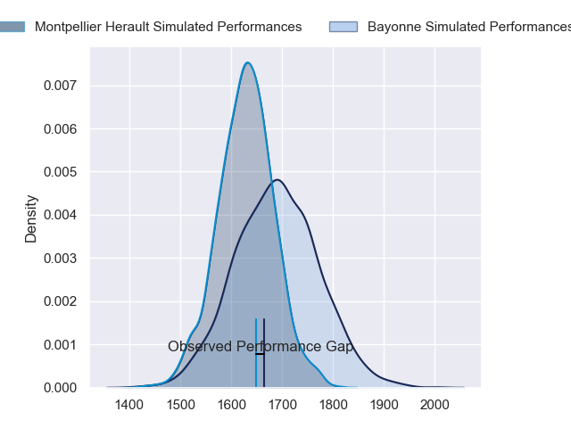
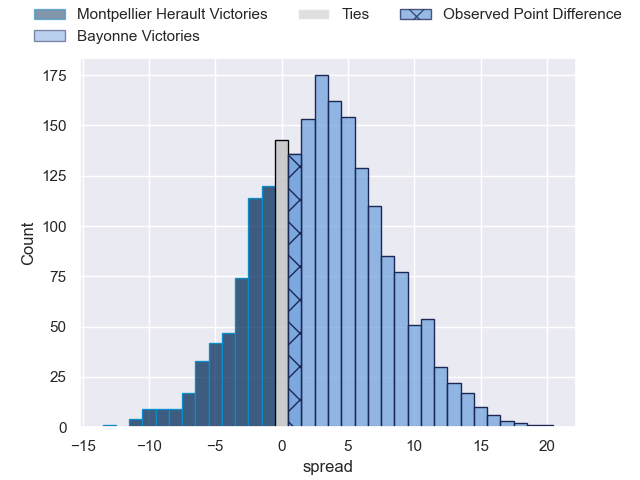
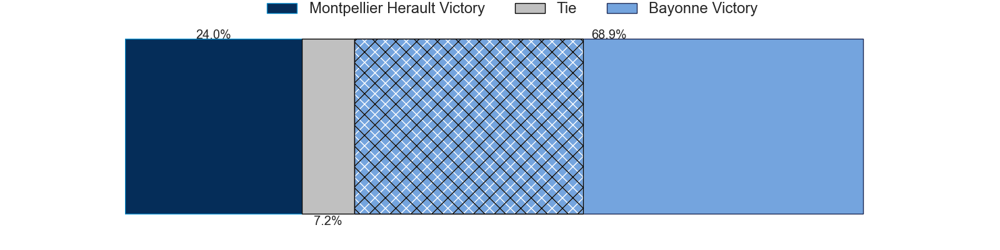
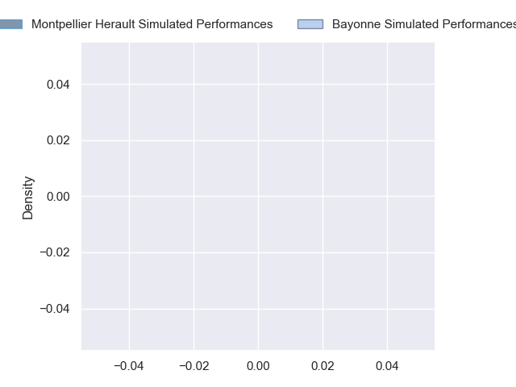
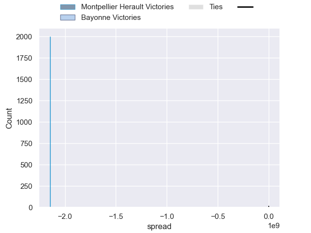

---  
layout: page  
title: Montpellier Herault at Bayonne; 27-28  
date: 2024-09-28 18:00:00 -0500  
categories: "Top 14 Orange 2024" match review  
---
# Montpellier Herault at Bayonne; 27-28

# Club Level Predictions

The first set of predictions treats a club as the smallest object, as the club develops its members, organizes a gameplan, and deploys its players as needed for each match. This club model has a prediction of 0.586, which translates to predicting Bayonne to win by 3.1.

Our Over/Under is 32.5 - and combined with the spread above, we have a predicted scoreline of 15 to 18

Each club has a rating and a rating deviation (similar to a Glicko rating), and expected performances can be generated. This allows for simulated matches and spreads like the ones below.
## Projected Performances - Club Model

## Projected Spreads - Club Model

## Projected Results - Club Model

# Player Level Predictions

Treating teams instead as an entity made up of the currently active players, I have ratings for each player in an altogether different system. These can be combined to form team ratings once teamsheets are announced, weighting starters a bit higher than the reserves. After the match is played, players can be weighted by their minutes on the field, allowing for an accurate measure of the team's composition. With these compiled team ratings, we can make predictions, measure inaccuracy, and update the individual player ratings.
## Prediction without Player Minutes: Bayonne by 10.6

Bayonne by 2.3 on a neutral pitch

## Projected Performances - Player Model

## Projected Spreads - Player Model

## Projected Results - Player Model

|   Away Minutes | Away Player         |   Away Percentile |   Number |   Home Percentile | Home Player             |   Home Minutes |
|---------------:|:--------------------|------------------:|---------:|------------------:|:------------------------|---------------:|
|             34 | Baptiste Erdocio    |            nan    |        1 |            nan    | Swan Cormenier          |             28 |
|              8 | Vano Karkadze       |            nan    |        2 |            nan    | Facundo Bosch           |             21 |
|             54 | Luka Japaridze      |            nan    |        3 |            nan    | Tevita Tatafu           |             29 |
|             61 | Florian Verhaeghe   |            nan    |        4 |            nan    | Arthur Iturria          |             26 |
|             80 | Tyler Duguid        |            nan    |        5 |            nan    | Alex Moon               |             30 |
|             80 | Yacouba Camara      |            nan    |        6 |            nan    | Giovanni Habel-Kueffner |             12 |
|             80 | Lenni Nouchi        |            nan    |        7 |            nan    | Baptiste Chouzenoux     |             48 |
|              9 | Sam Simmonds        |            nan    |        8 |            nan    | Uzair Cassiem           |              0 |
|             25 | Alexis Bernadet     |            nan    |        9 |            nan    | Guillaume Rouet         |             21 |
|             34 | Domingo Miotti      |            nan    |       10 |            nan    | Camille Lopez           |              0 |
|             38 | Madosh Tambwe       |            nan    |       11 |            nan    | Aurelien Callandret     |             23 |
|             42 | Auguste Cadot       |            nan    |       12 |            nan    | Guillaume Martocq       |             31 |
|             61 | Thomas Darmon       |            nan    |       13 |            nan    | Sireli Maqala           |             26 |
|             77 | Gabriel Ngandebe    |            nan    |       14 |            nan    | Arnaud Erbinartegaray   |             68 |
|             80 | Julien Tisseron     |            nan    |       15 |            nan    | Yohan Orabe             |             80 |
|             60 | Christopher Tolofua |            nan    |       16 |            nan    | Vincent Giudicelli      |             80 |
|             80 | Enzo Forletta       |            nan    |       17 |            nan    | Pierre Castillon        |             65 |
|             50 | Paul Willemse       |             47.67 |       18 |             97.91 | Denis Marchois          |             58 |
|             80 | Marco Tauleigne     |             93.47 |       19 |            nan    | Baptiste Heguy          |             80 |
|             80 | Billy Vunipola      |            nan    |       20 |            nan    | Maxime Machenaud        |             80 |
|             12 | Leo Coly            |            nan    |       21 |            nan    | Joris Segonds           |             80 |
|             80 | George Bridge       |            nan    |       22 |            nan    | Cheikh Tiberghien       |             80 |
|             21 | Wilfrid Hounkpatin  |            nan    |       23 |            nan    | Luke Tagi               |             29 |

