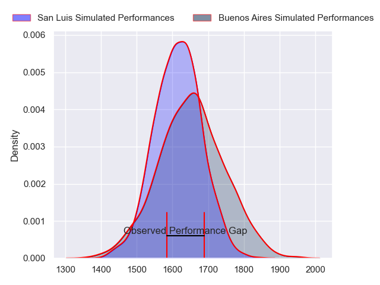
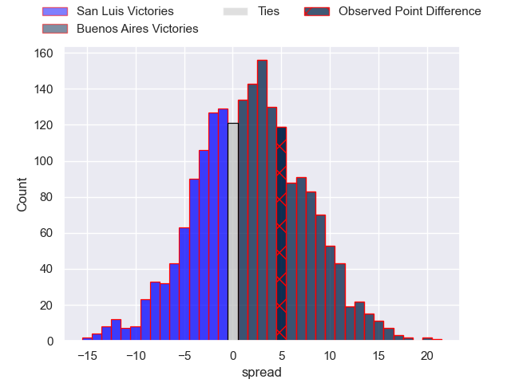

---  
layout: page  
title: San Luis at Buenos Aires; 27-32  
date: 2024-09-28 18:00:00 -0500  
categories: "URBA Top 13 2023" match review  
---
# San Luis at Buenos Aires; 27-32

# Club Level Predictions

The first set of predictions treats a club as the smallest object, as the club develops its members, organizes a gameplan, and deploys its players as needed for each match. This club model has a prediction of 0.551, which translates to predicting Buenos Aires to win by 1.8.

Our Over/Under is 41.5 - and combined with the spread above, we have a predicted scoreline of 20 to 22

Each club has a rating and a rating deviation (similar to a Glicko rating), and expected performances can be generated. This allows for simulated matches and spreads like the ones below.
## Projected Performances - Club Model

## Projected Spreads - Club Model

## Projected Results - Club Model

