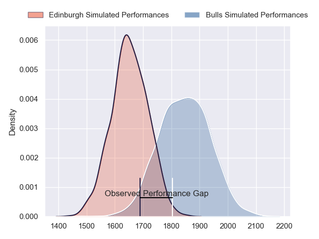
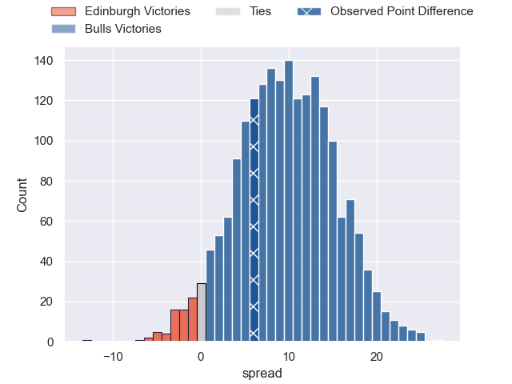
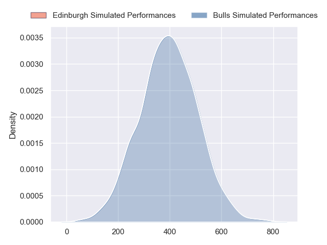
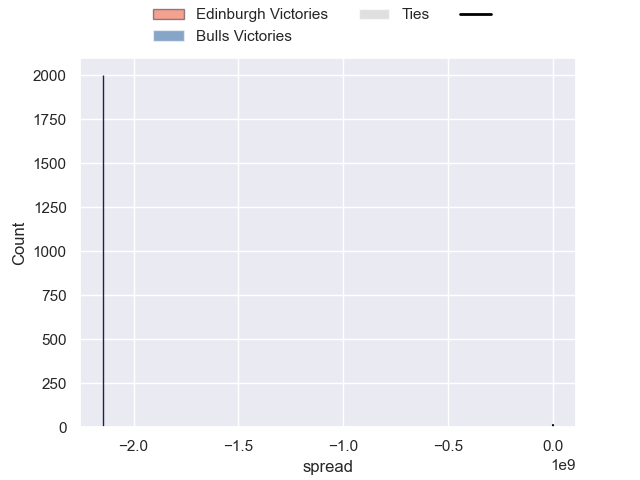

---  
layout: page  
title: Edinburgh at Bulls; 16-22  
date: 2024-09-28 18:00:00 -0500  
categories: "United Rugby Championship 2024" match review  
---
# Edinburgh at Bulls; 16-22

# Club Level Predictions

The first set of predictions treats a club as the smallest object, as the club develops its members, organizes a gameplan, and deploys its players as needed for each match. This club model has a prediction of 0.752, which translates to predicting Bulls to win by 9.8.

Our Over/Under is 46.5 - and combined with the spread above, we have a predicted scoreline of 18 to 28

Each club has a rating and a rating deviation (similar to a Glicko rating), and expected performances can be generated. This allows for simulated matches and spreads like the ones below.
## Projected Performances - Club Model

## Projected Spreads - Club Model

## Projected Results - Club Model

# Player Level Predictions

Treating teams instead as an entity made up of the currently active players, I have ratings for each player in an altogether different system. These can be combined to form team ratings once teamsheets are announced, weighting starters a bit higher than the reserves. After the match is played, players can be weighted by their minutes on the field, allowing for an accurate measure of the team's composition. With these compiled team ratings, we can make predictions, measure inaccuracy, and update the individual player ratings.
## Prediction without Player Minutes: Bulls by 7.7

Bulls by 3.1 on a neutral pitch

## Projected Performances - Player Model

## Projected Spreads - Player Model

## Projected Results - Player Model

|   Away Minutes | Away Player         |   Away Percentile |   Number |   Home Percentile | Home Player         |   Home Minutes |
|---------------:|:--------------------|------------------:|---------:|------------------:|:--------------------|---------------:|
|             19 | Pierre Schoeman     |            nan    |        1 |            nan    | Alulutho Tshakweni  |             20 |
|             80 | Dave Cherry         |             49.36 |        2 |            nan    | Akker van der Merwe |              4 |
|             74 | Paul Hill           |             99.11 |        3 |            nan    | François Klopper    |             29 |
|             80 | Marshall Sykes      |             84.54 |        4 |            nan    | Ruan Vermaak        |             29 |
|              8 | Grant Gilchrist     |             95.01 |        5 |            nan    | Cobus Wiese         |             76 |
|             80 | Jamie Ritchie       |            nan    |        6 |            nan    | Nama Xaba           |             80 |
|             80 | Hamish Watson       |             42.86 |        7 |            nan    | Jannes Kirsten      |             80 |
|             80 | Magnus Bradbury     |             71.13 |        8 |            nan    | Cameron Hanekom     |             29 |
|             80 | Ali Price           |             85.53 |        9 |            nan    | Embrose Papier      |             40 |
|             58 | Ross Thompson       |            nan    |       10 |            nan    | Jaco van der Walt   |             29 |
|             80 | Duhan van der Merwe |            nan    |       11 |            nan    | Canan Moodie        |             53 |
|              4 | Matt Scott          |             91.29 |       12 |            nan    | Chris Smit          |             33 |
|             53 | Mark Bennett        |             61.98 |       13 |            nan    | Stedman Gans        |             20 |
|             80 | Darcy Graham        |             41.15 |       14 |            nan    | Sebastian de Klerk  |             29 |
|             80 | Wes Goosen          |             93.45 |       15 |            nan    | David Kriel         |             67 |
|             76 | Ewan Ashman         |            nan    |       16 |             97.17 | Johan Grobbelaar    |             51 |
|             62 | Boan Venter         |             15.5  |       17 |             82.21 | Simphiwe Matanzima  |             80 |
|             66 | D'Arcy Rae          |            nan    |       18 |             86.02 | Mornay Smith        |             80 |
|             80 | Jamie Hodgson       |             92.27 |       19 |             67.31 | JF van Heerden      |             80 |
|             60 | Tom Dodd            |             44.01 |       20 |             97.37 | Marcell Coetzee     |             66 |
|             80 | Ben Vellacott       |             82.89 |       21 |            nan    | Keagan Johannes     |             40 |
|             51 | Ben Healy           |            nan    |       22 |             83.03 | Boeta Chamberlain   |              0 |
|              6 | Ross Mccann         |            nan    |       23 |              8.04 | Aphiwe Dyantyi      |             51 |

