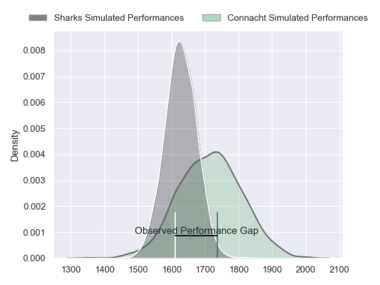
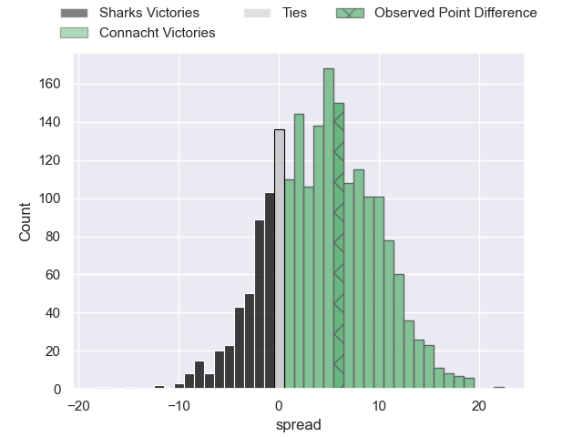
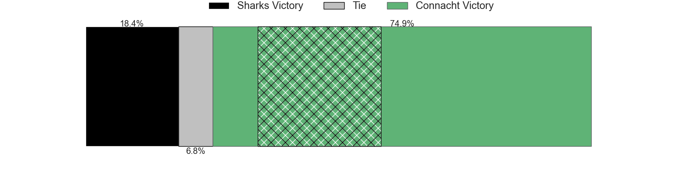
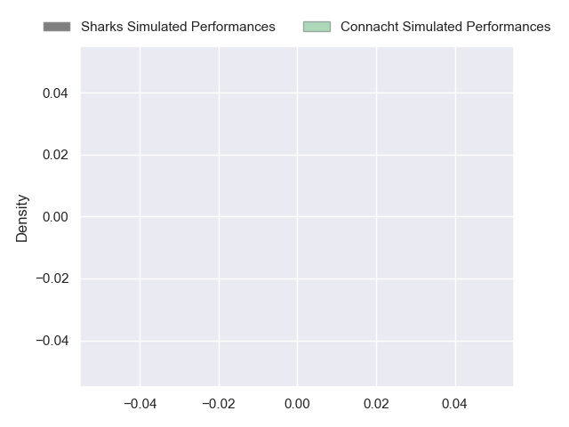
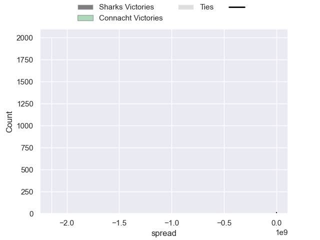

---  
layout: page  
title: Sharks at Connacht; 30-36  
date: 2024-09-28 18:00:00 -0500  
categories: "United Rugby Championship 2024" match review  
---
# Sharks at Connacht; 30-36

# Club Level Predictions

The first set of predictions treats a club as the smallest object, as the club develops its members, organizes a gameplan, and deploys its players as needed for each match. This club model has a prediction of 0.631, which translates to predicting Connacht to win by 4.7.

Our Over/Under is 37.5 - and combined with the spread above, we have a predicted scoreline of 17 to 21

Each club has a rating and a rating deviation (similar to a Glicko rating), and expected performances can be generated. This allows for simulated matches and spreads like the ones below.
## Projected Performances - Club Model

## Projected Spreads - Club Model

## Projected Results - Club Model

# Player Level Predictions

Treating teams instead as an entity made up of the currently active players, I have ratings for each player in an altogether different system. These can be combined to form team ratings once teamsheets are announced, weighting starters a bit higher than the reserves. After the match is played, players can be weighted by their minutes on the field, allowing for an accurate measure of the team's composition. With these compiled team ratings, we can make predictions, measure inaccuracy, and update the individual player ratings.
## Prediction without Player Minutes: Connacht by 3.7

Sharks by 1.8 on a neutral pitch

## Projected Performances - Player Model

## Projected Spreads - Player Model

## Projected Results - Player Model

|   Away Minutes | Away Player        |   Away Percentile |   Number |   Home Percentile | Home Player           |   Home Minutes |
|---------------:|:-------------------|------------------:|---------:|------------------:|:----------------------|---------------:|
|             10 | Ntuthuko Mchunu    |            nan    |        1 |            nan    | Denis Buckley         |           80   |
|              0 | Dylan Richardson   |            nan    |        2 |            nan    | Dave Heffernan        |           80   |
|             26 | Ruan Dreyer        |            nan    |        3 |            nan    | Finlay Bealham        |           54   |
|             20 | Jason Jenkins      |            nan    |        4 |            nan    | Niall Murray          |           74   |
|             21 | Gerbrandt Grobler  |            nan    |        5 |            nan    | David O'Connor        |           80   |
|             40 | James Venter       |            nan    |        6 |            nan    | Josh Murphy           |           72   |
|             80 | Vincent Tshituka   |            nan    |        7 |            nan    | Conor Oliver          |           80   |
|             10 | Manu Tshituka      |            nan    |        8 |            nan    | Cian Prendergast      |           80   |
|             60 | Bradley Davids     |            nan    |        9 |            nan    | Ben Murphy            |           52   |
|             60 | Bradley Davids     |            nan    |        9 |            nan    | Ben Murphy            |           80   |
|             59 | Siya Masuku        |            nan    |       10 |            nan    | Josh Ioane            |           72   |
|             60 | Ethan Hooker       |            nan    |       11 |            nan    | Shane Jennings        |           80   |
|             48 | Andre Esterhuizen  |            nan    |       12 |            nan    | Cathal Forde          |           31.5 |
|             72 | Jurenzo Julius     |            nan    |       13 |            nan    | Piers O'Conor         |           35   |
|             72 | Eduan Keyter       |            nan    |       14 |            nan    | Mack Hansen           |           55   |
|             26 | Jordan Hendrikse   |            nan    |       15 |            nan    | Santiago Cordero      |           80   |
|             26 | Fez Mbatha         |             91.77 |       16 |            nan    | Dylan Tierney-Martin  |           31.5 |
|             59 | Trevor Nyakane     |             87.42 |       17 |             97.71 | Peter Dooley          |           35   |
|             33 | Hanru Jacobs       |             67.6  |       18 |            nan    | Sam Illo              |           40   |
|             70 | Corne Rahl         |             15.3  |       19 |             74.56 | Oisin Dowling         |           71   |
|             20 | Reniel Hugo        |             97.1  |       20 |             55.5  | Shamus Hurley-Langton |           80   |
|             53 | Tinotenda Mavesere |             79.97 |       21 |             80    | Caolin Blade          |           75   |
|             80 | Tian Meyer         |            nan    |       22 |             71.52 | David Hawkshaw        |           26   |
|             71 | Gurshwin Wehr      |            nan    |       23 |             65.29 | Paul Boyle            |           10   |

