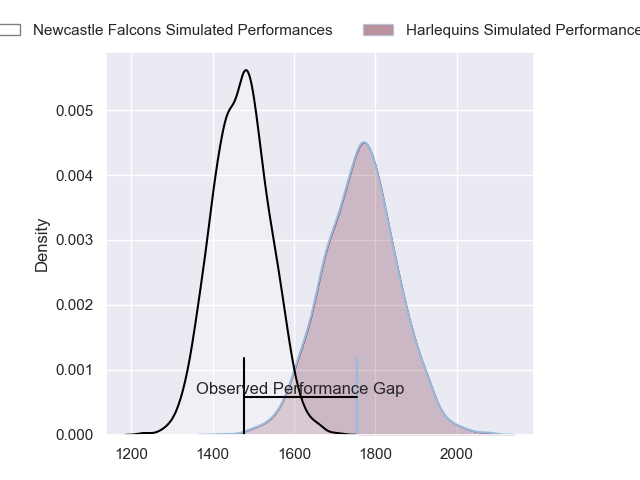
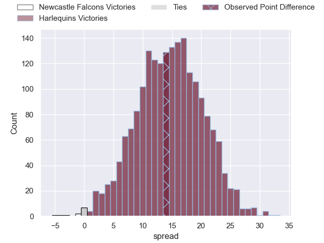
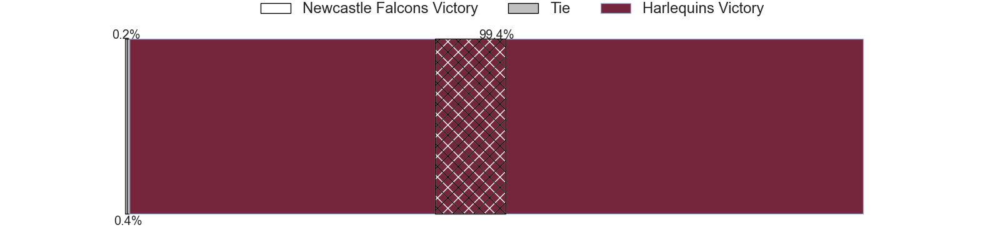
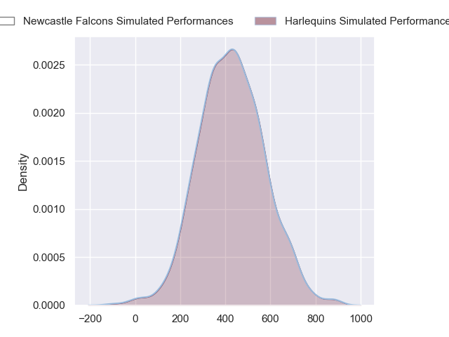
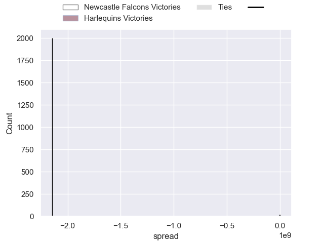

---  
layout: page  
title: Newcastle Falcons at Harlequins; 14-28  
date: 2024-09-28 18:00:00 -0500  
categories: "Gallagher Premiership 2024" match review  
---
# Newcastle Falcons at Harlequins; 14-28

# Club Level Predictions

The first set of predictions treats a club as the smallest object, as the club develops its members, organizes a gameplan, and deploys its players as needed for each match. This club model has a prediction of 0.84, which translates to predicting Harlequins to win by 14.8.

Our Over/Under is 52.5 - and combined with the spread above, we have a predicted scoreline of 19 to 34

Each club has a rating and a rating deviation (similar to a Glicko rating), and expected performances can be generated. This allows for simulated matches and spreads like the ones below.
## Projected Performances - Club Model

## Projected Spreads - Club Model

## Projected Results - Club Model

# Player Level Predictions

Treating teams instead as an entity made up of the currently active players, I have ratings for each player in an altogether different system. These can be combined to form team ratings once teamsheets are announced, weighting starters a bit higher than the reserves. After the match is played, players can be weighted by their minutes on the field, allowing for an accurate measure of the team's composition. With these compiled team ratings, we can make predictions, measure inaccuracy, and update the individual player ratings.
## Prediction without Player Minutes: Harlequins by 20.4

Harlequins by 12.8 on a neutral pitch

## Projected Performances - Player Model

## Projected Spreads - Player Model

## Projected Results - Player Model

|   Away Minutes | Away Player         |   Away Percentile |   Number |   Home Percentile | Home Player               |   Home Minutes |
|---------------:|:--------------------|------------------:|---------:|------------------:|:--------------------------|---------------:|
|             80 | Adam Brocklebank    |              1.78 |        1 |            nan    | Fin Baxter                |             71 |
|             80 | Jamie Blamire       |              1.03 |        2 |            nan    | Nathan Jibulu             |             80 |
|             21 | Richard Palframan   |             44.09 |        3 |            nan    | Titi Lamositele           |             50 |
|             13 | John Hawkins        |             11.27 |        4 |            nan    | Joe Launchbury            |             80 |
|             55 | Kiran McDonald      |             26.25 |        5 |            nan    | Stephan Lewies            |             80 |
|             44 | Philip van der Walt |             30.21 |        6 |            nan    | Jack Kenningham           |             61 |
|             62 | Tom Gordon          |             96.72 |        7 |            nan    | Will Evans                |             80 |
|             80 | Callum Chick        |              1.37 |        8 |            nan    | Chandler Cunningham-South |             80 |
|             80 | Sam Stuart          |              0.53 |        9 |            nan    | Will Porter               |             74 |
|             80 | Ethan Grayson       |            nan    |       10 |            nan    | Marcus Smith              |             74 |
|             80 | Ben Stevenson       |             19.88 |       11 |            nan    | Cassius Cleaves           |             80 |
|             14 | Sammy Arnold        |             34.84 |       12 |            nan    | Lennox Anyanwu            |             63 |
|             19 | Connor Doherty      |             30.82 |       13 |            nan    | Luke Northmore            |             80 |
|             40 | Adam Radwan         |             19.73 |       14 |            nan    | Nick David                |             52 |
|             28 | Elliott Obatoyinbo  |             12.32 |       15 |            nan    | Leigh Halfpenny           |             52 |
|             60 | Ollie Fletcher      |             76.86 |       16 |            nan    | Jack Walker               |             56 |
|             17 | Luan de Bruin       |             24.14 |       17 |             60.86 | Wyn Jones                 |             61 |
|             74 | Murray McCallum     |             82.34 |       18 |             73.57 | Simon Kerrod              |             56 |
|             60 | Freddie Lockwood    |             26.11 |       19 |            nan    | Irne Herbst               |             80 |
|             32 | Adam Scott          |            nan    |       20 |             93.27 | Dino Lamb                 |             66 |
|             32 | Joe Davis           |            nan    |       21 |            nan    | Danny Care                |             60 |
|             24 | Ben Redshaw         |             89.69 |       22 |            nan    | Jarrod Evans              |             80 |
|             80 | Louis Brown         |             84.78 |       23 |            nan    | Oscar Beard               |             80 |

