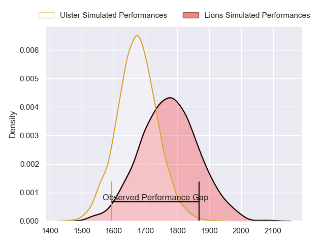
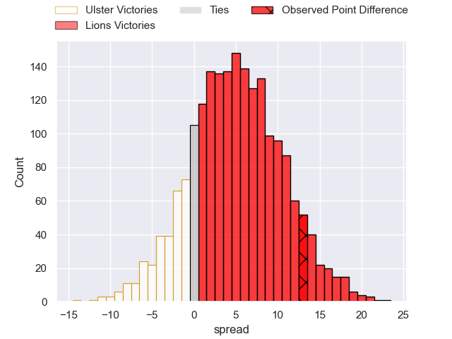
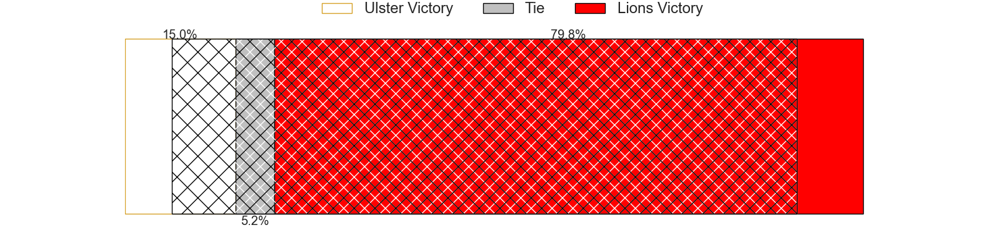
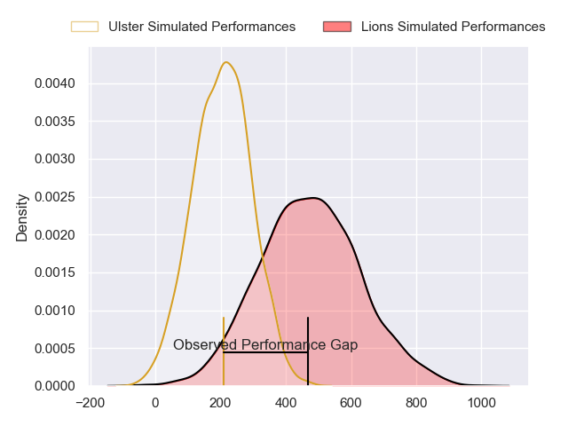
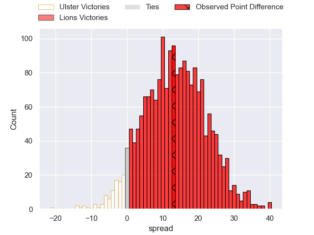
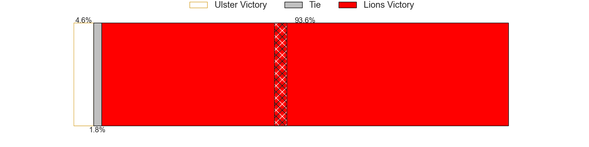

---  
layout: page  
title: Ulster at Lions; 22-35  
date: 2024-09-28 18:00:00 -0500  
categories: "United Rugby Championship 2024" match review  
---
# Ulster at Lions; 22-35

# Club Level Predictions

The first set of predictions treats a club as the smallest object, as the club develops its members, organizes a gameplan, and deploys its players as needed for each match. This club model has a prediction of 0.639, which translates to predicting Lions to win by 5.1.

Our Over/Under is 61.5 - and combined with the spread above, we have a predicted scoreline of 28 to 33

Each club has a rating and a rating deviation (similar to a Glicko rating), and expected performances can be generated. This allows for simulated matches and spreads like the ones below.
## Projected Performances - Club Model

## Projected Spreads - Club Model

## Projected Results - Club Model

# Player Level Predictions

Treating teams instead as an entity made up of the currently active players, I have ratings for each player in an altogether different system. These can be combined to form team ratings once teamsheets are announced, weighting starters a bit higher than the reserves. After the match is played, players can be weighted by their minutes on the field, allowing for an accurate measure of the team's composition. With these compiled team ratings, we can make predictions, measure inaccuracy, and update the individual player ratings.
## Prediction without Player Minutes: Lions by 6.8

Lions by 2.9 on a neutral pitch

## Projected Performances - Player Model

## Projected Spreads - Player Model

## Projected Results - Player Model

|   Away Minutes | Away Player      |   Away Percentile |   Number |   Home Percentile | Home Player          |   Home Minutes |
|---------------:|:-----------------|------------------:|---------:|------------------:|:---------------------|---------------:|
|            9.5 | Andrew Warwick   |            nan    |        1 |             77    | Morgan Naude         |             58 |
|           14   | John Andrew      |            nan    |        2 |             87.92 | PJ Botha             |             80 |
|           18   | Tom O'Toole      |            nan    |        3 |             79.54 | Asenathi Ntlabakanye |             40 |
|            9.5 | Kieran Treadwell |            nan    |        4 |             93.88 | Reinhard Nothnagel   |             80 |
|           25   | Alan O'Connor    |             81.64 |        5 |             49.92 | Darrien Landsberg    |             80 |
|           11   | Matty Rea        |             75.86 |        6 |             46.63 | Jarod Cairns         |             80 |
|           19   | Sean Reffell     |             78    |        7 |             96.39 | Ruan Venter          |             80 |
|           61   | Nick Timoney     |            nan    |        8 |             99.66 | Francke Horn         |             56 |
|           80   | John Cooney      |             93.95 |        9 |             95.79 | Sanele Nohamba       |             80 |
|           58   | Aidan Morgan     |            nan    |       10 |             47.6  | Kade Wolhuter        |             80 |
|           80   | Jacob Stockdale  |            nan    |       11 |             86.01 | Tapiwa Mafura        |             80 |
|           23   | Stuart McCloskey |             84.09 |       12 |             44.89 | Rynhardt Jonker      |             29 |
|           24   | Stewart Moore    |            nan    |       13 |             18.26 | Erich Cronje         |             80 |
|           14   | Werner Kok       |            nan    |       14 |             88.37 | Rabz Maxwane         |             57 |
|           29   | Ethan McIlroy    |            nan    |       15 |             97.83 | Quan Horn            |             60 |
|           44   | James Mccormick  |            nan    |       16 |            nan    | Franco Marais        |             80 |
|           51   | Eric O'Sullivan  |            nan    |       17 |             56.54 | Juan Schoeman        |             55 |
|           51   | Eric O'Sullivan  |            nan    |       17 |             56.54 | Juan Schoeman        |             80 |
|           69   | Corrie Barrett   |            nan    |       18 |             55.15 | Conraad van Vuuren   |             69 |
|           20   | Iain Henderson   |            nan    |       19 |            nan    | Ruben Schoeman       |             61 |
|           20   | Iain Henderson   |            nan    |       19 |            nan    | Ruben Schoeman       |             80 |
|           50   | James Mcnabney   |            nan    |       20 |            nan    | Siba Qoma            |             66 |
|           17   | Nathan Doak      |            nan    |       21 |            nan    | Renzo Du Plessis     |             44 |
|           18   | Mike Lowry       |            nan    |       22 |            nan    | Nico Steyn           |             36 |
|           13   | David McCann     |            nan    |       23 |             81.57 | Henco van Wyk        |             18 |

