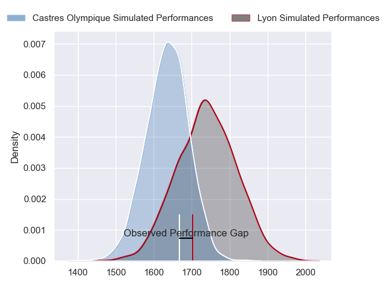
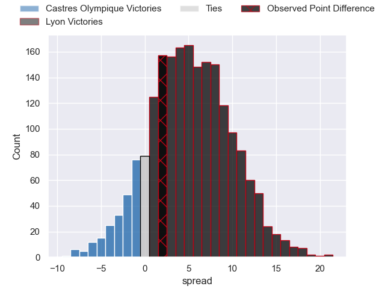
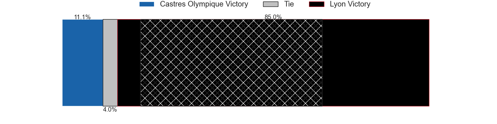
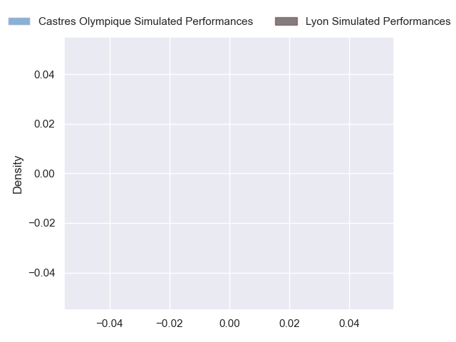
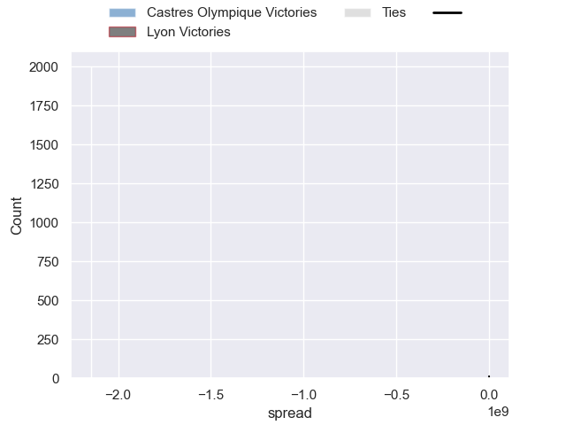

---  
layout: page  
title: Castres Olympique at Lyon; 38-40  
date: 2024-09-28 18:00:00 -0500  
categories: "Top 14 Orange 2024" match review  
---
# Castres Olympique at Lyon; 38-40

# Club Level Predictions

The first set of predictions treats a club as the smallest object, as the club develops its members, organizes a gameplan, and deploys its players as needed for each match. This club model has a prediction of 0.644, which translates to predicting Lyon to win by 5.2.

Our Over/Under is 36.5 - and combined with the spread above, we have a predicted scoreline of 16 to 21

Each club has a rating and a rating deviation (similar to a Glicko rating), and expected performances can be generated. This allows for simulated matches and spreads like the ones below.
## Projected Performances - Club Model

## Projected Spreads - Club Model

## Projected Results - Club Model

# Player Level Predictions

Treating teams instead as an entity made up of the currently active players, I have ratings for each player in an altogether different system. These can be combined to form team ratings once teamsheets are announced, weighting starters a bit higher than the reserves. After the match is played, players can be weighted by their minutes on the field, allowing for an accurate measure of the team's composition. With these compiled team ratings, we can make predictions, measure inaccuracy, and update the individual player ratings.
## Prediction without Player Minutes: Lyon by 9.3

Lyon by 1.6 on a neutral pitch

## Projected Performances - Player Model

## Projected Spreads - Player Model

## Projected Results - Player Model

|   Away Minutes | Away Player           |   Away Percentile |   Number |   Home Percentile | Home Player          |   Home Minutes |
|---------------:|:----------------------|------------------:|---------:|------------------:|:---------------------|---------------:|
|             24 | Lois Guerois-Galisson |            nan    |        1 |            nan    | Sebastien Taofifenua |             62 |
|             29 | Gaetan Barlot         |            nan    |        2 |            nan    | Guillaume Marchand   |             80 |
|             29 | Nicolas Corato        |            nan    |        3 |            nan    | Jermaine Ainsley     |             27 |
|             29 | Paul Jedrasiak        |            nan    |        4 |            nan    | Felix Lambey         |             80 |
|              8 | Florent Vanverberghe  |            nan    |        5 |            nan    | Mickael Guillard     |             20 |
|             18 | Baptiste Delaporte    |            nan    |        6 |            nan    | Dylan Cretin         |             20 |
|             24 | Gauthier Maravat      |            nan    |        7 |            nan    | Beka Shvangiradze    |             20 |
|             80 | Yann Peysson          |            nan    |        8 |            nan    | Arno Botha           |             32 |
|             56 | Santiago Arata        |            nan    |        9 |            nan    | Baptiste Couilloud   |             51 |
|             80 | Louis Le Brun         |            nan    |       10 |            nan    | Leo Berdeu           |             56 |
|              7 | Remy Baget            |            nan    |       11 |            nan    | Monty Ioane          |             57 |
|             30 | Adrien Seguret        |            nan    |       12 |            nan    | Theo Millet          |             59 |
|             15 | Vilimoni Botitu       |            nan    |       13 |            nan    | Semi Radradra        |             59 |
|             22 | Christian Ambadiang   |            nan    |       14 |            nan    | Ethan Dumortier      |             80 |
|             32 | Geoffrey Palis        |            nan    |       15 |            nan    | Alexandre Tchaptchet |             29 |
|             50 | Loris Zarantonello    |             34.7  |       16 |            nan    | Sam Matavesi         |             28 |
|             80 | Wayan De Benedittis   |            nan    |       17 |            nan    | Hamza Kaabeche       |             28 |
|             37 | Leone Nakarawa        |            nan    |       18 |             50.08 | Killian Géraci       |             39 |
|             54 | Feibyan Tukino        |            nan    |       19 |             26.93 | Theo William         |             26 |
|             80 | Gauthier Doubrere     |             52.89 |       20 |            nan    | Martin Page-Relo     |             32 |
|             45 | Joris Dupont          |             67.34 |       21 |             11.07 | Martin Meliande      |             21 |
|             80 | Theo Chabouni         |            nan    |       22 |            nan    | Steeve Blanc-Mappaz  |             54 |
|             80 | Aurelien Azar         |             49.3  |       23 |             66.58 | Feao Fotuaika        |             80 |

