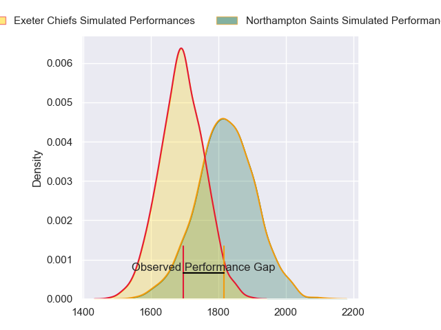
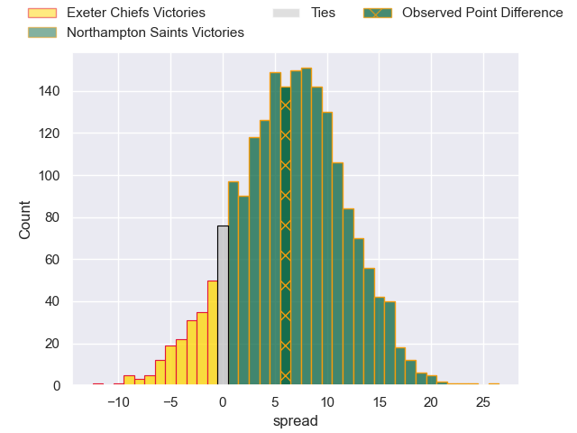
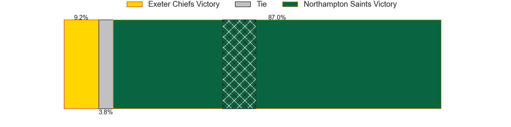
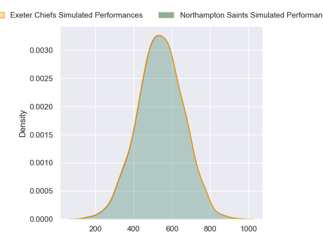
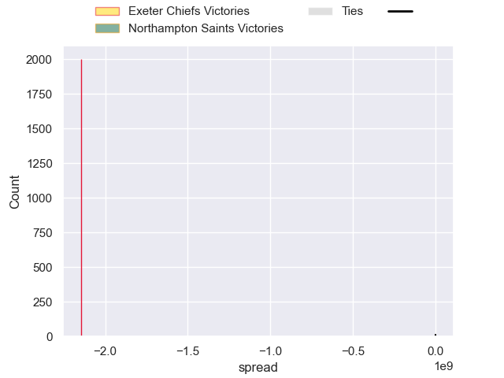

---  
layout: page  
title: Exeter Chiefs at Northampton Saints; 24-30  
date: 2024-09-28 18:00:00 -0500  
categories: "Gallagher Premiership 2024" match review  
---
# Exeter Chiefs at Northampton Saints; 24-30

# Club Level Predictions

The first set of predictions treats a club as the smallest object, as the club develops its members, organizes a gameplan, and deploys its players as needed for each match. This club model has a prediction of 0.677, which translates to predicting Northampton Saints to win by 6.6.

Our Over/Under is 47.5 - and combined with the spread above, we have a predicted scoreline of 21 to 27

Each club has a rating and a rating deviation (similar to a Glicko rating), and expected performances can be generated. This allows for simulated matches and spreads like the ones below.
## Projected Performances - Club Model

## Projected Spreads - Club Model

## Projected Results - Club Model

# Player Level Predictions

Treating teams instead as an entity made up of the currently active players, I have ratings for each player in an altogether different system. These can be combined to form team ratings once teamsheets are announced, weighting starters a bit higher than the reserves. After the match is played, players can be weighted by their minutes on the field, allowing for an accurate measure of the team's composition. With these compiled team ratings, we can make predictions, measure inaccuracy, and update the individual player ratings.
## Prediction without Player Minutes: Northampton Saints by 16.9

Northampton Saints by 8.5 on a neutral pitch

## Projected Performances - Player Model

## Projected Spreads - Player Model

## Projected Results - Player Model

|   Away Minutes | Away Player          |   Away Percentile |   Number |   Home Percentile | Home Player        |   Home Minutes |
|---------------:|:---------------------|------------------:|---------:|------------------:|:-------------------|---------------:|
|           80   | Scott Sio            |            nan    |        1 |            nan    | Emmanuel Iyogun    |           72   |
|           10.5 | Dan Frost            |             88.17 |        2 |            nan    | Curtis Langdon     |           80   |
|           21   | Ehren Painter        |             62.39 |        3 |            nan    | Trevor Davison     |           10.5 |
|           30   | Rusiate Tuima        |             36.71 |        4 |            nan    | Chunya Munga       |            4   |
|           19   | Christ Tshiunza      |             59.9  |        5 |            nan    | Alex Coles         |           21   |
|           21   | Ethan Roots          |             89    |        6 |            nan    | Josh Kemeny        |           53   |
|            8   | Richard Capstick     |              6.9  |        7 |            nan    | Tom Pearson        |           80   |
|           61   | Ross Vintcent        |            nan    |        8 |            nan    | Juarno Augustus    |           52   |
|            0   | Sam Maunder          |             49.21 |        9 |            nan    | Tom James          |           80   |
|           40   | Harvey Skinner       |             44.28 |       10 |            nan    | Fin Smith          |           65   |
|           40   | Paul Brown-Bampoe    |             52.28 |       11 |            nan    | Tommy Freeman      |           50   |
|           40   | Joe Hawkins          |             48.07 |       12 |            nan    | Rory Hutchinson    |           40   |
|           49   | Olly Woodburn        |             95.31 |       13 |            nan    | Fraser Dingwall    |           30   |
|           80   | Immanuel Feyi-Waboso |             92.78 |       14 |            nan    | James Ramm         |           40   |
|           68   | Josh Hodge           |              1.81 |       15 |            nan    | George Furbank     |           80   |
|           59   | Jack Yeandle         |             98.46 |       16 |            nan    | Robbie Smith       |           80   |
|           80   | Will Goodrick-Clarke |             60.99 |       17 |             65.82 | Tom West           |           53   |
|           61   | Marcus Street        |             47.78 |       18 |            nan    | Luke Green         |           62   |
|           80   | Jack Dunne           |             75.2  |       19 |             70.37 | Angus Scott-Young  |           44   |
|           61   | Martin Moloney       |            nan    |       20 |             99.31 | Sam Graham         |           40   |
|           80   | Tom Cairns           |             90.79 |       21 |             80.53 | Archie McParland   |            8   |
|           80   | Will Haydon-Wood     |            nan    |       22 |            nan    | Toby Thame         |           80   |
|           80   | Will Rigg            |             94.47 |       23 |             96.32 | Ollie Sleightholme |           80   |

