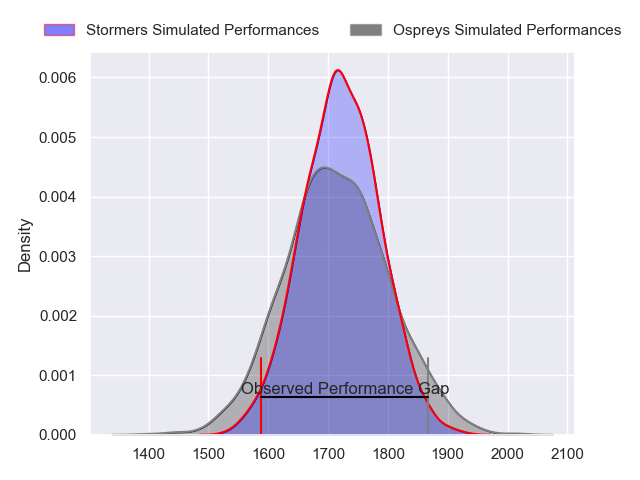
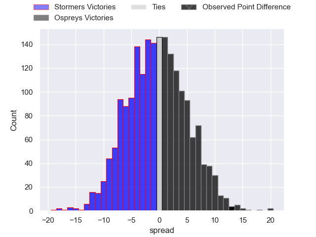
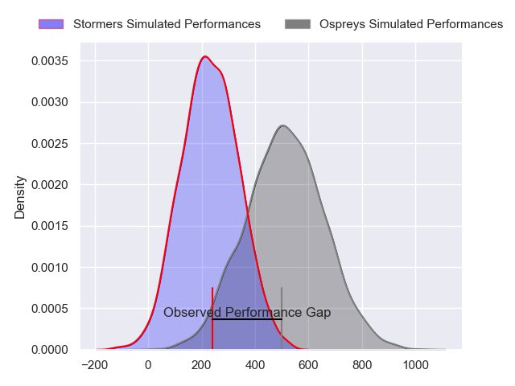
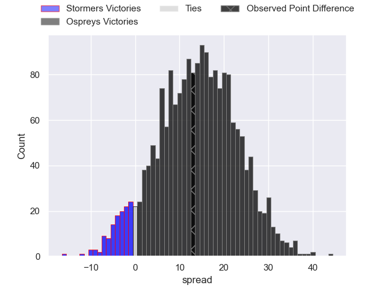

---  
layout: page  
title: Stormers at Ospreys; 24-37  
date: 2024-09-28 18:00:00 -0500  
categories: "United Rugby Championship 2024" match review  
---
# Stormers at Ospreys; 24-37

# Club Level Predictions

The first set of predictions treats a club as the smallest object, as the club develops its members, organizes a gameplan, and deploys its players as needed for each match. This club model has a prediction of 0.496, which translates to predicting Stormers to win by 0.2.

Our Over/Under is 31.5 - and combined with the spread above, we have a predicted scoreline of 16 to 16

Each club has a rating and a rating deviation (similar to a Glicko rating), and expected performances can be generated. This allows for simulated matches and spreads like the ones below.
## Projected Performances - Club Model

## Projected Spreads - Club Model

## Projected Results - Club Model

# Player Level Predictions

Treating teams instead as an entity made up of the currently active players, I have ratings for each player in an altogether different system. These can be combined to form team ratings once teamsheets are announced, weighting starters a bit higher than the reserves. After the match is played, players can be weighted by their minutes on the field, allowing for an accurate measure of the team's composition. With these compiled team ratings, we can make predictions, measure inaccuracy, and update the individual player ratings.
## Prediction without Player Minutes: Ospreys by 7.7

Ospreys by 1.9 on a neutral pitch

## Projected Performances - Player Model

## Projected Spreads - Player Model

## Projected Results - Player Model

|   Away Minutes | Away Player          |   Away Percentile |   Number |   Home Percentile | Home Player            |   Home Minutes |
|---------------:|:---------------------|------------------:|---------:|------------------:|:-----------------------|---------------:|
|             11 | Sti Sithole          |             80.69 |        1 |             44.35 | Gareth Thomas          |             80 |
|             67 | Joseph Dweba         |             64.52 |        2 |             59.38 | Dewi Lake              |             73 |
|              0 | Neethling Fouche     |             84.37 |        3 |             70.9  | Tom Botha              |             80 |
|             34 | Jd Schickerling      |             50.89 |        4 |             76.65 | James Ratti            |             80 |
|             32 | Ruben van Heerden    |             81.96 |        5 |             96.14 | Adam Beard             |             68 |
|              2 | Marcel Theunissen    |             39.24 |        6 |             94.42 | Jac Morgan             |             80 |
|             69 | Dave Ewers           |             95.89 |        7 |             98.69 | Justin Tipuric         |             35 |
|             80 | Keketso Morabe       |             33.68 |        8 |              6.19 | Morgan Morris          |             60 |
|             80 | Paul de Wet          |             84.21 |        9 |             73.95 | Reuben Morgan-Williams |             10 |
|             80 | Jurie Matthee        |             39.85 |       10 |             63.47 | Dan Edwards            |             80 |
|             16 | Leolin Zas           |             90.43 |       11 |             15.02 | Ryan Conbeer           |             69 |
|             58 | Daniel du Plessis    |             93.8  |       12 |             90.62 | Keiran Williams        |             80 |
|             17 | Ruhan Nel            |             45.73 |       13 |             98.83 | Owen Watkin            |             74 |
|             11 | Suleiman Hartzenberg |             74.82 |       14 |             19.59 | Luke Morgan            |             34 |
|             31 | Damian Willemse      |             97.46 |       15 |             55.8  | Jack Walsh             |             49 |
|             25 | Andre-Hugo Venter    |             78.66 |       16 |            nan    | Ethan Lewis            |             80 |
|             11 | Leon Lyons           |            nan    |       17 |            nan    | Garyn Phillips         |             57 |
|             17 | Brok Harris          |            100    |       18 |            nan    | Ben Warren             |             57 |
|             17 | Adre Smith           |             82.93 |       19 |             71.34 | Huw Owen-Sutton        |             64 |
|             20 | Ben-Jason Dixon      |            nan    |       20 |             91.79 | Harri Deaves           |             80 |
|             80 | Stefan Ungerer       |             22.11 |       21 |             68.95 | Luke Davies            |             64 |
|             80 | Jean-Luc Du Plessis  |            nan    |       22 |             70.18 | Phil Cokanasiga        |             80 |
|             62 | Angelo Davids        |             95.73 |       23 |             85.14 | Max Nagy               |             53 |
|            nan | nan                  |            nan    |       24 |            nan    |                        |             80 |

