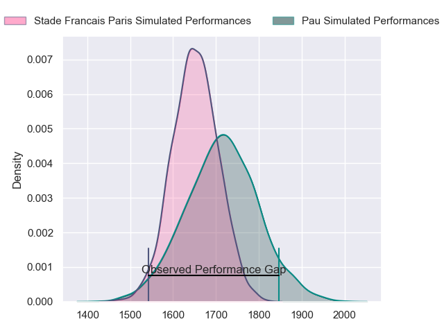
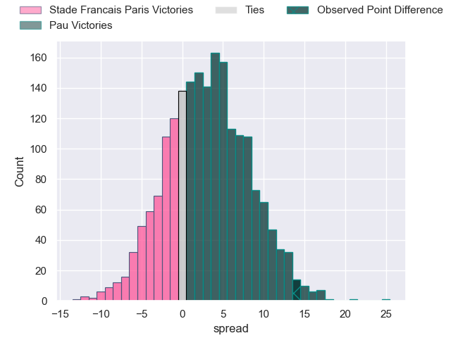
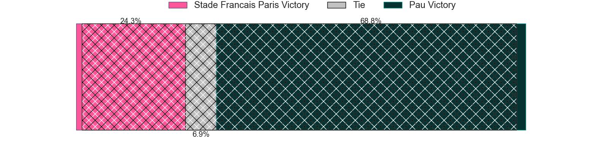
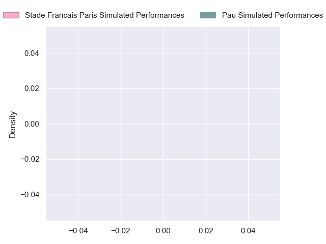
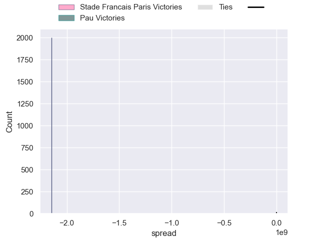

---  
layout: page  
title: Stade Francais Paris at Pau; 16-30  
date: 2024-09-28 18:00:00 -0500  
categories: "Top 14 Orange 2024" match review  
---
# Stade Francais Paris at Pau; 16-30

# Club Level Predictions

The first set of predictions treats a club as the smallest object, as the club develops its members, organizes a gameplan, and deploys its players as needed for each match. This club model has a prediction of 0.584, which translates to predicting Pau to win by 3.0.

Our Over/Under is 34.5 - and combined with the spread above, we have a predicted scoreline of 16 to 19

Each club has a rating and a rating deviation (similar to a Glicko rating), and expected performances can be generated. This allows for simulated matches and spreads like the ones below.
## Projected Performances - Club Model

## Projected Spreads - Club Model

## Projected Results - Club Model

# Player Level Predictions

Treating teams instead as an entity made up of the currently active players, I have ratings for each player in an altogether different system. These can be combined to form team ratings once teamsheets are announced, weighting starters a bit higher than the reserves. After the match is played, players can be weighted by their minutes on the field, allowing for an accurate measure of the team's composition. With these compiled team ratings, we can make predictions, measure inaccuracy, and update the individual player ratings.
## Prediction without Player Minutes: Pau by 11.6

Pau by 3.4 on a neutral pitch

## Projected Performances - Player Model

## Projected Spreads - Player Model

## Projected Results - Player Model

|   Away Minutes | Away Player            |   Away Percentile |   Number |   Home Percentile | Home Player         |   Home Minutes |
|---------------:|:-----------------------|------------------:|---------:|------------------:|:--------------------|---------------:|
|             80 | Clement Castets        |               nan |        1 |            nan    | Daniel Bibi Biziwu  |             46 |
|             80 | Lucas Peyresblanques   |               nan |        2 |            nan    | Youri Delhommel     |             50 |
|             63 | Moses Alo-Emile        |               nan |        3 |            nan    | Harry Williams      |             46 |
|             16 | Pierre-Henri Azagoh    |               nan |        4 |            nan    | Thomas Jolmes       |             34 |
|             26 | JJ van der Mescht      |               nan |        5 |            nan    | Remi Picquette      |             28 |
|              0 | Ryan Chapuis           |               nan |        6 |            nan    | Sacha Zegueur       |             80 |
|             19 | Pierre Huguet          |               nan |        7 |            nan    | Loic Credoz         |             30 |
|             26 | Yoan Tanga             |               nan |        8 |            nan    | Beka Gorgadze       |             46 |
|             69 | Brad Weber             |               nan |        9 |            nan    | Thibault Daubagna   |             45 |
|             63 | Zack Henry             |               nan |       10 |            nan    | Joe Simmonds        |             54 |
|             27 | Samuel Ezeala          |               nan |       11 |            nan    | Aymeric Luc         |             54 |
|             22 | Jeremy Ward            |               nan |       12 |            nan    | Tumua Manu          |             73 |
|             80 | Joe Marchant           |               nan |       13 |            nan    | Emilien Gailleton   |             56 |
|             25 | Peniasi Dakuwaqa       |               nan |       14 |            nan    | Theo Attissogbe     |             64 |
|             80 | Joe Jonas              |               nan |       15 |            nan    | Jack Maddocks       |             35 |
|             80 | Mamoudou Meïté         |               nan |       16 |             67.61 | Romain Ruffenach    |              0 |
|             80 | Isaac Koffi            |               nan |       17 |            nan    | Guram Papidze       |             61 |
|             78 | Paul Gabrillagues      |               nan |       18 |            nan    | Lekima Tagitagivalu |             53 |
|             59 | Romain Briatte         |               nan |       19 |            nan    | Joel Kpoku          |             23 |
|             80 | Jules Gimbert          |               nan |       20 |            nan    | Dan Robson          |             80 |
|             21 | Leo Barre              |               nan |       21 |            nan    | Axel Desperes       |             64 |
|             55 | Lester Etien           |               nan |       22 |            nan    | Nathan Decron       |             80 |
|             80 | Francisco Gomez Kodela |               nan |       23 |             70.52 | Jon Zabala          |             80 |

