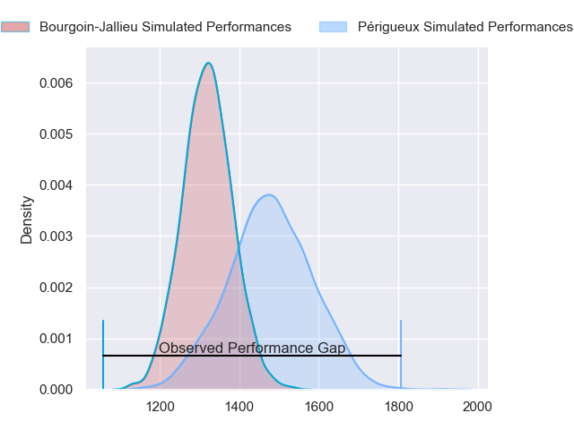
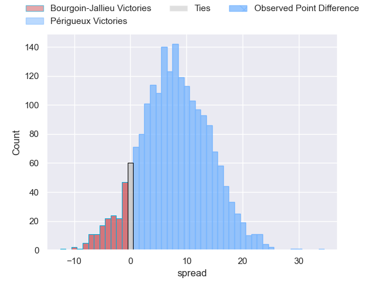
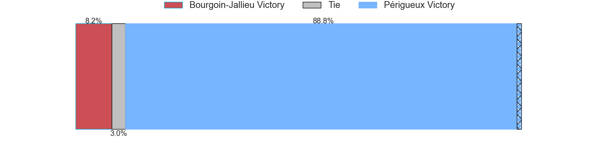
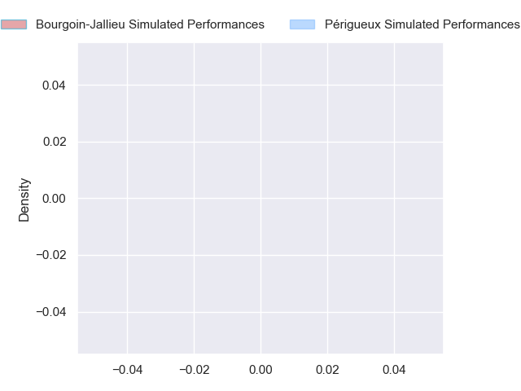
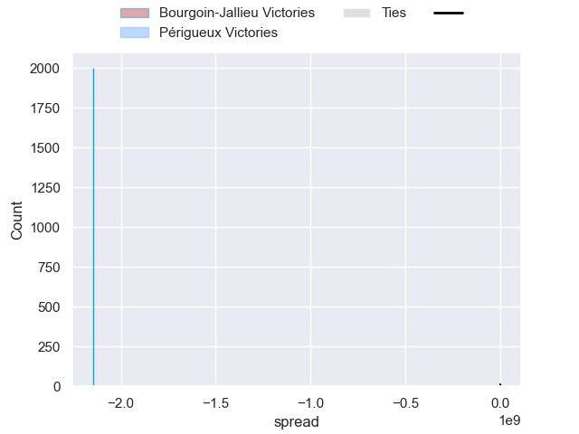

---  
layout: page  
title: Bourgoin-Jallieu at Perigueux; 0-34  
date: 2024-09-28 18:00:00 -0500  
categories: "Nationale 2024" match review  
---
# Bourgoin-Jallieu at Perigueux; 0-34

# Club Level Predictions

The first set of predictions treats a club as the smallest object, as the club develops its members, organizes a gameplan, and deploys its players as needed for each match. This club model has a prediction of 0.709, which translates to predicting Périgueux to win by 7.9.

Our Over/Under is 43.5 - and combined with the spread above, we have a predicted scoreline of 18 to 26

Each club has a rating and a rating deviation (similar to a Glicko rating), and expected performances can be generated. This allows for simulated matches and spreads like the ones below.
## Projected Performances - Club Model

## Projected Spreads - Club Model

## Projected Results - Club Model

# Player Level Predictions

Treating teams instead as an entity made up of the currently active players, I have ratings for each player in an altogether different system. These can be combined to form team ratings once teamsheets are announced, weighting starters a bit higher than the reserves. After the match is played, players can be weighted by their minutes on the field, allowing for an accurate measure of the team's composition. With these compiled team ratings, we can make predictions, measure inaccuracy, and update the individual player ratings.
## Prediction without Player Minutes: Périgueux by 2.5

Bourgoin-Jallieu by 0.0 on a neutral pitch

## Projected Performances - Player Model

## Projected Spreads - Player Model

## Projected Results - Player Model

|   Away Minutes | Away Player       |   Away Percentile |   Number |   Home Percentile | Home Player       |   Home Minutes |
|---------------:|:------------------|------------------:|---------:|------------------:|:------------------|---------------:|
|             51 | Lucas Dycke       |               nan |        1 |            nan    | Damien Lavergne   |             43 |
|             20 | Julien Ratajczak  |               nan |        2 |            nan    | Manu Leiataua     |             22 |
|             14 | Keynan Knox       |               nan |        3 |            nan    | Kalivati Tawake   |             33 |
|             27 | Robin Gascou      |               nan |        4 |            nan    | Clément Lanen     |             21 |
|             27 | Léandre Cotte     |               nan |        5 |            nan    | Jaco Willemse     |             36 |
|             51 | Sam Daly          |               nan |        6 |            nan    | Madioké Konaté    |              0 |
|             27 | Morgan Eames      |               nan |        7 |            nan    | Afa Amosa         |             17 |
|             28 | Talalelei Gray    |               nan |        8 |            nan    | Karl Lambert      |             29 |
|             46 | Liam Rimet        |               nan |        9 |            nan    | Nicolas Faltrept  |             44 |
|             53 | Nicolas Vuillemin |               nan |       10 |            nan    | Jaun Kotzé        |             52 |
|             40 | Hugo Desgrange    |               nan |       11 |            nan    | Axel Muller       |             52 |
|             70 | Aviata Silago     |               nan |       12 |            nan    | Frederick Hickes  |             80 |
|             60 | Christopher Bosch |               nan |       13 |            nan    | Dorian Lavernhe   |             65 |
|             80 | Paul Champ        |               nan |       14 |            nan    | Vincent Fouillade |             80 |
|             80 | Nicolas Cachet    |               nan |       15 |            nan    | Yon Camou         |             80 |
|             29 | Louis Ponton      |               nan |       16 |            nan    | Baptiste Arvouet  |             63 |
|              0 | Romain Favaretto  |               nan |       17 |            nan    | Émilien Borges    |             17 |
|             80 | Thomas Adélaïde   |               nan |       18 |            nan    | Richard Fourcade  |             53 |
|             28 | Poutasi Luafutu   |               nan |       19 |            nan    | Nahum Merigan     |             41 |
|             51 | Martin Doan       |               nan |       20 |             59.21 | Max Green         |             80 |
|             80 | Tom Danovaro      |               nan |       21 |            nan    | Greg Hutley       |             80 |
|             80 | Mattéo Broeders   |               nan |       22 |            nan    | Cyril Couturier   |             80 |
|             80 | Oktay Yilmaz      |               nan |       23 |            nan    | Anthony Pelmard   |             80 |

