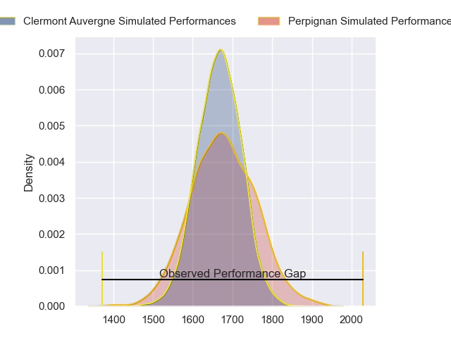
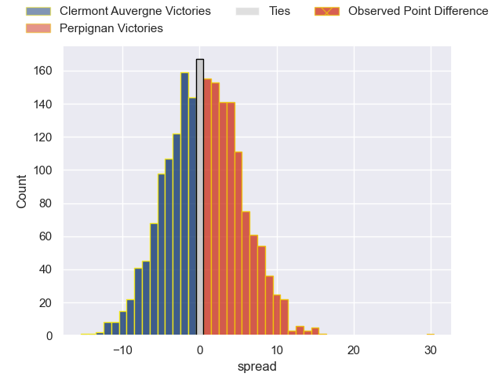
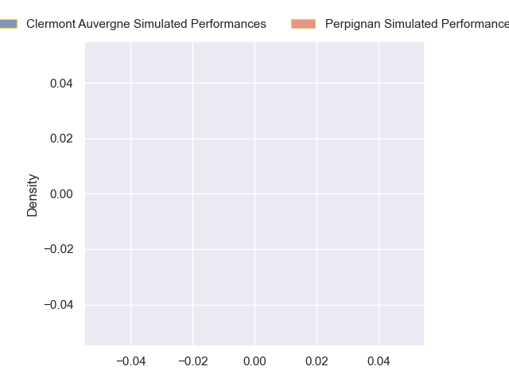
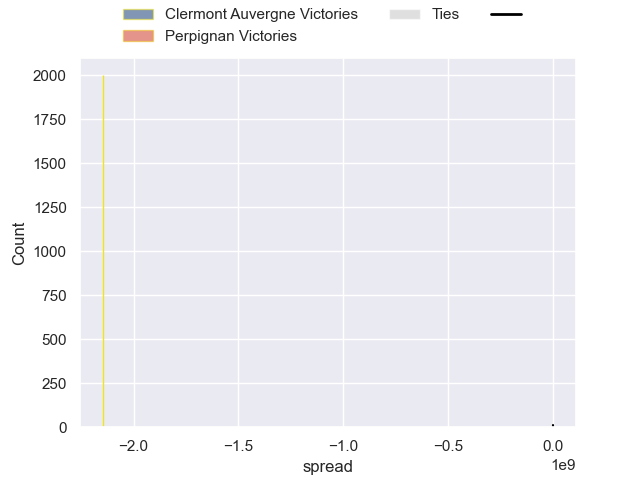

---  
layout: page  
title: Clermont Auvergne at Perpignan; 3-33  
date: 2024-09-28 18:00:00 -0500  
categories: "Top 14 Orange 2024" match review  
---
# Clermont Auvergne at Perpignan; 3-33

# Club Level Predictions

The first set of predictions treats a club as the smallest object, as the club develops its members, organizes a gameplan, and deploys its players as needed for each match. This club model has a prediction of 0.514, which translates to predicting Perpignan to win by 0.5.

Our Over/Under is 38.5 - and combined with the spread above, we have a predicted scoreline of 19 to 19

Each club has a rating and a rating deviation (similar to a Glicko rating), and expected performances can be generated. This allows for simulated matches and spreads like the ones below.
## Projected Performances - Club Model

## Projected Spreads - Club Model

## Projected Results - Club Model

# Player Level Predictions

Treating teams instead as an entity made up of the currently active players, I have ratings for each player in an altogether different system. These can be combined to form team ratings once teamsheets are announced, weighting starters a bit higher than the reserves. After the match is played, players can be weighted by their minutes on the field, allowing for an accurate measure of the team's composition. With these compiled team ratings, we can make predictions, measure inaccuracy, and update the individual player ratings.
## Prediction without Player Minutes: Perpignan by 5.9

Clermont Auvergne by 3.1 on a neutral pitch

## Projected Performances - Player Model

## Projected Spreads - Player Model

## Projected Results - Player Model

|   Away Minutes | Away Player          |   Away Percentile |   Number |   Home Percentile | Home Player           |   Home Minutes |
|---------------:|:---------------------|------------------:|---------:|------------------:|:----------------------|---------------:|
|             25 | Sacha Lotrian        |               nan |        1 |               nan | Giorgi Beria          |             28 |
|             11 | Barnabé Massa        |               nan |        2 |               nan | Seilala Lam           |             40 |
|             41 | Michael Ala'alatoa   |               nan |        3 |               nan | Kieran Brookes        |             55 |
|             28 | Thibaud Lanen        |               nan |        4 |               nan | Marvin Orie           |             28 |
|             80 | Oskar Rixen          |               nan |        5 |               nan | Posolo Tuilagi        |             28 |
|             80 | Anthime Hemery       |               nan |        6 |               nan | Jacobus van Tonder    |              0 |
|             80 | Pita Gus Sowakula    |               nan |        7 |               nan | Lucas Bachelier       |             63 |
|             80 | Fritz Lee            |               nan |        8 |               nan | Lucas Velarte         |             10 |
|             33 | Sebastien Bezy       |               nan |        9 |               nan | Tom Ecochard          |             13 |
|             52 | Anthony Belleau      |               nan |       10 |               nan | Jake McIntyre         |             54 |
|             60 | Alivereti Raka       |               nan |       11 |               nan | Lucas Dubois          |             40 |
|             41 | George Moala         |               nan |       12 |               nan | Jeronimo de la Fuente |             54 |
|             39 | Leon Darricarrere    |               nan |       13 |               nan | Apisai Naqalevu       |             40 |
|             26 | Joris Jurand         |               nan |       14 |               nan | Jefferson-Lee Joseph  |             53 |
|             80 | Kylan Hamdaoui       |               nan |       15 |               nan | Antoine Aucagne       |             80 |
|             80 | Folau Fainga'a       |               nan |       16 |               nan | Victor Montgaillard   |             33 |
|             41 | Giorgi Akhaladze     |               nan |       17 |               nan | Akato Fakatika        |             80 |
|             41 | Thomas Ceyte         |               nan |       18 |               nan | Adrien Warion         |             55 |
|             80 | Peceli Yato          |               nan |       19 |               nan | Alan Brazo            |             80 |
|             20 | Baptiste Jauneau     |               nan |       20 |               nan | So'otala Fa'aso'o     |             80 |
|             64 | Benjamin Urdapilleta |               nan |       21 |               nan | Gela Aprasidze        |             80 |
|             80 | Irae Simone          |               nan |       22 |               nan | Tavite Veredamu       |             80 |
|             67 | Cristian Ojovan      |               nan |       23 |               nan | Pietro Ceccarelli     |             80 |

