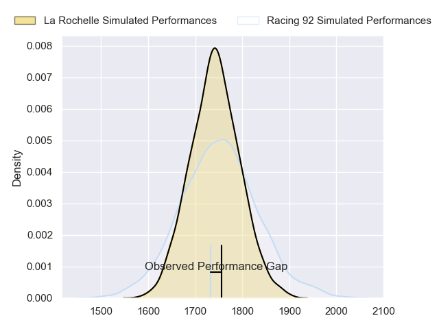
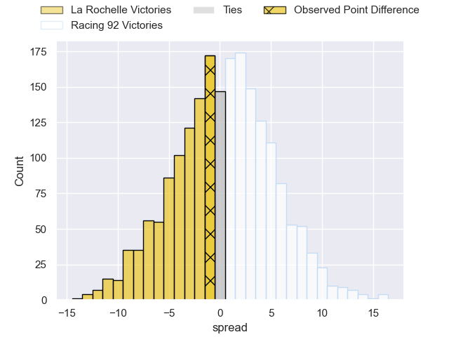
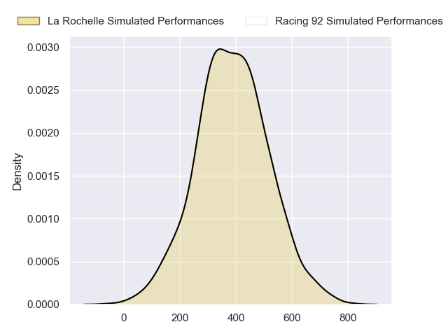
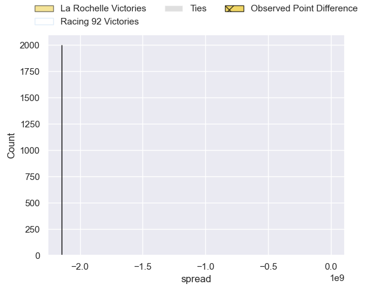
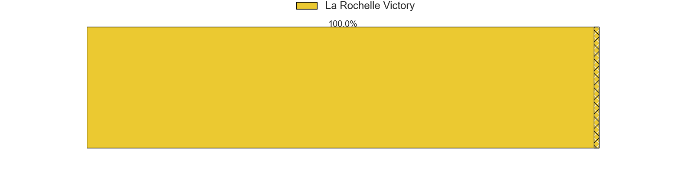

---  
layout: page  
title: La Rochelle at Racing 92; 17-16  
date: 2024-09-28 18:00:00 -0500  
categories: "Top 14 Orange 2024" match review  
---
# La Rochelle at Racing 92; 17-16

# Club Level Predictions

The first set of predictions treats a club as the smallest object, as the club develops its members, organizes a gameplan, and deploys its players as needed for each match. This club model has a prediction of 0.506, which translates to predicting Racing 92 to win by 0.2.

Our Over/Under is 37.5 - and combined with the spread above, we have a predicted scoreline of 19 to 19

Each club has a rating and a rating deviation (similar to a Glicko rating), and expected performances can be generated. This allows for simulated matches and spreads like the ones below.
## Projected Performances - Club Model

## Projected Spreads - Club Model

## Projected Results - Club Model

# Player Level Predictions

Treating teams instead as an entity made up of the currently active players, I have ratings for each player in an altogether different system. These can be combined to form team ratings once teamsheets are announced, weighting starters a bit higher than the reserves. After the match is played, players can be weighted by their minutes on the field, allowing for an accurate measure of the team's composition. With these compiled team ratings, we can make predictions, measure inaccuracy, and update the individual player ratings.
## Prediction without Player Minutes: La Rochelle by 2.1

La Rochelle by 9.0 on a neutral pitch

## Projected Performances - Player Model

## Projected Spreads - Player Model

## Projected Results - Player Model

|   Away Minutes | Away Player           |   Away Percentile |   Number |   Home Percentile | Home Player           |   Home Minutes |
|---------------:|:----------------------|------------------:|---------:|------------------:|:----------------------|---------------:|
|             26 | Louis Penverne        |            nan    |        1 |            nan    | Guram Gogichashvili   |             80 |
|             33 | Quentin Lespiaucq     |            nan    |        2 |            nan    | Robin Couly           |             59 |
|             17 | Uini Atonio           |            nan    |        3 |             36.34 | Gia Kharaishvili      |             80 |
|             33 | Thomas Lavault        |            nan    |        4 |            nan    | Junior Kpoku          |             51 |
|             12 | Will Skelton          |            nan    |        5 |            nan    | Will Rowlands         |             60 |
|             33 | Judicael Cancoriet    |            nan    |        6 |            nan    | Cameron Woki          |             80 |
|             55 | Paul Boudehent        |            nan    |        7 |            nan    | Ibrahim Diallo        |             80 |
|              0 | Gregory Alldritt      |            nan    |        8 |            nan    | Hacjivah Dayimani     |             80 |
|             48 | Thomas Berjon         |            nan    |        9 |            nan    | Nolann Le Garrec      |             26 |
|             48 | Antoine Hastoy        |            nan    |       10 |            nan    | Owen Farrell          |             22 |
|             48 | Dillyn Leyds          |            nan    |       11 |            nan    | Henry Arundell        |             32 |
|             69 | Jonathan Danty        |            nan    |       12 |            nan    | Sam James             |             10 |
|             80 | Ulupano Seuteni       |            nan    |       13 |            nan    | Gael Fickou           |             41 |
|             70 | Jack Nowell           |            nan    |       14 |            nan    | Josua Tuisova         |             80 |
|             80 | Brice Dulin           |            nan    |       15 |            nan    | Max Spring            |             80 |
|             80 | Tolu Latu             |             92.03 |       16 |             74.55 | Diego Escobar Alvarez |             54 |
|             60 | Reda Wardi            |            nan    |       17 |             98.09 | Eddy Ben Arous        |             70 |
|             80 | Kane Douglas          |            nan    |       18 |            nan    | Boris Palu            |             80 |
|             52 | Matthias Haddad       |            nan    |       19 |            nan    | Maxime Baudonne       |             80 |
|             51 | Teddy Iribaren        |             90    |       20 |             34.74 | Clovis Le Bail        |             80 |
|             80 | Ihaia West            |            nan    |       21 |            nan    | Dan Lancaster         |             60 |
|             80 | Jules Favre           |            nan    |       22 |             94.1  | Antoine Gibert        |             31 |
|             72 | Georges-Henri Colombe |            nan    |       23 |            nan    | Lee-Marvin Mazibuko   |             53 |

