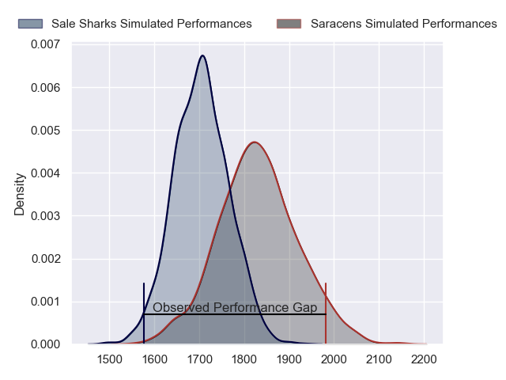
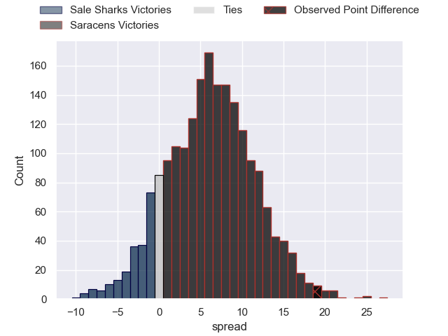
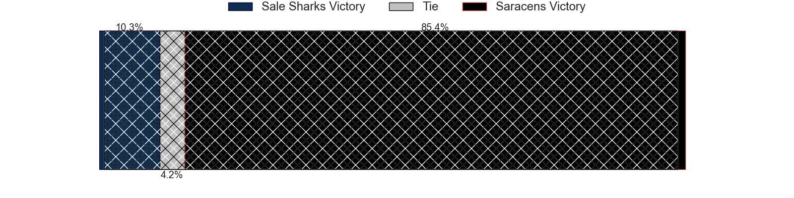
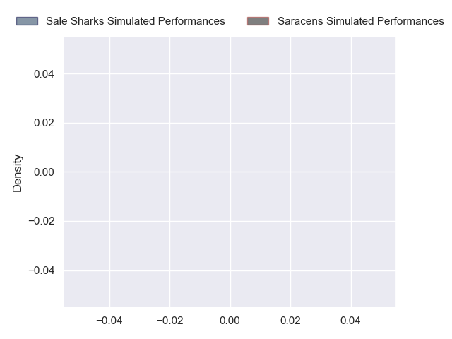
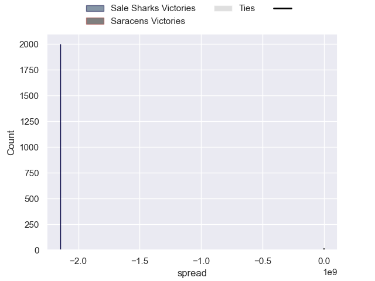

---  
layout: page  
title: Sale Sharks at Saracens; 26-45  
date: 2024-09-28 18:00:00 -0500  
categories: "Gallagher Premiership 2024" match review  
---
# Sale Sharks at Saracens; 26-45

# Club Level Predictions

The first set of predictions treats a club as the smallest object, as the club develops its members, organizes a gameplan, and deploys its players as needed for each match. This club model has a prediction of 0.666, which translates to predicting Saracens to win by 6.1.

Our Over/Under is 34.5 - and combined with the spread above, we have a predicted scoreline of 14 to 20

Each club has a rating and a rating deviation (similar to a Glicko rating), and expected performances can be generated. This allows for simulated matches and spreads like the ones below.
## Projected Performances - Club Model

## Projected Spreads - Club Model

## Projected Results - Club Model

# Player Level Predictions

Treating teams instead as an entity made up of the currently active players, I have ratings for each player in an altogether different system. These can be combined to form team ratings once teamsheets are announced, weighting starters a bit higher than the reserves. After the match is played, players can be weighted by their minutes on the field, allowing for an accurate measure of the team's composition. With these compiled team ratings, we can make predictions, measure inaccuracy, and update the individual player ratings.
## Prediction without Player Minutes: Saracens by 4.0

Sale Sharks by 3.0 on a neutral pitch

## Projected Performances - Player Model

## Projected Spreads - Player Model

## Projected Results - Player Model

|   Away Minutes | Away Player                    |   Away Percentile |   Number |   Home Percentile | Home Player     |   Home Minutes |
|---------------:|:-------------------------------|------------------:|---------:|------------------:|:----------------|---------------:|
|             15 | Simon McIntyre                 |            nan    |        1 |            nan    | Rhys Carré      |             62 |
|             80 | Luke Cowan-Dickie              |            nan    |        2 |            nan    | Theo Dan        |              9 |
|             51 | Asher Opoku-Fordjour           |            nan    |        3 |            nan    | Marco Riccioni  |             74 |
|              4 | Ben Bamber                     |            nan    |        4 |            nan    | Maro Itoje      |             20 |
|             80 | Hyron Andrews                  |            nan    |        5 |            nan    | Hugh Tizard     |             80 |
|             80 | Sam Dugdale                    |            nan    |        6 |            nan    | Andy Christie   |             24 |
|             80 | Ben Curry                      |            nan    |        7 |            nan    | Ben Earl        |             19 |
|             24 | Jean-Luc du Preez              |            nan    |        8 |            nan    | Tom Willis      |             30 |
|             14 | Gus Warr                       |            nan    |        9 |            nan    | Ivan van Zyl    |             20 |
|             80 | George Ford                    |            nan    |       10 |            nan    | Fergus Burke    |              6 |
|             31 | Tom O'Flaherty                 |            nan    |       11 |            nan    | Rotimi Segun    |             40 |
|             24 | Rob Du Preez                   |            nan    |       12 |            nan    | Nick Tompkins   |             20 |
|             28 | Waisea Nayacalevu Vuidravuwalu |            nan    |       13 |            nan    | Alex Lozowski   |              6 |
|             19 | Tom Roebuck                    |            nan    |       14 |            nan    | Tobias Elliott  |              6 |
|             19 | Joe Carpenter                  |            nan    |       15 |            nan    | Elliot Daly     |             80 |
|             21 | Ethan Caine                    |            nan    |       16 |             99.74 | Jamie George    |             41 |
|             12 | Tumy Onasanya                  |             18.93 |       17 |             84.37 | Sam Crean       |             80 |
|              6 | James Harper                   |             18.17 |       18 |             48.92 | Alec Clarey     |             40 |
|             80 | Josh Beaumont                  |             87.92 |       19 |             91.63 | Nick Isiekwe    |             69 |
|             67 | Roubs Birch                    |            nan    |       20 |            nan    | Theo McFarland  |             65 |
|             80 | Nye Thomas                     |            nan    |       21 |            nan    | Toby Knight     |             38 |
|             56 | Sam Bedlow                     |             87.6  |       22 |            nan    | Charlie Bracken |             80 |
|             59 | Will Addison                   |             95.48 |       23 |             87.68 | Alex Goode      |              4 |

