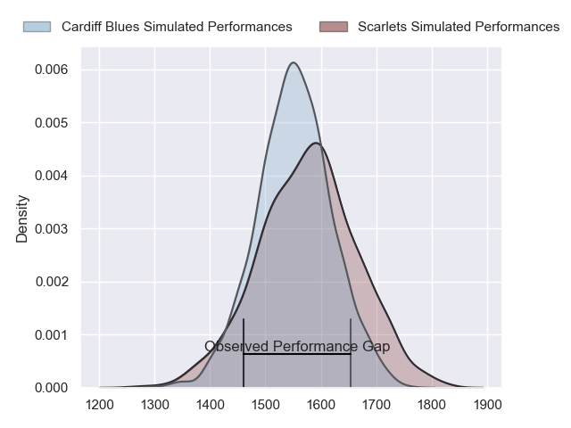
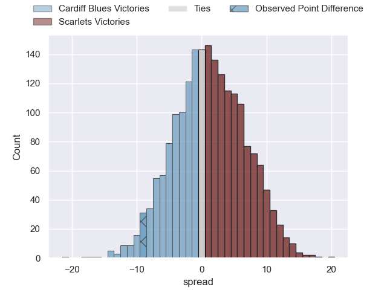
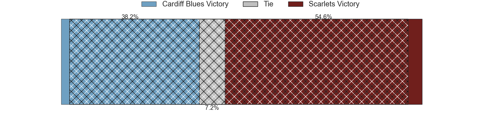
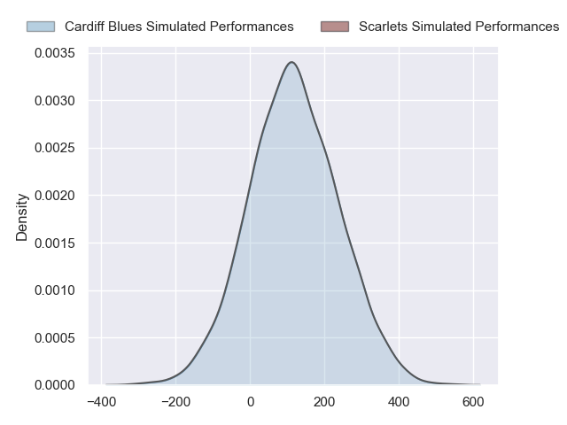
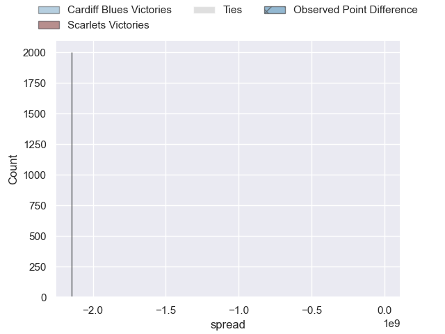

---  
layout: page  
title: Cardiff Blues at Scarlets; 24-15  
date: 2024-09-28 18:00:00 -0500  
categories: "United Rugby Championship 2024" match review  
---
# Cardiff Blues at Scarlets; 24-15

# Club Level Predictions

The first set of predictions treats a club as the smallest object, as the club develops its members, organizes a gameplan, and deploys its players as needed for each match. This club model has a prediction of 0.534, which translates to predicting Scarlets to win by 1.2.

Our Over/Under is 37.5 - and combined with the spread above, we have a predicted scoreline of 18 to 19

Each club has a rating and a rating deviation (similar to a Glicko rating), and expected performances can be generated. This allows for simulated matches and spreads like the ones below.
## Projected Performances - Club Model

## Projected Spreads - Club Model

## Projected Results - Club Model

# Player Level Predictions

Treating teams instead as an entity made up of the currently active players, I have ratings for each player in an altogether different system. These can be combined to form team ratings once teamsheets are announced, weighting starters a bit higher than the reserves. After the match is played, players can be weighted by their minutes on the field, allowing for an accurate measure of the team's composition. With these compiled team ratings, we can make predictions, measure inaccuracy, and update the individual player ratings.
## Prediction without Player Minutes: Scarlets by 0.3

Cardiff Blues by 5.6 on a neutral pitch

## Projected Performances - Player Model

## Projected Spreads - Player Model

## Projected Results - Player Model

|   Away Minutes | Away Player       |   Away Percentile |   Number |   Home Percentile | Home Player          |   Home Minutes |
|---------------:|:------------------|------------------:|---------:|------------------:|:---------------------|---------------:|
|             55 | Corey Domachowski |            nan    |        1 |             51.72 | Alec Hepburn         |             80 |
|             80 | Liam Belcher      |            nan    |        2 |            nan    | Ryan Elias           |             46 |
|             40 | Keiron Assiratti  |            nan    |        3 |             27.19 | Henry Thomas         |             80 |
|              8 | Josh McNally      |            nan    |        4 |            nan    | Alex Craig           |             40 |
|             80 | Teddy Williams    |            nan    |        5 |            nan    | Max Douglas          |             26 |
|             16 | Ben Donnell       |            nan    |        6 |            nan    | Jarrod Taylor        |             37 |
|             30 | Daniel Thomas     |            nan    |        7 |             38.75 | Josh Macleod         |             40 |
|             12 | Alun Lawrence     |            nan    |        8 |            nan    | Taine Plumtree       |             26 |
|             20 | Aled Davies       |            nan    |        9 |            nan    | Gareth Davies        |             77 |
|             20 | Callum Sheedy     |            nan    |       10 |             42.07 | Sam Costelow         |              0 |
|              7 | Iwan Stephens     |            nan    |       11 |            nan    | Blair Murray         |             80 |
|             28 | Ben Thomas        |            nan    |       12 |            nan    | Johnny Williams      |             13 |
|             23 | Rey Lee-Lo        |            nan    |       13 |            nan    | Macs Page            |              3 |
|              3 | Mason Grady       |            nan    |       14 |            nan    | Tom Rogers           |             12 |
|             80 | Cameron Winnett   |            nan    |       15 |            nan    | Ioan Lloyd           |             13 |
|             80 | Evan Lloyd        |             42.42 |       16 |            nan    | Marnus Van Der Merwe |             60 |
|             52 | Ed Byrne          |             93.14 |       17 |            nan    | Sam O'Connor         |             71 |
|             73 | Rhys Litterick    |             36.85 |       18 |            nan    | Sam Wainwright       |             60 |
|             68 | Rory Thornton     |              7.73 |       19 |              4.35 | Jac Price            |             80 |
|             80 | Mackenzie Martin  |             44.67 |       20 |             81.61 | Dan Davis            |             41 |
|             55 | Ellis Bevan       |             68.42 |       21 |             36.58 | Efan Jones           |             26 |
|             80 | Tinus de Beer     |             75.65 |       22 |             44.22 | Eddie James          |             51 |
|             75 | Harri Millard     |              7.08 |       23 |            nan    | Ellis Mee            |             80 |

