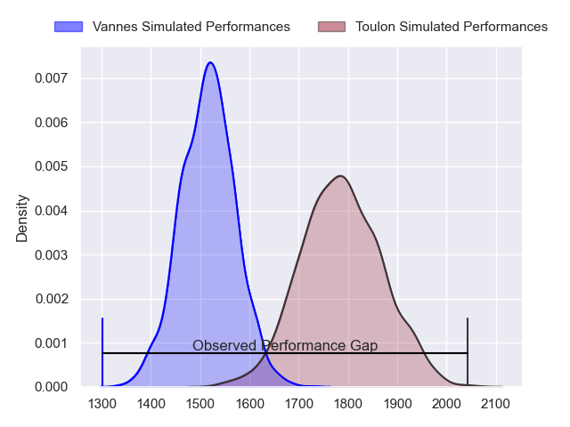
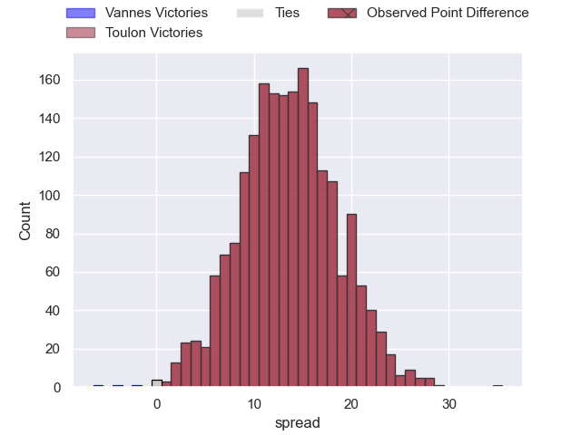
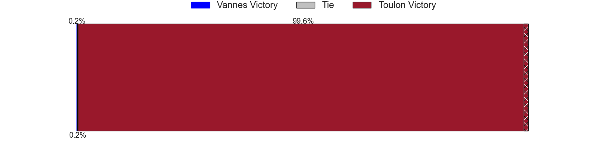
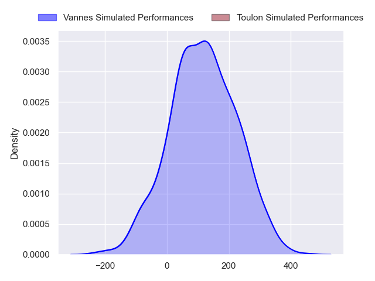
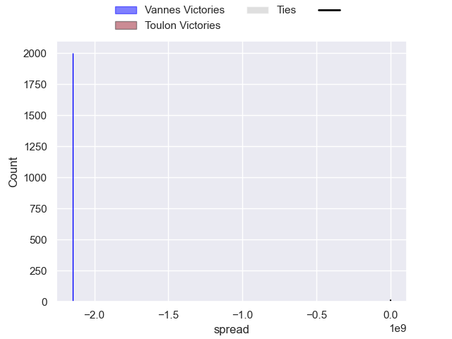

---  
layout: page  
title: Vannes at Toulon; 19-54  
date: 2024-09-28 18:00:00 -0500  
categories: "Top 14 Orange 2024" match review  
---
# Vannes at Toulon; 19-54

# Club Level Predictions

The first set of predictions treats a club as the smallest object, as the club develops its members, organizes a gameplan, and deploys its players as needed for each match. This club model has a prediction of 0.821, which translates to predicting Toulon to win by 13.4.

Our Over/Under is 54.5 - and combined with the spread above, we have a predicted scoreline of 21 to 34

Each club has a rating and a rating deviation (similar to a Glicko rating), and expected performances can be generated. This allows for simulated matches and spreads like the ones below.
## Projected Performances - Club Model

## Projected Spreads - Club Model

## Projected Results - Club Model

# Player Level Predictions

Treating teams instead as an entity made up of the currently active players, I have ratings for each player in an altogether different system. These can be combined to form team ratings once teamsheets are announced, weighting starters a bit higher than the reserves. After the match is played, players can be weighted by their minutes on the field, allowing for an accurate measure of the team's composition. With these compiled team ratings, we can make predictions, measure inaccuracy, and update the individual player ratings.
## Prediction without Player Minutes: Toulon by 22.0

Toulon by 14.9 on a neutral pitch

## Projected Performances - Player Model

## Projected Spreads - Player Model

## Projected Results - Player Model

|   Away Minutes | Away Player              |   Away Percentile |   Number |   Home Percentile | Home Player            |   Home Minutes |
|---------------:|:-------------------------|------------------:|---------:|------------------:|:-----------------------|---------------:|
|             25 | Thomas Moukoro           |            nan    |        1 |            nan    | Dany Priso             |             54 |
|             80 | Pat Leafa                |            nan    |        2 |            nan    | Teddy Baubigny         |             55 |
|             80 | Simon Bourgeois          |            nan    |        3 |            nan    | Kyle Sinckler          |             58 |
|             25 | Eric Marks               |            nan    |        4 |            nan    | Corentin Mézou         |             80 |
|             70 | Timothé Mézou            |            nan    |        5 |            nan    | Brian Alainu'uese      |             17 |
|             26 | Kitione Kamikamica       |            nan    |        6 |            nan    | Matteo Le Corvec       |             41 |
|             16 | Simon Augry              |            nan    |        7 |            nan    | Charles Ollivon        |             80 |
|             21 | Karl Chateau             |            nan    |        8 |            nan    | Facundo Isa            |             80 |
|             54 | Jules Le Bail            |            nan    |        9 |            nan    | Ben White              |             39 |
|             47 | Thibault Debaes          |            nan    |       10 |            nan    | Enzo Herve             |             47 |
|             54 | Romaric Camou            |            nan    |       11 |            nan    | Gabin Villiere         |             59 |
|             63 | Francis Saili            |            nan    |       12 |            nan    | Antoine Frisch         |             59 |
|             80 | Robin Taccola            |            nan    |       13 |            nan    | Leicester Fainga'anuku |             80 |
|             80 | Théo Bastardie           |            nan    |       14 |            nan    | Seta Tuicuvu           |             47 |
|             52 | Paul Surano              |            nan    |       15 |            nan    | Marius Domon           |             80 |
|             20 | Théo Béziat              |            nan    |       16 |            nan    | Gianmarco Lucchesi     |             54 |
|             32 | Charlesty Berguet        |             58.32 |       17 |            nan    | Jean-Baptiste Gros     |             74 |
|             16 | Christiaan Van Der Merwe |            nan    |       18 |            nan    | Yannick Youyoutte      |             71 |
|             10 | Leon Boulier             |            nan    |       19 |             89.98 | Selevasio Tolofua      |             48 |
|             13 | Tani Vili                |            nan    |       20 |            nan    | Jules Coulon           |             80 |
|             27 | Alexandre Gouaux         |            nan    |       21 |            nan    | Baptiste Serin         |             80 |
|             16 | Jean Cotarmanac'H        |            nan    |       22 |            nan    | Jeremy Sinzelle        |             20 |
|             80 | Phil Kité                |            nan    |       23 |             94.41 | Emerick Setiano        |             25 |

