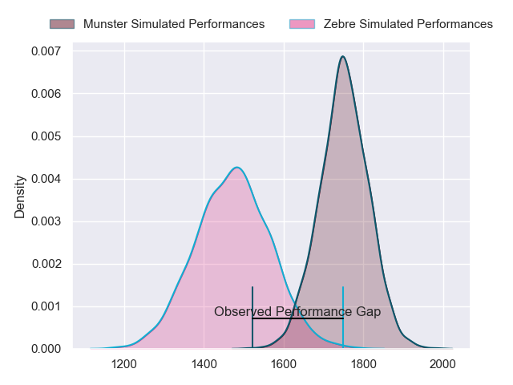
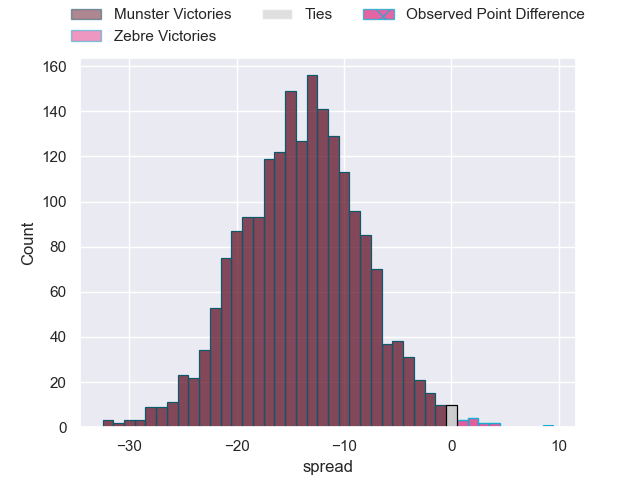
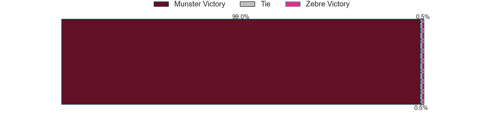
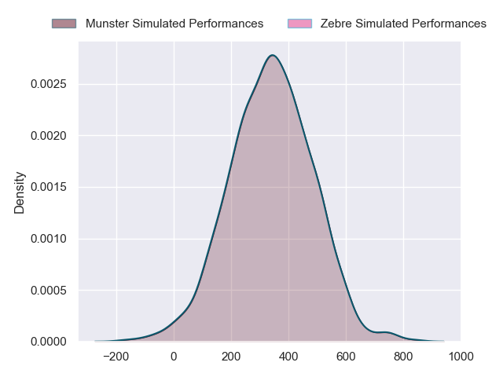
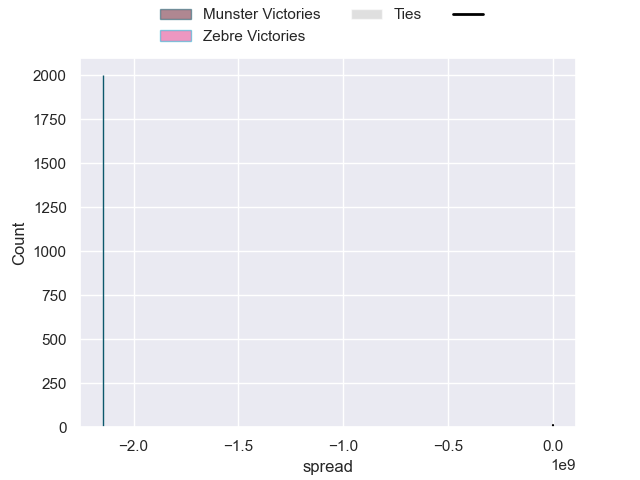

---  
layout: page  
title: Munster at Zebre; 33-42  
date: 2024-09-28 18:00:00 -0500  
categories: "United Rugby Championship 2024" match review  
---
# Munster at Zebre; 33-42

# Club Level Predictions

The first set of predictions treats a club as the smallest object, as the club develops its members, organizes a gameplan, and deploys its players as needed for each match. This club model has a prediction of 0.17, which translates to predicting Munster to win by 14.0.

Our Over/Under is 53.5 - and combined with the spread above, we have a predicted scoreline of 34 to 20

Each club has a rating and a rating deviation (similar to a Glicko rating), and expected performances can be generated. This allows for simulated matches and spreads like the ones below.
## Projected Performances - Club Model

## Projected Spreads - Club Model

## Projected Results - Club Model

# Player Level Predictions

Treating teams instead as an entity made up of the currently active players, I have ratings for each player in an altogether different system. These can be combined to form team ratings once teamsheets are announced, weighting starters a bit higher than the reserves. After the match is played, players can be weighted by their minutes on the field, allowing for an accurate measure of the team's composition. With these compiled team ratings, we can make predictions, measure inaccuracy, and update the individual player ratings.
## Prediction without Player Minutes: Munster by 10.7

Munster by 15.1 on a neutral pitch

## Projected Performances - Player Model

## Projected Spreads - Player Model

## Projected Results - Player Model

|   Away Minutes | Away Player      |   Away Percentile |   Number |   Home Percentile | Home Player            |   Home Minutes |
|---------------:|:-----------------|------------------:|---------:|------------------:|:-----------------------|---------------:|
|           80   | Josh Wycherley   |            nan    |        1 |            nan    | Danilo Fischetti       |           74   |
|           51   | Josh Wycherley   |            nan    |        1 |            nan    | Danilo Fischetti       |           74   |
|           51   | Diarmuid Barron  |            nan    |        2 |             58.61 | Tommaso Di Bartolomeo  |           23   |
|           27   | Oli Jager        |            nan    |        3 |              4.19 | Matteo Nocera          |           29   |
|           18   | Jean Kleyn       |            nan    |        4 |             93.08 | Matteo Canali          |           51   |
|           80   | Fineen Wycherley |            nan    |        5 |              2.42 | Leonard Krumov         |           14   |
|           17   | Fineen Wycherley |            nan    |        5 |              2.42 | Leonard Krumov         |           14   |
|           80   | Ruadhan Quinn    |            nan    |        6 |             50.41 | Davide Ruggeri         |           29   |
|           80   | John Hodnett     |            nan    |        7 |             56.32 | Samuele Locatelli      |            6   |
|           26   | Gavin Coombes    |            nan    |        8 |             40.89 | Giovanni Licata        |           72   |
|           33   | Craig Casey      |            nan    |        9 |             16.32 | Alessandro Fusco       |           58   |
|           33   | Tony Butler      |            nan    |       10 |              6.64 | Giovanni Montemauri    |           51   |
|           61   | Thaakir Abrahams |            nan    |       11 |              9.13 | Simone Gesi            |           70   |
|           27   | Tom Farrell      |            nan    |       12 |             96.15 | Luca Morisi            |           29   |
|           23.5 | Shane Daly       |            nan    |       13 |             51.59 | Scott Gregory          |           25   |
|           47   | Calvin Nash      |            nan    |       14 |            nan    | Jacopo Trulla          |           22   |
|           80   | Mike Haley       |            nan    |       15 |             90.94 | Geronimo Prisciantelli |           18   |
|           80   | Niall Scannell   |             94.34 |       16 |             10.54 | Giampietro Ribaldi     |           23.5 |
|           22   | Jeremy Loughman  |            nan    |       17 |             41.42 | Luca Rizzoli           |           29   |
|           22   | John Ryan        |            nan    |       18 |             22.49 | Juan Pitinari          |            4   |
|           80   | Jack Daly        |            nan    |       19 |            nan    | Andrea Zambonin        |           54   |
|           80   | Jack O'Donoghue  |             84.19 |       20 |             44.01 | Giacomo Ferrari        |           59   |
|           80   | Conor Murray     |             99.47 |       21 |            nan    | Patricio Baronio       |           80   |
|           70   | Bryan Fitzgerald |            nan    |       22 |            nan    | Fetuli Paea            |            0   |
|           67   | Shay Mccarthy    |            nan    |       23 |            nan    | Giacomo Da Re          |           23   |

