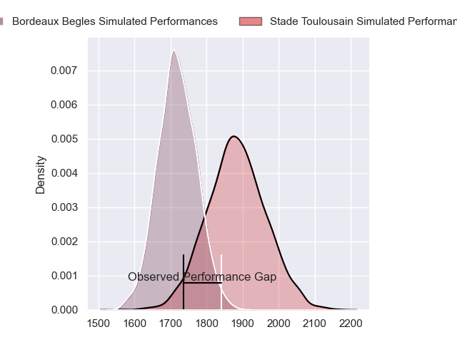
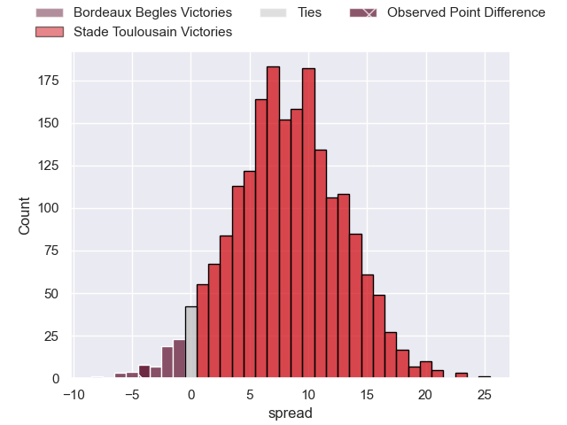
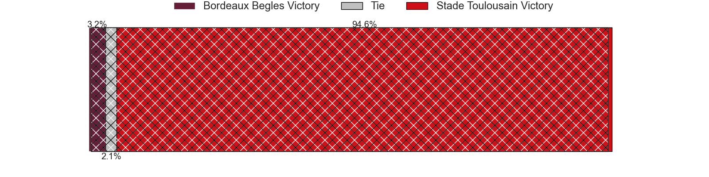
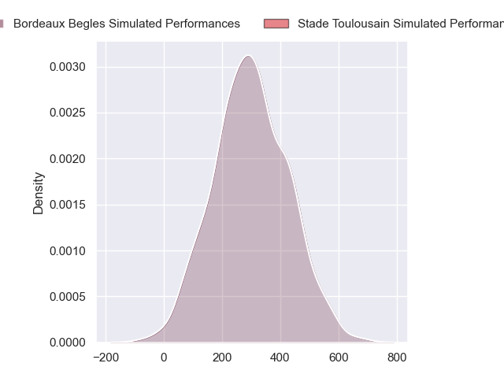
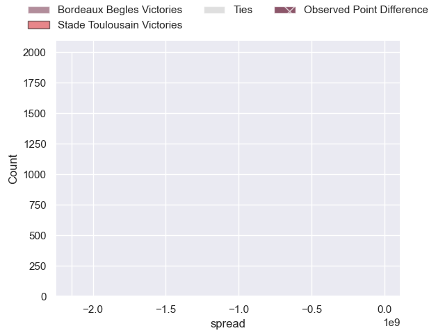

---  
layout: page  
title: Bordeaux Begles at Stade Toulousain; 16-12  
date: 2024-09-29 18:00:00 -0500  
categories: "Top 14 Orange 2024" match review  
---
# Bordeaux Begles at Stade Toulousain; 16-12

# Club Level Predictions

The first set of predictions treats a club as the smallest object, as the club develops its members, organizes a gameplan, and deploys its players as needed for each match. This club model has a prediction of 0.719, which translates to predicting Stade Toulousain to win by 8.3.

Our Over/Under is 45.5 - and combined with the spread above, we have a predicted scoreline of 19 to 27

Each club has a rating and a rating deviation (similar to a Glicko rating), and expected performances can be generated. This allows for simulated matches and spreads like the ones below.
## Projected Performances - Club Model

## Projected Spreads - Club Model

## Projected Results - Club Model

# Player Level Predictions

Treating teams instead as an entity made up of the currently active players, I have ratings for each player in an altogether different system. These can be combined to form team ratings once teamsheets are announced, weighting starters a bit higher than the reserves. After the match is played, players can be weighted by their minutes on the field, allowing for an accurate measure of the team's composition. With these compiled team ratings, we can make predictions, measure inaccuracy, and update the individual player ratings.
## Prediction without Player Minutes: Stade Toulousain by 18.4

Stade Toulousain by 10.8 on a neutral pitch

## Projected Performances - Player Model

## Projected Spreads - Player Model

## Projected Results - Player Model

|   Away Minutes | Away Player               |   Away Percentile |   Number |   Home Percentile | Home Player          |   Home Minutes |
|---------------:|:--------------------------|------------------:|---------:|------------------:|:---------------------|---------------:|
|             15 | Ugo Boniface              |            nan    |        1 |            nan    | David Ainu'u         |             33 |
|             65 | Romain Latterrade         |            nan    |        2 |            nan    | Julien Marchand      |             31 |
|             24 | Sipili Falatea            |            nan    |        3 |            nan    | Dorian Aldegheri     |             33 |
|             24 | Pierre Bochaton           |            nan    |        4 |            nan    | Thibaud Flament      |             23 |
|              4 | Jonny Gray                |            nan    |        5 |            nan    | Emmanuel Meafou      |             15 |
|             42 | Bastien Vergnes Taillefer |            nan    |        6 |            nan    | Francois Cros        |             47 |
|             24 | Pete Samu                 |            nan    |        7 |            nan    | Leo Banos            |             19 |
|             22 | Tevita Tatafu             |            nan    |        8 |            nan    | Alexandre Roumat     |             80 |
|             39 | Maxime Lucu               |            nan    |        9 |            nan    | Paul Graou           |             33 |
|             47 | Matthieu Jalibert         |            nan    |       10 |            nan    | Romain Ntamack       |             49 |
|             47 | Pablo Uberti              |            nan    |       11 |            nan    | Blair Kinghorn       |             61 |
|             80 | Rohan Janse Van Rensburg  |            nan    |       12 |            nan    | Pita Ahki            |             59 |
|             68 | Yoram Moefana             |            nan    |       13 |            nan    | Pierre-Louis Barassi |             63 |
|             61 | Arthur Retiere            |            nan    |       14 |            nan    | Ange Capuozzo        |             68 |
|             49 | Louis Bielle-Biarrey      |            nan    |       15 |            nan    | Thomas Ramos         |             47 |
|             61 | Maxime Lamothe            |            nan    |       16 |             97.69 | Peato Mauvaka        |             80 |
|             80 | Jefferson Poirot          |            nan    |       17 |            nan    | Rodrigue Neti        |             47 |
|             80 | Cyril Cazeaux             |            nan    |       18 |            nan    | Joshua Brennan       |             80 |
|             80 | Alexandre Ricard          |             63.12 |       19 |            nan    | Richie Arnold        |             58 |
|             80 | Temo Matiu                |            nan    |       20 |             98.63 | Anthony Jelonch      |             80 |
|             80 | Mateo Garcia              |             46.86 |       21 |            nan    | Naoto Saito          |             38 |
|             57 | Enzo Reybier              |             54.79 |       22 |            nan    | Dimitri Delibes      |             68 |
|             80 | Carlu Sadie               |            nan    |       23 |             82.59 | Joel Merkler         |             80 |

