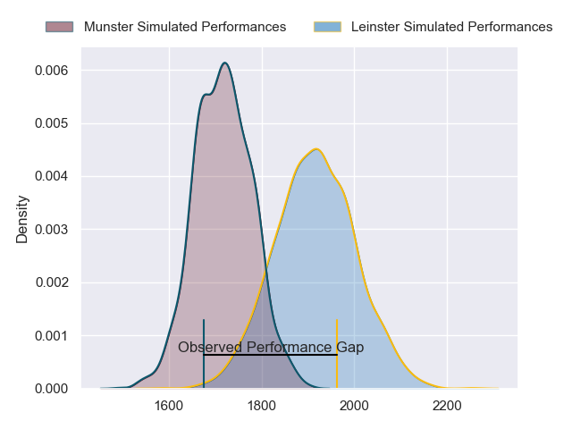
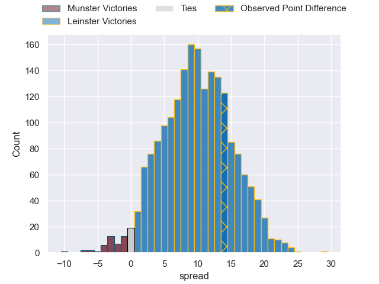
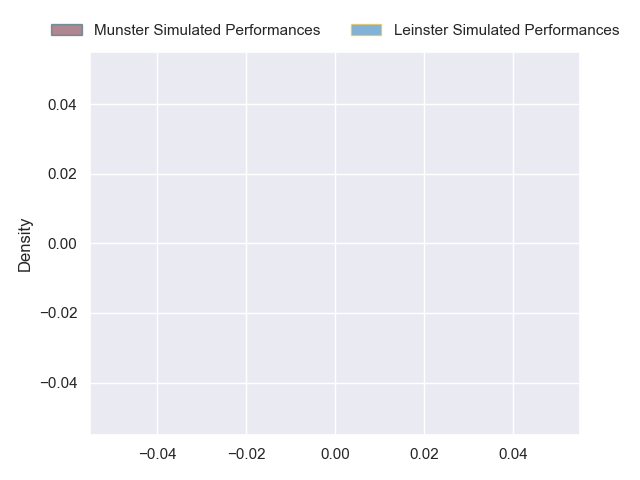
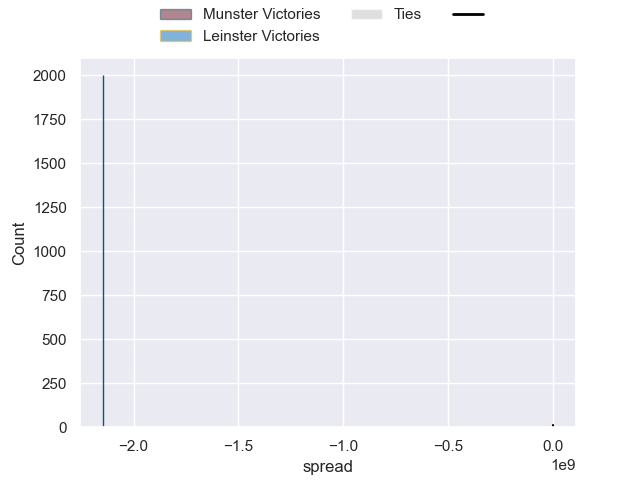

---  
layout: page  
title: Munster at Leinster; 12-26  
date: 2024-10-12 18:00:00 -0500  
categories: "United Rugby Championship 2024" match review  
---
# Munster at Leinster; 12-26

# Club Level Predictions

The first set of predictions treats a club as the smallest object, as the club develops its members, organizes a gameplan, and deploys its players as needed for each match. This club model has a prediction of 0.749, which translates to predicting Leinster to win by 9.7.

Our Over/Under is 39.5 - and combined with the spread above, we have a predicted scoreline of 15 to 25

Each club has a rating and a rating deviation (similar to a Glicko rating), and expected performances can be generated. This allows for simulated matches and spreads like the ones below.
## Projected Performances - Club Model

## Projected Spreads - Club Model

## Projected Results - Club Model

# Player Level Predictions

Treating teams instead as an entity made up of the currently active players, I have ratings for each player in an altogether different system. These can be combined to form team ratings once teamsheets are announced, weighting starters a bit higher than the reserves. After the match is played, players can be weighted by their minutes on the field, allowing for an accurate measure of the team's composition. With these compiled team ratings, we can make predictions, measure inaccuracy, and update the individual player ratings.
## Prediction without Player Minutes: Leinster by 17.1

Leinster by 10.7 on a neutral pitch

## Projected Performances - Player Model

## Projected Spreads - Player Model

## Projected Results - Player Model

|   Away Minutes | Away Player     |   Away Percentile |   Number |   Home Percentile | Home Player         |   Home Minutes |
|---------------:|:----------------|------------------:|---------:|------------------:|:--------------------|---------------:|
|             20 | Jeremy Loughman |            nan    |        1 |            nan    | Andrew Porter       |             12 |
|             81 | Niall Scannell  |            nan    |        2 |            nan    | Lee Barron          |             29 |
|             81 | Stephen Archer  |            nan    |        3 |            nan    | Tadhg Furlong       |              2 |
|             67 | Jean Kleyn      |            nan    |        4 |            nan    | RG Snyman           |             61 |
|              6 | Tadhg Beirne    |            nan    |        5 |            nan    | James Ryan          |             70 |
|             56 | Jack O'Donoghue |            nan    |        6 |            nan    | Jack Conan          |             81 |
|             26 | John Hodnett    |            nan    |        7 |            nan    | Josh van der Flier  |             40 |
|             31 | Gavin Coombes   |            nan    |        8 |            nan    | Caelan Doris        |             69 |
|              8 | Craig Casey     |            nan    |        9 |            nan    | Jamison Gibson-Park |             81 |
|             35 | Jack Crowley    |            nan    |       10 |            nan    | Ciaran Frawley      |             40 |
|             35 | Sean O'Brien    |            nan    |       11 |            nan    | James Lowe          |             16 |
|             61 | Sean O'Brien    |            nan    |       11 |            nan    | James Lowe          |             16 |
|             61 | Sean O'Brien    |            nan    |       11 |            nan    | James Lowe          |             40 |
|             35 | Sean O'Brien    |            nan    |       11 |            nan    | James Lowe          |             40 |
|             69 | Alex Nankivell  |            nan    |       12 |            nan    | Jamie Osborne       |             81 |
|             81 | Tom Farrell     |            nan    |       13 |            nan    | Garry Ringrose      |             59 |
|             26 | Calvin Nash     |            nan    |       14 |            nan    | Liam Turner         |             81 |
|             81 | Mike Haley      |            nan    |       15 |            nan    | Hugo Keenan         |             56 |
|             82 | Diarmuid Barron |             93.41 |       16 |            nan    | Gus McCarthy        |             81 |
|             82 | Diarmuid Barron |             93.41 |       16 |            nan    | Gus McCarthy        |             61 |
|             81 | Kieran Ryan     |            nan    |       17 |            nan    | Cian Healy          |             75 |
|             22 | John Ryan       |            nan    |       18 |            nan    | Thomas Clarkson     |             81 |
|             56 | John Ryan       |            nan    |       18 |            nan    | Thomas Clarkson     |             81 |
|              4 | John Ryan       |            nan    |       18 |            nan    | Thomas Clarkson     |             81 |
|             78 | John Ryan       |            nan    |       18 |            nan    | Thomas Clarkson     |             81 |
|             22 | Thomas Ahern    |             62.24 |       19 |             92.2  | Ryan Baird          |             12 |
|             56 | Ruadhan Quinn   |            nan    |       20 |            nan    | Max Deegan          |              5 |
|              1 | Conor Murray    |             99.37 |       21 |            nan    | Luke McGrath        |             50 |
|             26 | Tony Butler     |            nan    |       22 |            nan    | Ross Byrne          |              9 |
|             25 | Shay McCarthy   |            nan    |       23 |             90.56 | Harry Byrne         |             81 |

