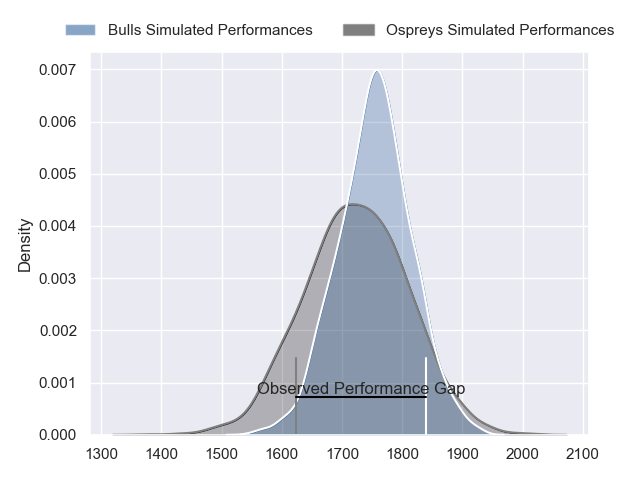
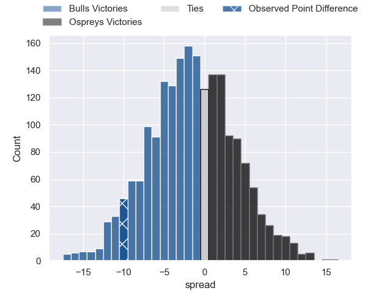
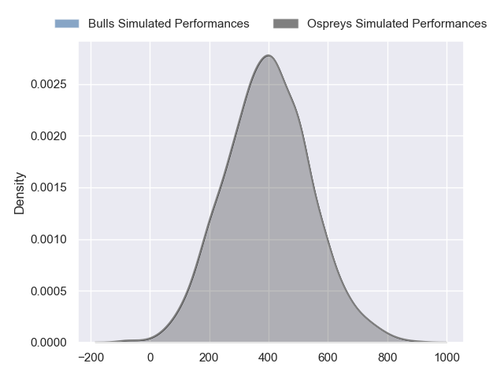
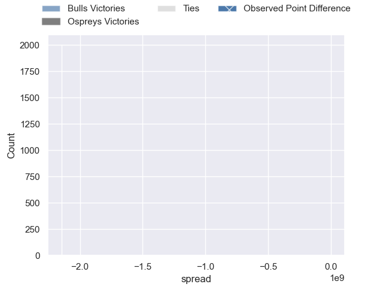

---  
layout: page  
title: Bulls at Ospreys; 29-19  
date: 2024-10-12 18:00:00 -0500  
categories: "United Rugby Championship 2024" match review  
---
# Bulls at Ospreys; 29-19

# Club Level Predictions

The first set of predictions treats a club as the smallest object, as the club develops its members, organizes a gameplan, and deploys its players as needed for each match. This club model has a prediction of 0.453, which translates to predicting Bulls to win by 1.7.

Our Over/Under is 57.5 - and combined with the spread above, we have a predicted scoreline of 29 to 28

Each club has a rating and a rating deviation (similar to a Glicko rating), and expected performances can be generated. This allows for simulated matches and spreads like the ones below.
## Projected Performances - Club Model

## Projected Spreads - Club Model

## Projected Results - Club Model

# Player Level Predictions

Treating teams instead as an entity made up of the currently active players, I have ratings for each player in an altogether different system. These can be combined to form team ratings once teamsheets are announced, weighting starters a bit higher than the reserves. After the match is played, players can be weighted by their minutes on the field, allowing for an accurate measure of the team's composition. With these compiled team ratings, we can make predictions, measure inaccuracy, and update the individual player ratings.
## Prediction without Player Minutes: Bulls by 0.7

Bulls by 6.6 on a neutral pitch

## Projected Performances - Player Model

## Projected Spreads - Player Model

## Projected Results - Player Model

|   Away Minutes | Away Player         |   Away Percentile |   Number |   Home Percentile | Home Player            |   Home Minutes |
|---------------:|:--------------------|------------------:|---------:|------------------:|:-----------------------|---------------:|
|             82 | Gerhard Steenekamp  |            nan    |        1 |            nan    | Gareth Thomas          |             82 |
|             64 | Johan Grobbelaar    |            nan    |        2 |            nan    | Dewi Lake              |             82 |
|             53 | Wilco Louw          |            nan    |        3 |            nan    | Tom Botha              |             26 |
|             30 | Ruan Vermaak        |            nan    |        4 |            nan    | James Ratti            |             78 |
|             29 | Ruan Nortje         |            nan    |        5 |            nan    | Adam Beard             |              0 |
|             19 | Marcell Coetzee     |            nan    |        6 |            nan    | Jac Morgan             |             52 |
|             80 | Reinhardt Ludwig    |             85.4  |        7 |            nan    | Justin Tipuric         |             82 |
|             80 | Elrigh Louw         |            nan    |        8 |            nan    | Morgan Morris          |             82 |
|             33 | Embrose Papier      |            nan    |        9 |            nan    | Reuben Morgan-Williams |             57 |
|              0 | Boeta Chamberlain   |            nan    |       10 |            nan    | Dan Edwards            |             82 |
|              0 | Kurt-Lee Arendse    |            nan    |       11 |            nan    | Ryan Conbeer           |             82 |
|             29 | David Kriel         |            nan    |       12 |            nan    | Keiran Williams        |             26 |
|             18 | Canan Moodie        |            nan    |       13 |            nan    | Owen Watkin            |             60 |
|             33 | Sebastian de Klerk  |            nan    |       14 |            nan    | Luke Morgan            |             70 |
|             47 | Willie le Roux      |            nan    |       15 |            nan    | Max Nagy               |             12 |
|             33 | Akker van der Merwe |            nan    |       16 |             77.84 | Sam Parry              |             82 |
|             33 | Alulutho Tshakweni  |            nan    |       17 |             71.3  | Garyn Phillips         |             57 |
|             71 | Francois Klopper    |            nan    |       18 |            nan    | Ben Warren             |             82 |
|             71 | Cobus Wiese         |            nan    |       19 |            nan    | Lewis Jones            |             82 |
|             71 | Cameron Hanekom     |            nan    |       20 |            nan    | William Greatbanks     |             78 |
|             71 | Keagan Johannes     |            nan    |       21 |             78.68 | Kieran Hardy           |             82 |
|             80 | Stedman Gans        |            nan    |       22 |            nan    | Luke Scully            |             82 |
|             82 | Aphiwe Dyantyi      |              9.31 |       23 |             57.64 | Jack Walsh             |             82 |
|             82 | Aphiwe Dyantyi      |              9.31 |       23 |             57.64 | Jack Walsh             |             26 |

