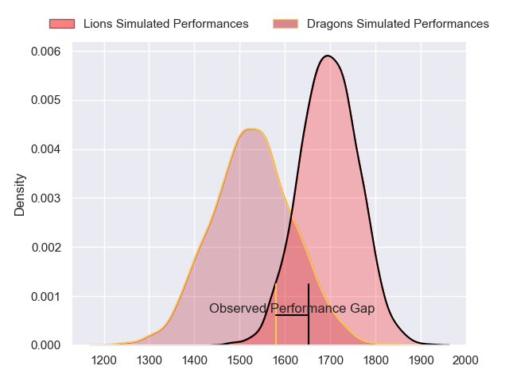
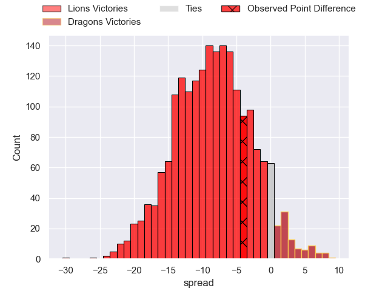
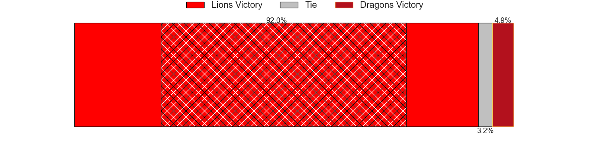
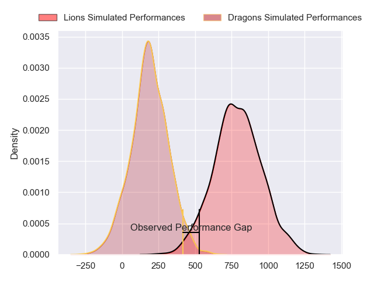
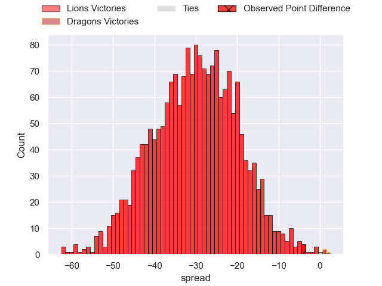
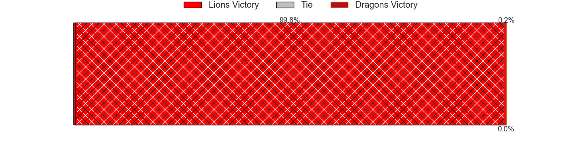

---  
layout: page  
title: Lions at Dragons; 23-19  
date: 2024-10-13 18:00:00 -0500  
categories: "United Rugby Championship 2024" match review  
---
# Lions at Dragons; 23-19

# Club Level Predictions

The first set of predictions treats a club as the smallest object, as the club develops its members, organizes a gameplan, and deploys its players as needed for each match. This club model has a prediction of 0.279, which translates to predicting Lions to win by 8.4.

Our Over/Under is 54.5 - and combined with the spread above, we have a predicted scoreline of 32 to 23

Each club has a rating and a rating deviation (similar to a Glicko rating), and expected performances can be generated. This allows for simulated matches and spreads like the ones below.
## Projected Performances - Club Model

## Projected Spreads - Club Model

## Projected Results - Club Model

# Player Level Predictions

Treating teams instead as an entity made up of the currently active players, I have ratings for each player in an altogether different system. These can be combined to form team ratings once teamsheets are announced, weighting starters a bit higher than the reserves. After the match is played, players can be weighted by their minutes on the field, allowing for an accurate measure of the team's composition. With these compiled team ratings, we can make predictions, measure inaccuracy, and update the individual player ratings.
## Prediction without Player Minutes: Lions by 17.5

Lions by 23.6 on a neutral pitch

## Projected Performances - Player Model

## Projected Spreads - Player Model

## Projected Results - Player Model

|   Away Minutes | Away Player            |   Away Percentile |   Number |   Home Percentile | Home Player        |   Home Minutes |
|---------------:|:-----------------------|------------------:|---------:|------------------:|:-------------------|---------------:|
|             82 | Juan Schoeman          |            nan    |        1 |            nan    | Rodrigo Martinez   |             44 |
|             17 | Franco Marais          |            nan    |        2 |            nan    | Brodie Coghlan     |             81 |
|             58 | Asenathi Ntlabakanye   |            nan    |        3 |             69.08 | Leon Brown         |             81 |
|             29 | Reinhard Nothnagel     |            nan    |        4 |            nan    | Ben Carter         |             56 |
|             50 | Darrien-Lane Landsberg |            nan    |        5 |            nan    | Matthew Screech    |             81 |
|             82 | JC Pretorius           |            nan    |        6 |            nan    | Shane Lewis-Hughes |             82 |
|             67 | Jarod Cairns           |            nan    |        7 |              1.8  | Harrison Keddie    |             55 |
|             82 | Francke Horn           |            nan    |        8 |            nan    | Taine Basham       |             60 |
|             57 | Morne van den Berg     |            nan    |        9 |            nan    | Rhodri Williams    |             81 |
|              8 | Morne van den Berg     |            nan    |        9 |            nan    | Rhodri Williams    |             81 |
|             38 | Morne van den Berg     |            nan    |        9 |            nan    | Rhodri Williams    |             81 |
|             82 | Morne van den Berg     |            nan    |        9 |            nan    | Rhodri Williams    |             81 |
|             58 | Nico Steyn             |             36.91 |       10 |            nan    | Lloyd Evans        |             81 |
|             82 | Edwill van der Merwe   |            nan    |       11 |             67.53 | Ewan Rosser        |             70 |
|             25 | Rynhardt Jonker        |            nan    |       12 |            nan    | Aneurin Owen       |             81 |
|             35 | Erich Cronje           |            nan    |       13 |            nan    | Joe Westwood       |             58 |
|             12 | Rabz Maxwane           |            nan    |       14 |            nan    | Rio Dyer           |             32 |
|             27 | Rabz Maxwane           |            nan    |       14 |            nan    | Rio Dyer           |             32 |
|             33 | Quan Horn              |            nan    |       15 |            nan    | Angus O'Brien      |             19 |
|             47 | PJ Botha               |             88.62 |       16 |            nan    | Oli Burrows        |             70 |
|             82 | Heiko Pohlmann         |            nan    |       17 |            nan    | Cameron Jones      |             82 |
|             82 | Conraad van Vuuren     |             55.47 |       18 |            nan    | Chris Coleman      |             22 |
|             55 | Ruben Schoeman         |             96.15 |       19 |             52.8  | Ryan Woodman       |             53 |
|             63 | Renzo Du Plessis       |            nan    |       20 |            nan    | Dan Lydiate        |             27 |
|             82 | Sanele Nohamba         |             95.92 |       21 |             13.17 | Dane Blacker       |             81 |
|             82 | Marius Louw            |             98.02 |       22 |             30.47 | Will Reed          |             81 |
|             26 | Henco van Wyk          |             81.98 |       23 |            nan    | Harry Wilson       |             70 |

