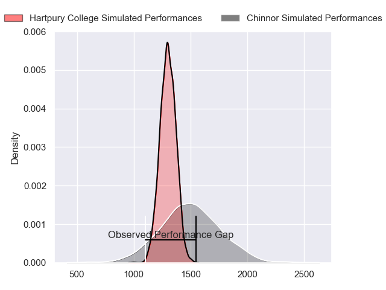
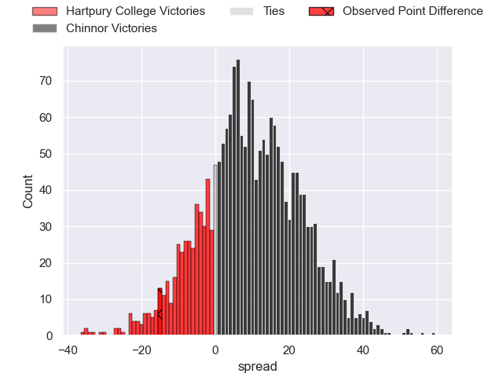

---  
layout: page  
title: Hartpury College at Chinnor; 34-19  
date: 2024-10-19 18:00:00 -0500  
categories: "RFU Championship 2024" match review  
---
# Hartpury College at Chinnor; 34-19

# Club Level Predictions

The first set of predictions treats a club as the smallest object, as the club develops its members, organizes a gameplan, and deploys its players as needed for each match. This club model has a prediction of 0.745, which translates to predicting Chinnor to win by 9.5.

Our Over/Under is 51.5 - and combined with the spread above, we have a predicted scoreline of 21 to 31

Each club has a rating and a rating deviation (similar to a Glicko rating), and expected performances can be generated. This allows for simulated matches and spreads like the ones below.
## Projected Performances - Club Model

## Projected Spreads - Club Model

## Projected Results - Club Model

