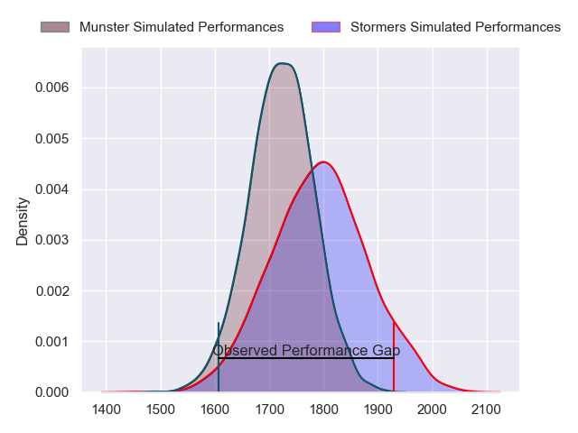
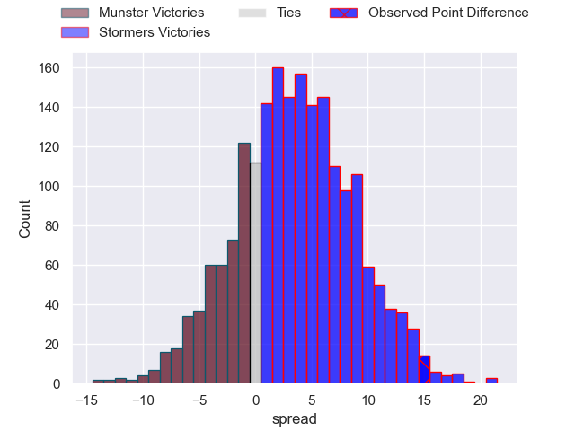
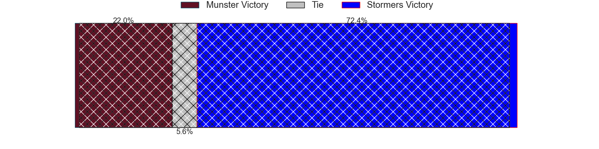
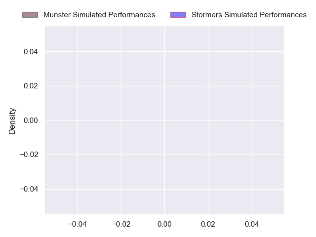
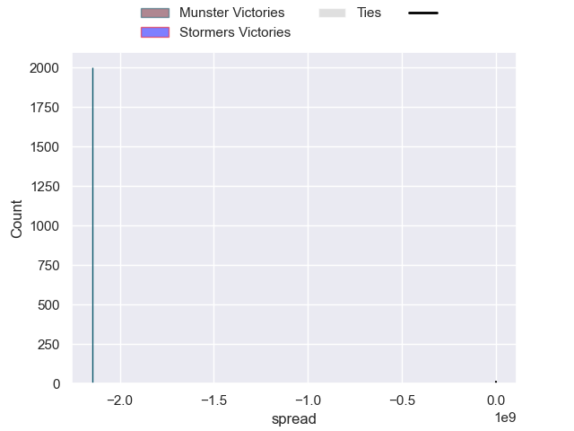

---  
layout: page  
title: Munster at Stormers; 19-34  
date: 2024-10-19 18:00:00 -0500  
categories: "United Rugby Championship 2024" match review  
---
# Munster at Stormers; 19-34

# Club Level Predictions

The first set of predictions treats a club as the smallest object, as the club develops its members, organizes a gameplan, and deploys its players as needed for each match. This club model has a prediction of 0.6, which translates to predicting Stormers to win by 3.6.

Our Over/Under is 37.5 - and combined with the spread above, we have a predicted scoreline of 17 to 21

Each club has a rating and a rating deviation (similar to a Glicko rating), and expected performances can be generated. This allows for simulated matches and spreads like the ones below.
## Projected Performances - Club Model

## Projected Spreads - Club Model

## Projected Results - Club Model

# Player Level Predictions

Treating teams instead as an entity made up of the currently active players, I have ratings for each player in an altogether different system. These can be combined to form team ratings once teamsheets are announced, weighting starters a bit higher than the reserves. After the match is played, players can be weighted by their minutes on the field, allowing for an accurate measure of the team's composition. With these compiled team ratings, we can make predictions, measure inaccuracy, and update the individual player ratings.
## Prediction without Player Minutes: Munster by 2.0

Munster by 6.7 on a neutral pitch

## Projected Performances - Player Model

## Projected Spreads - Player Model

## Projected Results - Player Model

|   Away Minutes | Away Player      |   Away Percentile |   Number |   Home Percentile | Home Player          |   Home Minutes |
|---------------:|:-----------------|------------------:|---------:|------------------:|:---------------------|---------------:|
|             31 | Jeremy Loughman  |               nan |        1 |            nan    | Sti Sithole          |             50 |
|             31 | Jeremy Loughman  |               nan |        1 |            nan    | Sti Sithole          |             20 |
|             31 | Jeremy Loughman  |               nan |        1 |            nan    | Sti Sithole          |             81 |
|             51 | Niall Scannell   |               nan |        2 |            nan    | Joseph Dweba         |             84 |
|             84 | John Ryan        |               nan |        3 |            nan    | Neethling Fouche     |             41 |
|             73 | John Ryan        |               nan |        3 |            nan    | Neethling Fouche     |             41 |
|             84 | Jean Kleyn       |               nan |        4 |            nan    | Adre Smith           |             41 |
|             49 | Tadhg Beirne     |               nan |        5 |            nan    | JD Schickerling      |             31 |
|             24 | Thomas Ahern     |               nan |        6 |            nan    | Marcel Theunissen    |             84 |
|             49 | Alex Kendellen   |               nan |        7 |            nan    | Ben-Jason Dixon      |             41 |
|             84 | Jack O'Donoghue  |               nan |        8 |            nan    | Keketso Morabe       |             84 |
|             35 | Conor Murray     |               nan |        9 |            nan    | Paul de Wet          |             29 |
|             84 | Jack Crowley     |               nan |       10 |            nan    | Damian Willemse      |             61 |
|             84 | Shane Daly       |               nan |       11 |            nan    | Leolin Zas           |             64 |
|             11 | Shane Daly       |               nan |       11 |            nan    | Leolin Zas           |             64 |
|              5 | Sean O'Brien     |               nan |       12 |            nan    | Daniel du Plessis    |             50 |
|             58 | Sean O'Brien     |               nan |       12 |            nan    | Daniel du Plessis    |             50 |
|             36 | Sean O'Brien     |               nan |       12 |            nan    | Daniel du Plessis    |             50 |
|             73 | Sean O'Brien     |               nan |       12 |            nan    | Daniel du Plessis    |             50 |
|             60 | Sean O'Brien     |               nan |       12 |            nan    | Daniel du Plessis    |             50 |
|             52 | Sean O'Brien     |               nan |       12 |            nan    | Daniel du Plessis    |             50 |
|             33 | Tom Farrell      |               nan |       13 |            nan    | Ruhan Nel            |             14 |
|              0 | Calvin Nash      |               nan |       14 |            nan    | Suleiman Hartzenberg |             11 |
|             33 | Mike Haley       |               nan |       15 |            nan    | Warrick Gelant       |             32 |
|             49 | Eoghan Clarke    |               nan |       16 |            nan    | Andre-Hugo Venter    |             51 |
|             43 | Kieran Ryan      |               nan |       17 |            nan    | Brok Harris          |             84 |
|             84 | Stephen Archer   |               nan |       18 |             15.33 | Sazi Sandi           |             74 |
|             84 | Fineen Wycherley |               nan |       19 |            nan    | Ruben van Heerden    |             84 |
|             84 | Ruadhan Quinn    |               nan |       20 |            nan    | Dave Ewers           |             41 |
|             79 | Ethan Coughlan   |               nan |       21 |            nan    | Louw Nel             |             17 |
|             55 | Billy Burns      |               nan |       22 |             94.17 | Herschel Jantjies    |             81 |
|              0 | Gavin Coombes    |               nan |       23 |            nan    | Jurie Matthee        |             31 |

