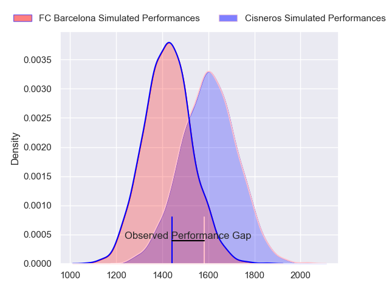
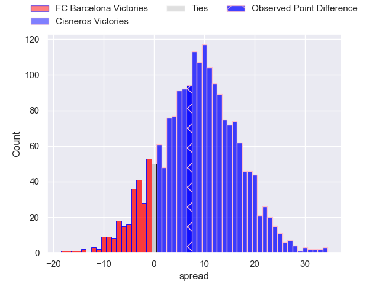
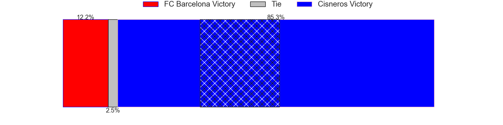
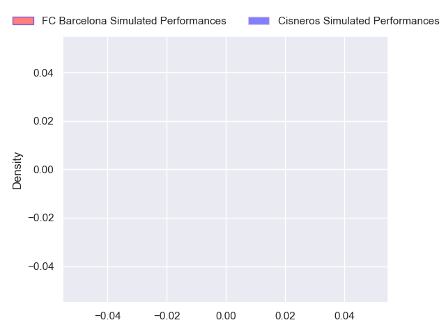
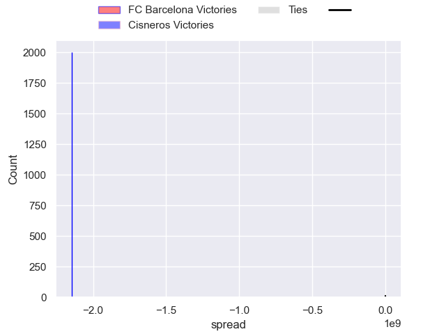

---  
layout: page  
title: FC Barcelona at Cisneros; 20-27  
date: 2024-10-20 18:00:00 -0500  
categories: "Division de Honor de Rugby 2024" match review  
---
# FC Barcelona at Cisneros; 20-27

# Club Level Predictions

The first set of predictions treats a club as the smallest object, as the club develops its members, organizes a gameplan, and deploys its players as needed for each match. This club model has a prediction of 0.72, which translates to predicting Cisneros to win by 8.6.

Our Over/Under is 57.5 - and combined with the spread above, we have a predicted scoreline of 25 to 33

Each club has a rating and a rating deviation (similar to a Glicko rating), and expected performances can be generated. This allows for simulated matches and spreads like the ones below.
## Projected Performances - Club Model

## Projected Spreads - Club Model

## Projected Results - Club Model

# Player Level Predictions

Treating teams instead as an entity made up of the currently active players, I have ratings for each player in an altogether different system. These can be combined to form team ratings once teamsheets are announced, weighting starters a bit higher than the reserves. After the match is played, players can be weighted by their minutes on the field, allowing for an accurate measure of the team's composition. With these compiled team ratings, we can make predictions, measure inaccuracy, and update the individual player ratings.
## Prediction without Player Minutes: FC Barcelona by 0.3

FC Barcelona by 3.4 on a neutral pitch

## Projected Performances - Player Model

## Projected Spreads - Player Model

## Projected Results - Player Model

|   Away Minutes | Away Player                    |   Away Percentile |   Number |   Home Percentile | Home Player             |   Home Minutes |
|---------------:|:-------------------------------|------------------:|---------:|------------------:|:------------------------|---------------:|
|             51 | Goga Turiashvili               |               nan |        1 |            nan    | Nicolas Fernandez-Duran |             80 |
|             30 | Shota Tlashadze                |               nan |        2 |            nan    | Gonzalo Gonzalez        |             81 |
|             29 | Sergio Cetti                   |               nan |        3 |            nan    | Andres Vallejo          |             52 |
|             27 | Pedro Maximiliano Alonso Perez |               nan |        4 |            nan    | Jorge Gonzalez          |             81 |
|             25 | Rochedi Mirabet                |               nan |        5 |            nan    | Pablo Riva Boal         |             81 |
|              6 | Lucas Santipolo                |               nan |        6 |            nan    | Juan Ozonas             |             57 |
|             80 | Gerson Ortiz                   |               nan |        7 |            nan    | Robert Edginton         |             62 |
|             14 | Ramiro Robledo                 |               nan |        8 |            nan    | Manex Pujana Lendinez   |             55 |
|             80 | Adria Bonell                   |               nan |        9 |            nan    | Ike Irusta              |             80 |
|             71 | Santiago Mansilla              |               nan |       10 |            nan    | Gonzalo Vinuesa         |             80 |
|             81 | Felipe Alegria Haines          |               nan |       11 |            nan    | Miguel Perez            |             53 |
|             66 | Pau Aira Rebollo               |               nan |       12 |            nan    | Nicolas Petros          |             80 |
|             59 | Daniel Barranco                |               nan |       13 |            nan    | Juan Fonseca            |             74 |
|             18 | Valentino Cinti                |               nan |       14 |            nan    | Yako Irusta             |             59 |
|             80 | Arthur Carpentier              |               nan |       15 |            nan    | Francisco Soriano       |             52 |
|             80 | Xavier Cebrian                 |               nan |       16 |            nan    | Jose Ramon Borraz       |             80 |
|             14 | David Capdeferro Llanas        |               nan |       17 |            nan    | Pablo Flores            |             81 |
|             12 | Theodore Nwosu-Hope            |               nan |       18 |             75.38 | Andres Petros           |             73 |
|             21 | Marcel Peña                    |               nan |       19 |            nan    | Adrian Plaza Pegueroles |             80 |
|             71 | Francisco Uriarte              |               nan |       20 |            nan    | Guillermo Espinos       |             12 |
|             29 | Nicolas Borrazas               |               nan |       21 |            nan    | Daniel Sacristan        |             21 |
|             61 | Juan Facundo Czop              |               nan |       22 |            nan    | Rafael Medina           |              8 |
|             21 | Juan Zas Bustingorri           |               nan |       23 |            nan    | Lucas Nicolas Armani    |             65 |

