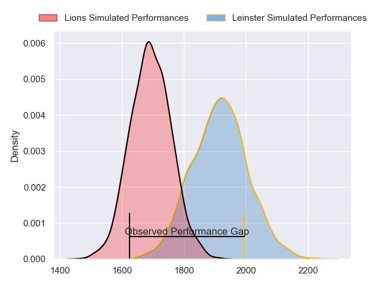
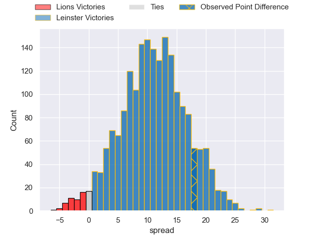
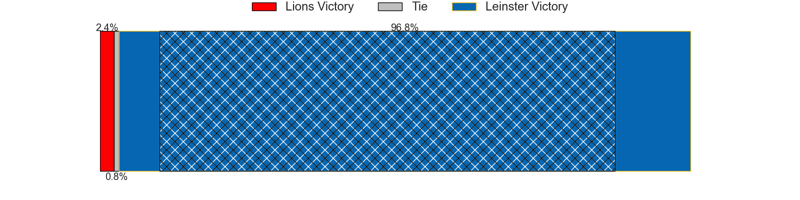
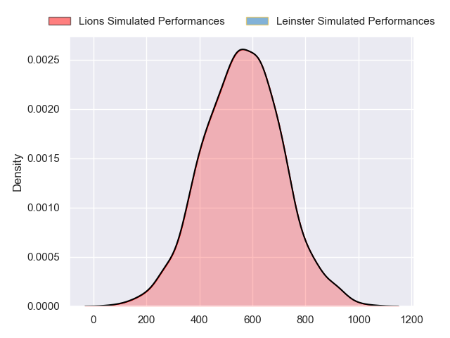
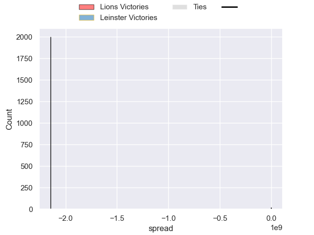
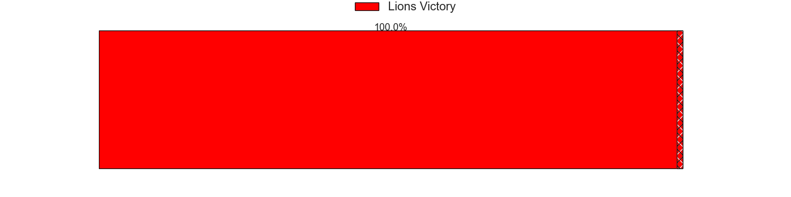

---  
layout: page  
title: Lions at Leinster; 6-24  
date: 2024-10-26 18:00:00 -0500  
categories: "United Rugby Championship 2024" match review  
---
# Lions at Leinster; 6-24

# Club Level Predictions

The first set of predictions treats a club as the smallest object, as the club develops its members, organizes a gameplan, and deploys its players as needed for each match. This club model has a prediction of 0.775, which translates to predicting Leinster to win by 11.0.

Our Over/Under is 52.5 - and combined with the spread above, we have a predicted scoreline of 21 to 32

Each club has a rating and a rating deviation (similar to a Glicko rating), and expected performances can be generated. This allows for simulated matches and spreads like the ones below.
## Projected Performances - Club Model

## Projected Spreads - Club Model

## Projected Results - Club Model

# Player Level Predictions

Treating teams instead as an entity made up of the currently active players, I have ratings for each player in an altogether different system. These can be combined to form team ratings once teamsheets are announced, weighting starters a bit higher than the reserves. After the match is played, players can be weighted by their minutes on the field, allowing for an accurate measure of the team's composition. With these compiled team ratings, we can make predictions, measure inaccuracy, and update the individual player ratings.
## Prediction without Player Minutes: Leinster by 31.1

Leinster by 24.8 on a neutral pitch

## Projected Performances - Player Model

## Projected Spreads - Player Model

## Projected Results - Player Model

|   Away Minutes | Away Player          |   Away Percentile |   Number |   Home Percentile | Home Player        |   Home Minutes |
|---------------:|:---------------------|------------------:|---------:|------------------:|:-------------------|---------------:|
|             22 | Juan Schoeman        |            nan    |        1 |            nan    | Michael Milne      |             16 |
|             82 | PJ Botha             |            nan    |        2 |            nan    | Gus McCarthy       |             14 |
|             82 | PJ Botha             |            nan    |        2 |            nan    | Gus McCarthy       |             81 |
|             82 | PJ Botha             |            nan    |        2 |            nan    | Gus McCarthy       |             67 |
|             82 | PJ Botha             |            nan    |        2 |            nan    | Gus McCarthy       |             32 |
|             70 | Asenathi Ntlabakanye |            nan    |        3 |            nan    | Rabah Slimani      |             18 |
|             70 | Asenathi Ntlabakanye |            nan    |        3 |            nan    | Rabah Slimani      |             36 |
|             70 | Asenathi Ntlabakanye |            nan    |        3 |            nan    | Rabah Slimani      |             82 |
|             82 | Ruben Schoeman       |            nan    |        4 |            nan    | RG Snyman          |             24 |
|             14 | Ruben Schoeman       |            nan    |        4 |            nan    | RG Snyman          |             24 |
|             82 | Reinhard Nothnagel   |            nan    |        5 |            nan    | Ryan Baird         |             62 |
|             46 | JC Pretorius         |            nan    |        6 |            nan    | Max Deegan         |             79 |
|             82 | Jarod Cairns         |            nan    |        7 |            nan    | Josh van der Flier |             12 |
|             82 | Francke Horn         |            nan    |        8 |            nan    | Caelan Doris       |             79 |
|             14 | Morne van den Berg   |            nan    |        9 |            nan    | Luke McGrath       |             81 |
|             12 | Morne van den Berg   |            nan    |        9 |            nan    | Luke McGrath       |             81 |
|             71 | Morne van den Berg   |            nan    |        9 |            nan    | Luke McGrath       |             81 |
|             22 | Morne van den Berg   |            nan    |        9 |            nan    | Luke McGrath       |             81 |
|             14 | Kade Wolhuter        |            nan    |       10 |            nan    | Sam Prendergast    |             57 |
|             22 | Edwill van der Merwe |            nan    |       11 |            nan    | James Lowe         |             70 |
|             22 | Edwill van der Merwe |            nan    |       11 |            nan    | James Lowe         |             79 |
|             22 | Edwill van der Merwe |            nan    |       11 |            nan    | James Lowe         |             82 |
|             22 | Edwill van der Merwe |            nan    |       11 |            nan    | James Lowe         |             49 |
|             60 | Rynhardt Jonker      |            nan    |       12 |             90.36 | Robbie Henshaw     |             68 |
|             70 | Henco van Wyk        |            nan    |       13 |            nan    | Hugh Cooney        |             64 |
|             82 | Richard Kriel        |            nan    |       14 |            nan    | Andrew Osborne     |             46 |
|              3 | Quan Horn            |            nan    |       15 |            nan    | Hugo Keenan        |             79 |
|              3 | Franco Marais        |            nan    |       16 |            nan    | Stephen Smyth      |             82 |
|             82 | Heiko Pohlmann       |            nan    |       17 |            nan    | Andrew Porter      |             64 |
|             36 | RF Schoeman          |            nan    |       18 |            nan    | Thomas Clarkson    |             82 |
|             82 | Ruan Delport         |             69.61 |       19 |            nan    | Brian Deeny        |             18 |
|             46 | Renzo Du Plessis     |            nan    |       20 |            nan    | James Culhane      |             70 |
|             46 | Sanele Nohamba       |            nan    |       21 |             60.26 | Cormac Foley       |             69 |
|             46 | Marius Louw          |            nan    |       22 |            nan    | Ross Byrne         |             79 |
|             11 | Erich Cronje         |            nan    |       23 |            nan    | Charlie Tector     |              0 |

