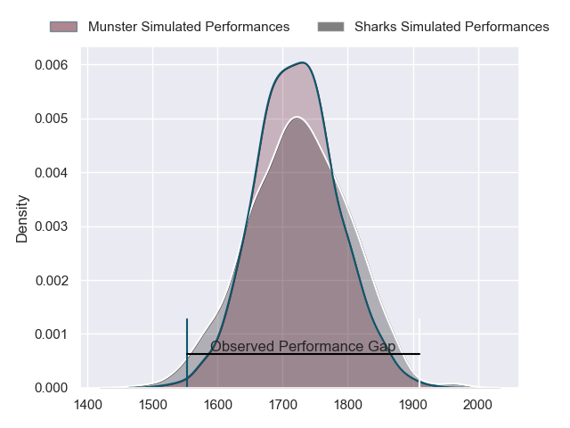
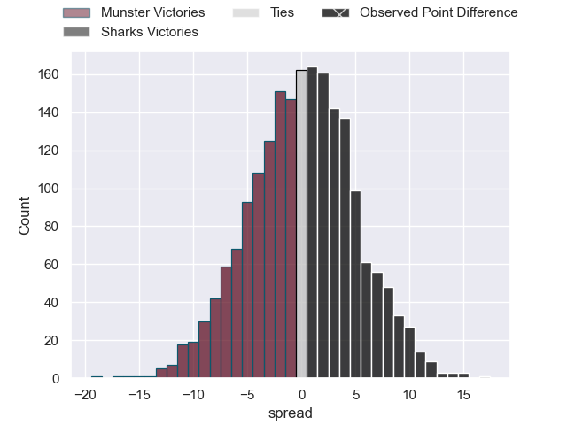
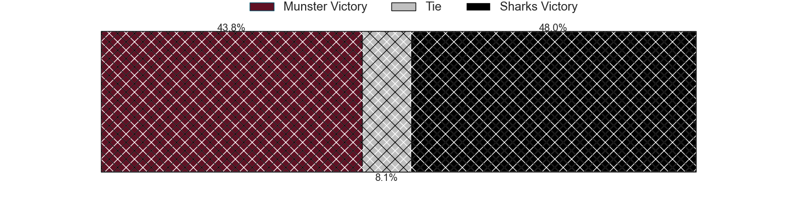
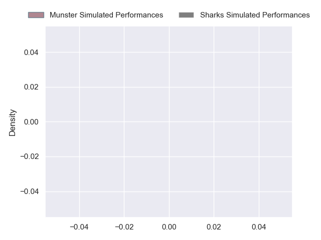
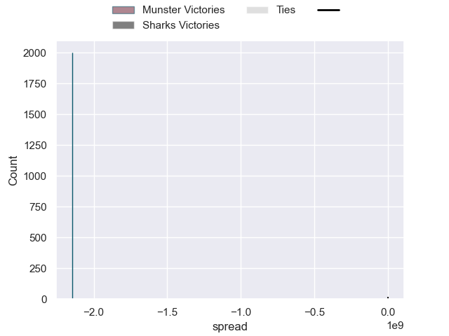

---  
layout: page  
title: Munster at Sharks; 24-41  
date: 2024-10-26 18:00:00 -0500  
categories: "United Rugby Championship 2024" match review  
---
# Munster at Sharks; 24-41

# Club Level Predictions

The first set of predictions treats a club as the smallest object, as the club develops its members, organizes a gameplan, and deploys its players as needed for each match. This club model has a prediction of 0.504, which translates to predicting Sharks to win by 0.1.

Our Over/Under is 47.5 - and combined with the spread above, we have a predicted scoreline of 23 to 24

Each club has a rating and a rating deviation (similar to a Glicko rating), and expected performances can be generated. This allows for simulated matches and spreads like the ones below.
## Projected Performances - Club Model

## Projected Spreads - Club Model

## Projected Results - Club Model

# Player Level Predictions

Treating teams instead as an entity made up of the currently active players, I have ratings for each player in an altogether different system. These can be combined to form team ratings once teamsheets are announced, weighting starters a bit higher than the reserves. After the match is played, players can be weighted by their minutes on the field, allowing for an accurate measure of the team's composition. With these compiled team ratings, we can make predictions, measure inaccuracy, and update the individual player ratings.
## Prediction without Player Minutes: Munster by 27.6

Munster by 32.1 on a neutral pitch

## Projected Performances - Player Model

## Projected Spreads - Player Model

## Projected Results - Player Model

|   Away Minutes | Away Player      |   Away Percentile |   Number |   Home Percentile | Home Player       |   Home Minutes |
|---------------:|:-----------------|------------------:|---------:|------------------:|:------------------|---------------:|
|             82 | John Ryan        |            nan    |        1 |            nan    | Ox Nche           |             68 |
|             82 | Niall Scannell   |            nan    |        2 |            nan    | Bongi Mbonambi    |             82 |
|             70 | Stephen Archer   |            nan    |        3 |            nan    | Vincent Koch      |             82 |
|             75 | Jean Kleyn       |            nan    |        4 |            nan    | Eben Etzebeth     |             61 |
|             56 | Tadhg Beirne     |            nan    |        5 |            nan    | Emile van Heerden |             53 |
|             87 | Thomas Ahern     |            nan    |        6 |            nan    | James Venter      |             21 |
|             26 | John Hodnett     |            nan    |        7 |            nan    | Vincent Tshituka  |             87 |
|             20 | Jack O'Donoghue  |            nan    |        8 |            nan    | Siya Kolisi       |             87 |
|             82 | Craig Casey      |            nan    |        9 |            nan    | Grant Williams    |             20 |
|             82 | Jack Crowley     |            nan    |       10 |            nan    | Jordan Hendrikse  |             82 |
|             62 | Sean O'Brien     |            nan    |       11 |            nan    | Makazole Mapimpi  |             60 |
|             27 | Sean O'Brien     |            nan    |       11 |            nan    | Makazole Mapimpi  |             60 |
|             10 | Sean O'Brien     |            nan    |       11 |            nan    | Makazole Mapimpi  |             60 |
|             82 | Sean O'Brien     |            nan    |       11 |            nan    | Makazole Mapimpi  |             60 |
|             55 | Sean O'Brien     |            nan    |       11 |            nan    | Makazole Mapimpi  |             60 |
|             59 | Sean O'Brien     |            nan    |       11 |            nan    | Makazole Mapimpi  |             60 |
|             38 | Sean O'Brien     |            nan    |       11 |            nan    | Makazole Mapimpi  |             60 |
|             81 | Sean O'Brien     |            nan    |       11 |            nan    | Makazole Mapimpi  |             60 |
|             59 | Rory Scannell    |            nan    |       12 |            nan    | Andre Esterhuizen |             62 |
|             10 | Tom Farrell      |            nan    |       13 |            nan    | Lukhanyo Am       |             81 |
|             87 | Calvin Nash      |            nan    |       14 |            nan    | Eduan Keyter      |             62 |
|             62 | Mike Haley       |            nan    |       15 |            nan    | Aphelele Fassi    |             81 |
|             20 | Diarmuid Barron  |             94.48 |       16 |            nan    | Fez Mbatha        |             87 |
|             10 | Kieran Ryan      |            nan    |       17 |            nan    | Ntuthuko Mchunu   |             34 |
|             10 | Kieran Ryan      |            nan    |       17 |            nan    | Ntuthuko Mchunu   |             87 |
|             10 | Kieran Ryan      |            nan    |       17 |            nan    | Ntuthuko Mchunu   |             50 |
|             10 | Kieran Ryan      |            nan    |       17 |            nan    | Ntuthuko Mchunu   |             26 |
|             51 | Ronan Foxe       |            nan    |       18 |            nan    | Trevor Nyakane    |             68 |
|             20 | Fineen Wycherley |            nan    |       19 |            nan    | Jason Jenkins     |             82 |
|             20 | Ruadhan Quinn    |            nan    |       20 |            nan    | Phepsi Buthelezi  |             50 |
|             33 | Ethan Coughlan   |            nan    |       21 |            nan    | Jaden Hendrikse   |             20 |
|             14 | Billy Burns      |            nan    |       22 |            nan    | Siya Masuku       |             82 |
|             22 | Alex Kendellen   |            nan    |       23 |             75.89 | Francois Venter   |             62 |

