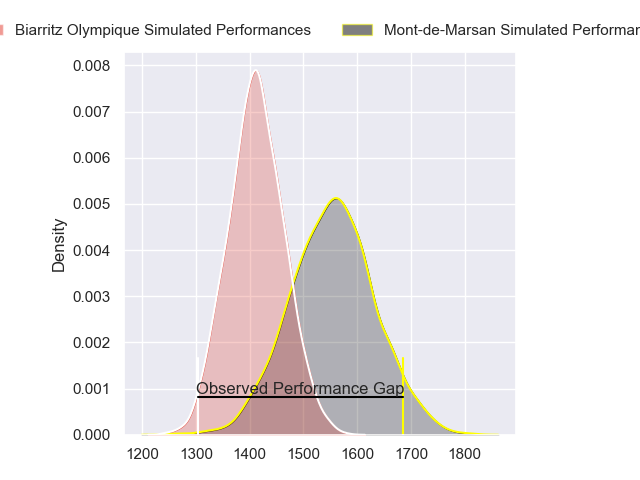
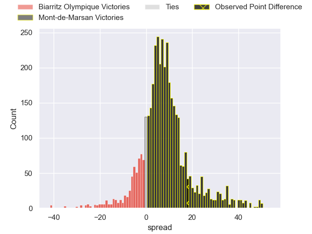
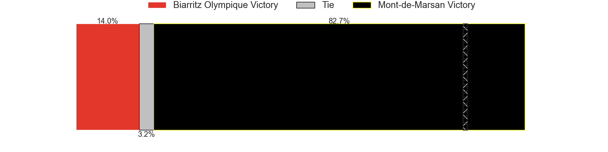
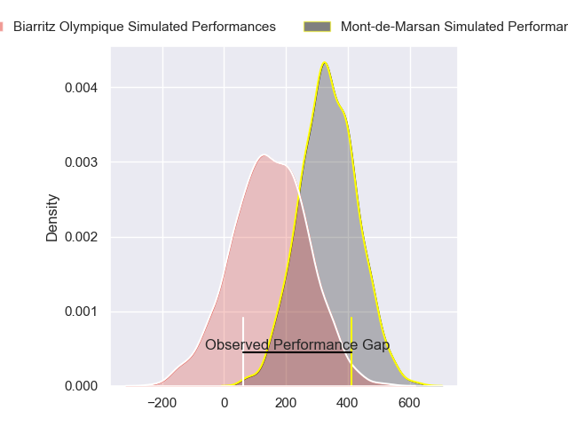
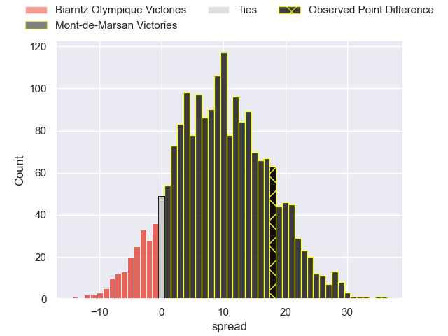
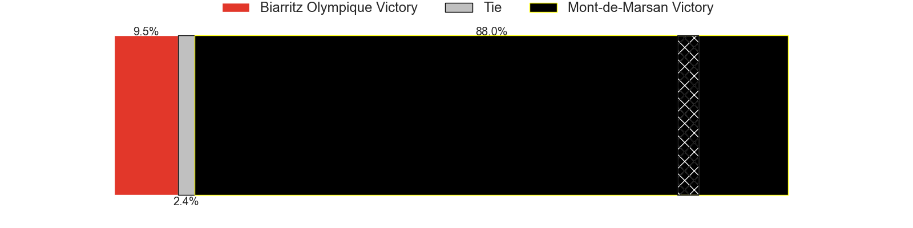

---  
layout: page  
title: Biarritz Olympique at Mont-de-Marsan; 15-33  
date: 2024-11-07 18:00:00 -0500  
categories: "Pro D2 2024" match review  
---
# Biarritz Olympique at Mont-de-Marsan; 15-33

# Club Level Predictions

The first set of predictions treats a club as the smallest object, as the club develops its members, organizes a gameplan, and deploys its players as needed for each match. This club model has a prediction of 0.689, which translates to predicting Mont-de-Marsan to win by 7.0.

Our Over/Under is 51.5 - and combined with the spread above, we have a predicted scoreline of 22 to 29

Each club has a rating and a rating deviation (similar to a Glicko rating), and expected performances can be generated. This allows for simulated matches and spreads like the ones below.
## Projected Performances - Club Model

## Projected Spreads - Club Model

## Projected Results - Club Model

# Player Level Predictions

Treating teams instead as an entity made up of the currently active players, I have ratings for each player in an altogether different system. These can be combined to form team ratings once teamsheets are announced, weighting starters a bit higher than the reserves. After the match is played, players can be weighted by their minutes on the field, allowing for an accurate measure of the team's composition. With these compiled team ratings, we can make predictions, measure inaccuracy, and update the individual player ratings.
## Prediction without Player Minutes: Mont-de-Marsan by 9.3

Biarritz Olympique by 3.7 on a neutral pitch

## Projected Performances - Player Model

## Projected Spreads - Player Model

## Projected Results - Player Model

|   Away Minutes | Away Player             |   Away Percentile |   Number |   Home Percentile | Home Player          |   Home Minutes |
|---------------:|:------------------------|------------------:|---------:|------------------:|:---------------------|---------------:|
|             80 | Alexandre Plantier      |             49.29 |        1 |             54.31 | Luka Goginava        |             66 |
|             80 | Yohan Beheregaray       |             55.84 |        2 |             42.94 | Samuel Lagrange      |             19 |
|             19 | Giorgi Dzmanashvili (2) |             53.69 |        3 |             11.12 | Anthony Alves        |             19 |
|              0 | Levi Douglas            |             55.96 |        4 |             49.73 | Nicolas Garrault     |             28 |
|              0 | Charlie Matthews        |             50.71 |        5 |             46.62 | Romain Durand        |             22 |
|             19 | Jessy Jegerlehner       |             49.61 |        6 |             52.89 | Aurélien Lafforgue   |             30 |
|             28 | Thomas Hébert           |             49.53 |        7 |             48.75 | Raphaël Robic        |             16 |
|             61 | Filimo Taofifenua       |             34.76 |        8 |             41.08 | Ioane Iashagashvili  |             30 |
|             16 | Imanol Biscay           |             52.87 |        9 |             50.64 | Nicolas Darquier     |             61 |
|             19 | Thomas Dolhagaray       |             60.32 |       10 |             48.41 | Willie Du Plessis    |             30 |
|             61 | Arthur Bonneval         |             45.6  |       11 |             60.34 | Pierre Sayerse       |             66 |
|             61 | François Vergnaud       |             41.08 |       12 |             48.12 | Nacani Wakaya        |             66 |
|             52 | Mathieu Acebes          |             94.14 |       13 |             46.57 | Gatien Massé         |             66 |
|             80 | Zach Kibirige           |             43.4  |       14 |             41.94 | Alexandre de Nardi   |             66 |
|             64 | Gervais Cordin          |             45.56 |       15 |             49.81 | Théo Cortes          |             66 |
|             71 | Brendan Lebrun          |            nan    |       16 |            nan    | Florian Dufour       |             30 |
|             67 | François Mur            |            nan    |       17 |            nan    | Thomas Bultel        |             30 |
|             50 | Nafi Ma'Afu             |             44.42 |       18 |            nan    | Myles Edwards        |             30 |
|             64 | Piula Fa'asalele        |             81.58 |       19 |             46.51 | Waël Ponpon          |             30 |
|             80 | Pierre Pagès            |            nan    |       20 |             43.79 | Christophe Loustalot |             30 |
|             80 | Ilian Perraux           |            nan    |       21 |             40.08 | Patricio Fernandez   |             80 |
|             30 | Kylian Jaminet          |             46.33 |       22 |            nan    | Yann Bréthous        |             30 |
|             30 | Nodar Shengelia         |            nan    |       23 |             51.25 | Gheorghe Gajion      |             52 |

