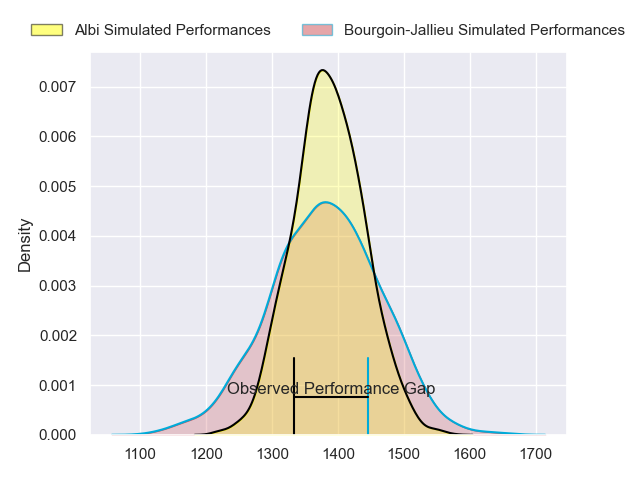
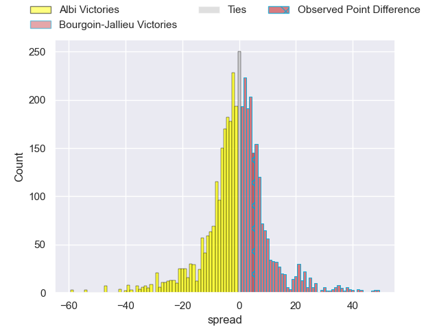
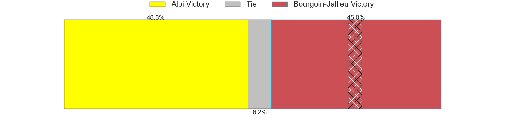
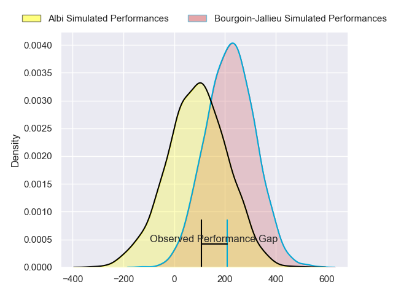
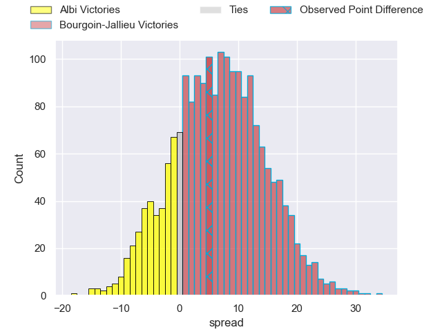
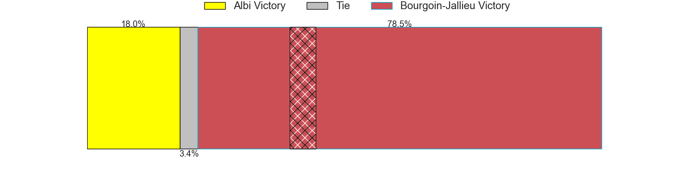

---  
layout: page  
title: Albi at Bourgoin-Jallieu; 17-22  
date: 2024-11-08 18:00:00 -0500  
categories: "Nationale 2024" match review  
---
# Albi at Bourgoin-Jallieu; 17-22

# Club Level Predictions

The first set of predictions treats a club as the smallest object, as the club develops its members, organizes a gameplan, and deploys its players as needed for each match. This club model has a prediction of 0.49, which translates to predicting Albi to win by 0.4.

Our Over/Under is 40.5 - and combined with the spread above, we have a predicted scoreline of 21 to 20

Each club has a rating and a rating deviation (similar to a Glicko rating), and expected performances can be generated. This allows for simulated matches and spreads like the ones below.
## Projected Performances - Club Model

## Projected Spreads - Club Model

## Projected Results - Club Model

# Player Level Predictions

Treating teams instead as an entity made up of the currently active players, I have ratings for each player in an altogether different system. These can be combined to form team ratings once teamsheets are announced, weighting starters a bit higher than the reserves. After the match is played, players can be weighted by their minutes on the field, allowing for an accurate measure of the team's composition. With these compiled team ratings, we can make predictions, measure inaccuracy, and update the individual player ratings.
## Prediction without Player Minutes: Bourgoin-Jallieu by 5.4

Albi by 7.6 on a neutral pitch

## Projected Performances - Player Model

## Projected Spreads - Player Model

## Projected Results - Player Model

|   Away Minutes | Away Player             |   Away Percentile |   Number |   Home Percentile | Home Player       |   Home Minutes |
|---------------:|:------------------------|------------------:|---------:|------------------:|:------------------|---------------:|
|             80 | Lucas Pindor            |             52.27 |        1 |             35.12 | Rémy Gaborit      |             43 |
|             29 | Reinach Venter          |             73.6  |        2 |             75.72 | Maxime Castant    |             80 |
|             11 | Jean Baptiste De Clercq |             32.95 |        3 |             79.05 | Dimitri Tchapnga  |             80 |
|             19 | Yanis Horvat            |             75.27 |        4 |             21.44 | Robin Gascou      |             21 |
|             27 | Jonathan Kpoku          |             86.12 |        5 |              1.16 | Morgan Eames      |             51 |
|             31 | Ianis Ponsole           |              7.25 |        6 |             16.57 | Kevin Chaudouard  |             21 |
|             33 | Simon Meka              |             25.19 |        7 |             55.48 | Merlin Bully      |             23 |
|             80 | Camille Jarreau         |             17.84 |        8 |             28.44 | Sam Daly          |             40 |
|             39 | Gilen Queheille         |             64.97 |        9 |             42.04 | Martin Doan       |             29 |
|             47 | Victor Pisano           |             27.98 |       10 |             21.03 | Tom Danovaro      |             29 |
|             80 | Kamilieni Raivono       |             79.07 |       11 |              6.35 | Remi Bouet        |             80 |
|             46 | Leo Treilles            |             22.78 |       12 |             83.62 | Isaiah Leota      |             59 |
|             69 | Baptiste Couchinave     |             77.22 |       13 |              4.48 | Aviata Silago     |             56 |
|             51 | Antoine Bouzerand       |             43.16 |       14 |             17.92 | Paul-Hugo Champ   |             20 |
|             41 | Théo Vidal              |             62.93 |       15 |              6.95 | Nicolas Cachet    |             17 |
|             80 | Antoine Soave           |             44.95 |       16 |              9.97 | Lucas Dycke       |              6 |
|             51 | Arthur Castant          |              4.7  |       17 |             25.8  | Julien Ratajczak  |             19 |
|             80 | Dion Evrard Oulai       |             38.08 |       18 |             44.2  | Keynan Knox       |             17 |
|             52 | Nasoni Naqiri Kunavore  |             91.13 |       19 |              2.42 | Poutasi Luafutu   |             59 |
|             73 | Titouan Pouzoullic      |             18.95 |       20 |             47.02 | Theophile Cotte   |              9 |
|             30 | Thibault Olender        |             62.9  |       21 |             29.14 | Liam Rimet        |             80 |
|             57 | Esteban Talalua         |            nan    |       22 |             82.33 | Joe Ravouvou      |             37 |
|            nan | nan                     |            nan    |       23 |              2.38 | Christopher Bosch |             29 |

