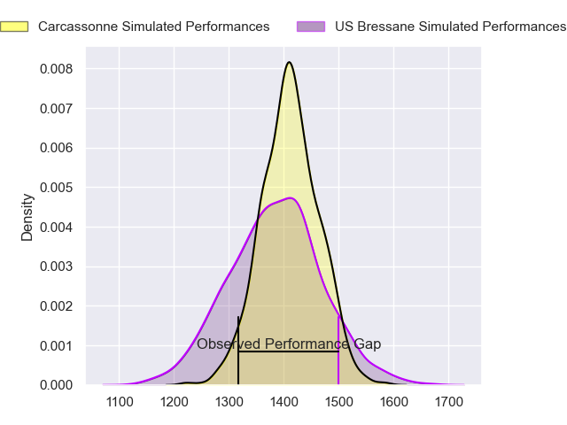
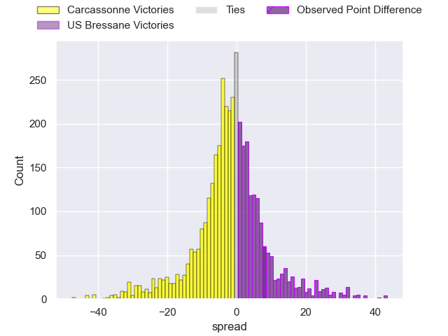
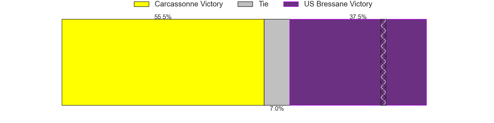
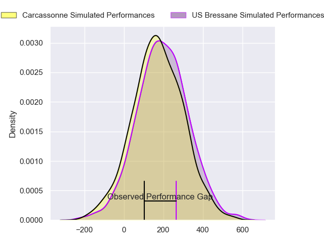
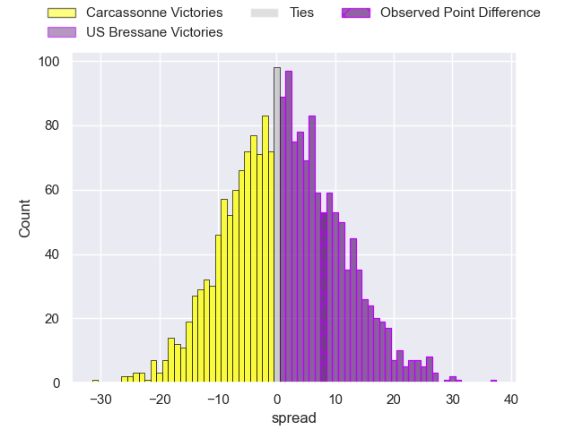
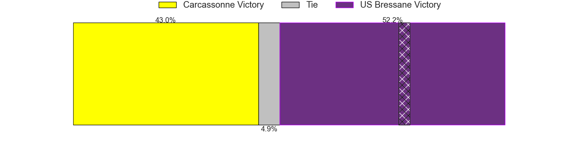

---  
layout: page  
title: Carcassonne at US Bressane; 23-31  
date: 2024-11-08 18:00:00 -0500  
categories: "Nationale 2024" match review  
---
# Carcassonne at US Bressane; 23-31

# Club Level Predictions

The first set of predictions treats a club as the smallest object, as the club develops its members, organizes a gameplan, and deploys its players as needed for each match. This club model has a prediction of 0.461, which translates to predicting Carcassonne to win by 1.4.

Our Over/Under is 42.5 - and combined with the spread above, we have a predicted scoreline of 22 to 20

Each club has a rating and a rating deviation (similar to a Glicko rating), and expected performances can be generated. This allows for simulated matches and spreads like the ones below.
## Projected Performances - Club Model

## Projected Spreads - Club Model

## Projected Results - Club Model

# Player Level Predictions

Treating teams instead as an entity made up of the currently active players, I have ratings for each player in an altogether different system. These can be combined to form team ratings once teamsheets are announced, weighting starters a bit higher than the reserves. After the match is played, players can be weighted by their minutes on the field, allowing for an accurate measure of the team's composition. With these compiled team ratings, we can make predictions, measure inaccuracy, and update the individual player ratings.
## Prediction without Player Minutes: US Bressane by 1.0

Carcassonne by 4.3 on a neutral pitch

## Projected Performances - Player Model

## Projected Spreads - Player Model

## Projected Results - Player Model

|   Away Minutes | Away Player         |   Away Percentile |   Number |   Home Percentile | Home Player          |   Home Minutes |
|---------------:|:--------------------|------------------:|---------:|------------------:|:---------------------|---------------:|
|             80 | Nika Neparidze      |             37.49 |        1 |             51.39 | Vazha Kapanadze      |             24 |
|             80 | Raphael Carbou      |             68.44 |        2 |             83.92 | Clement Jullien      |             18 |
|             80 | Fabien Lorenzon     |             88.07 |        3 |             20.88 | Atonio Ulutuipalelei |             13 |
|             80 | Valentin Sese       |              7.12 |        4 |             54    | Thomas Déliance      |             80 |
|             16 | Clément Fontaine    |             39.59 |        5 |              2.05 | Victor Fromenteze    |             80 |
|             23 | Maxime Millan       |             58.76 |        6 |             65.4  | Nail Ait Naceur      |             80 |
|             51 | Etienne Herjean     |             89.39 |        7 |             88.18 | Loic Baradel         |             80 |
|             16 | Ferdinand Dreno     |             34.57 |        8 |             73.98 | Wael May             |             57 |
|             80 | Kenjy Bayer         |             35.51 |        9 |             80.1  | Jeremy Valencot      |             80 |
|             14 | Nils Chalies        |             46.23 |       10 |             34.13 | Nathan Azais         |             80 |
|             80 | Clement Egiziano    |             95.36 |       11 |             52.04 | Élie De Fleurian     |             80 |
|             80 | Jordan Puletua      |             69.9  |       12 |             89.02 | Fred Zeilinga        |             80 |
|             66 | Mathys Barka        |              6.95 |       13 |             37.24 | Joe Margetts         |             39 |
|              3 | Naim Ben Alla       |             29.4  |       14 |             34.85 | Thibaut Perrette     |             51 |
|             33 | Maxime Gianet       |             94.21 |       15 |             73.94 | Florent Massip       |             28 |
|             80 | Florent Lorenzon    |             32.27 |       16 |             23.25 | Nicolas Lemaire      |             80 |
|             39 | Baptiste Moreno     |            nan    |       17 |              6.98 | Arnaud Feltrin       |             80 |
|             80 | Vakhtangi Akhobadze |             25.02 |       18 |             89.02 | Lasha Mchelidze      |             80 |
|             23 | Romain Guyot        |             55.87 |       19 |             22.32 | Nicolas Tachat       |             64 |
|             35 | Mateo Ibanez        |            nan    |       20 |             34.17 | Florian Burlet       |             64 |
|             80 | Thomas Hoarau       |             15.61 |       21 |             12.51 | Quentin Witt         |             80 |
|             23 | Alexandre Monarque  |            nan    |       22 |             21.97 | Jeremie Martin       |             45 |
|             57 | Paul Gadea          |             71.17 |       23 |             24.52 | Jules Margarit       |             64 |

