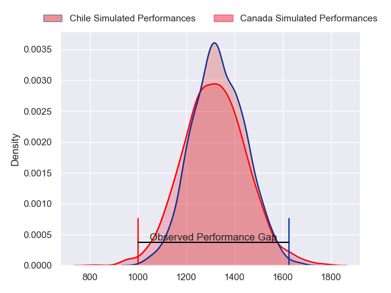
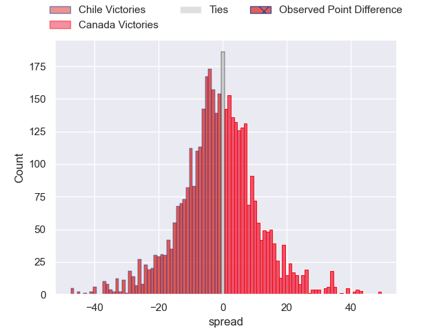
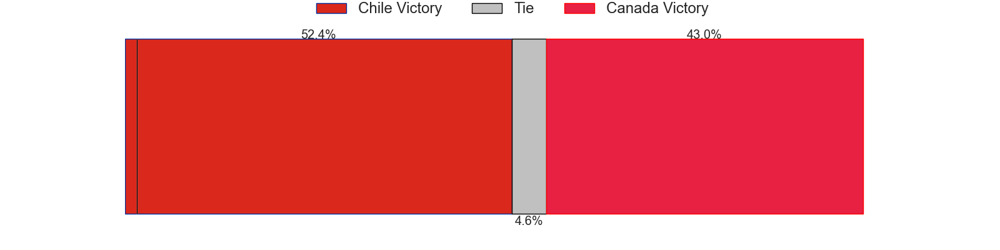
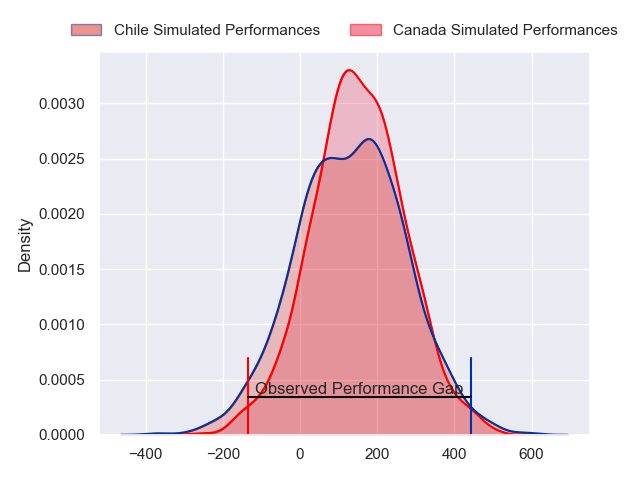
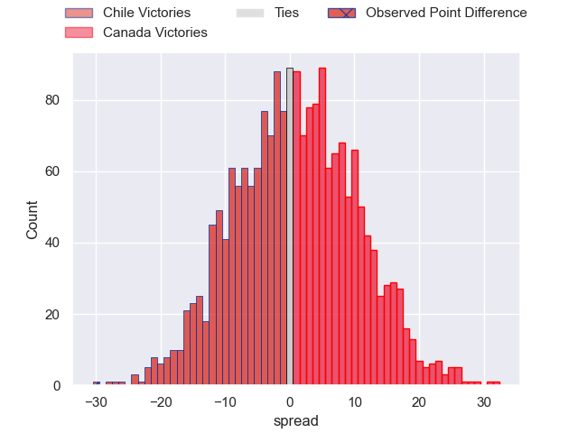
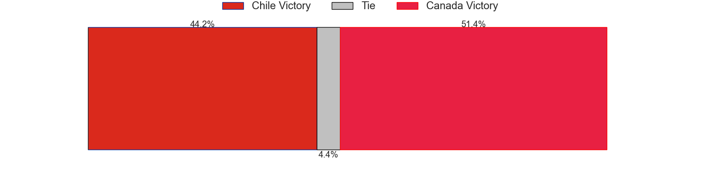

---  
layout: page  
title: Chile at Canada; 44-14  
date: 2024-11-09 18:00:00 -0500  
categories: "International Test Match 2024" match review  
---
# Chile at Canada; 44-14

# Club Level Predictions

The first set of predictions treats a club as the smallest object, as the club develops its members, organizes a gameplan, and deploys its players as needed for each match. This club model has a prediction of 0.476, which translates to predicting Chile to win by 0.9.

Our Over/Under is 55.5 - and combined with the spread above, we have a predicted scoreline of 28 to 27

Each club has a rating and a rating deviation (similar to a Glicko rating), and expected performances can be generated. This allows for simulated matches and spreads like the ones below.
## Projected Performances - Club Model

## Projected Spreads - Club Model

## Projected Results - Club Model

# Player Level Predictions

Treating teams instead as an entity made up of the currently active players, I have ratings for each player in an altogether different system. These can be combined to form team ratings once teamsheets are announced, weighting starters a bit higher than the reserves. After the match is played, players can be weighted by their minutes on the field, allowing for an accurate measure of the team's composition. With these compiled team ratings, we can make predictions, measure inaccuracy, and update the individual player ratings.
## Prediction without Player Minutes: Canada by 0.8

Chile by 2.3 on a neutral pitch

## Projected Performances - Player Model

## Projected Spreads - Player Model

## Projected Results - Player Model

|   Away Minutes | Away Player       |   Away Percentile |   Number |   Home Percentile | Home Player      |   Home Minutes |
|---------------:|:------------------|------------------:|---------:|------------------:|:-----------------|---------------:|
|             80 | Javier Carrasco   |             71.12 |        1 |             38.31 | Cole Keith       |              0 |
|              0 | Augusto Bohme     |             43.55 |        2 |             35.05 | Andrew Quattrin  |              0 |
|             80 | Inaki Gurruchaga  |             72.41 |        3 |             14.98 | Conor Young      |             83 |
|             83 | Santiago Pedrero  |             71.62 |        4 |             48.53 | Kaden Duguid     |              0 |
|             10 | Clemente Saavedra |             52.58 |        5 |              4.89 | Mason Flesch     |             33 |
|             80 | Martin Sigren     |             70.06 |        6 |             16.65 | Ethan Fryer      |             64 |
|             18 | Raimundo Martinez |             55.82 |        7 |             27.87 | Matt Heaton      |             83 |
|             50 | Alfonso Escobar   |             52.97 |        8 |              2.97 | Lucas Rumball    |              0 |
|             83 | Benjamin Videla   |             69.43 |        9 |             52.07 | Jason Higgins    |              0 |
|             80 | Rodrigo Fernandez |             63.29 |       10 |              3.77 | Peter Nelson     |              0 |
|             80 | Nicolas Garafulic |             69.54 |       11 |             27.93 | Josiah Morra     |             80 |
|             80 | Santiago Videla   |             63.31 |       12 |             23.6  | Noah Flesch      |             80 |
|             80 | Domingo Saavedra  |             64.5  |       13 |             63.4  | Ben LeSage       |             73 |
|             80 | Cristobal Game    |             63.03 |       14 |             71.66 | Andrew Coe       |             80 |
|             80 | Inaki Ayarza      |             65.06 |       15 |             64.86 | Nic Benn         |             80 |
|             83 | Diego Escobar     |            nan    |       16 |            nan    | Jesse MacKail    |             19 |
|             27 | Norman Aguayo     |            nan    |       17 |            nan    | Calixto Martinez |             80 |
|              0 | Matias Dittus     |             18.64 |       18 |            nan    | Tyler Matchem    |              0 |
|             80 | Bruno Saez        |            nan    |       19 |            nan    | Callum Botchar   |             80 |
|             80 | Ernesto Tchimino  |            nan    |       20 |            nan    | Sion Parry       |              0 |
|              0 | Marcelo Torrealba |              6.37 |       21 |            nan    | Brock Gallagher  |             80 |
|             80 | Juan Cruz Reyes   |            nan    |       22 |             35.71 | Cooper Coats     |             80 |
|             80 | Matias Garafulic  |            nan    |       23 |             13.82 | Mitch Richardson |             75 |

