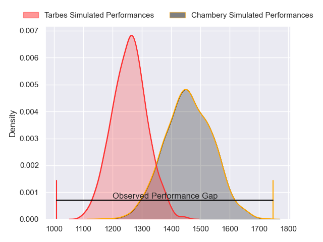
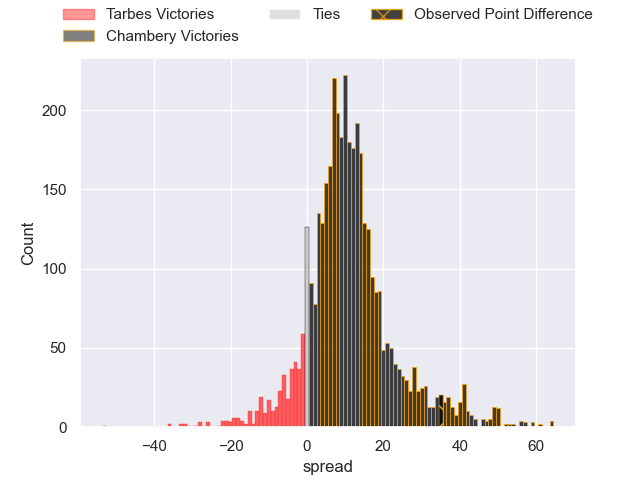
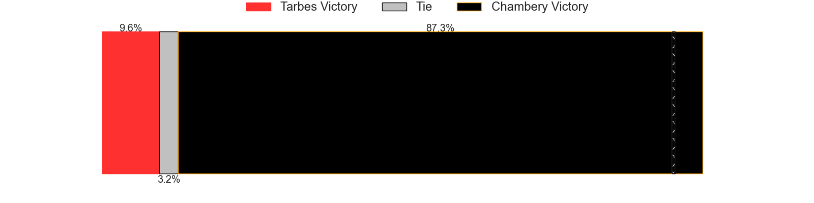
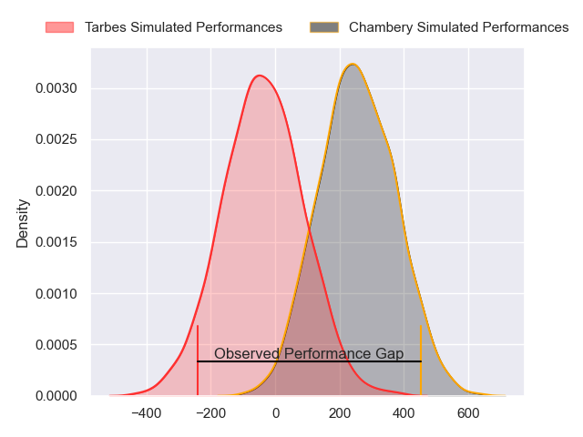
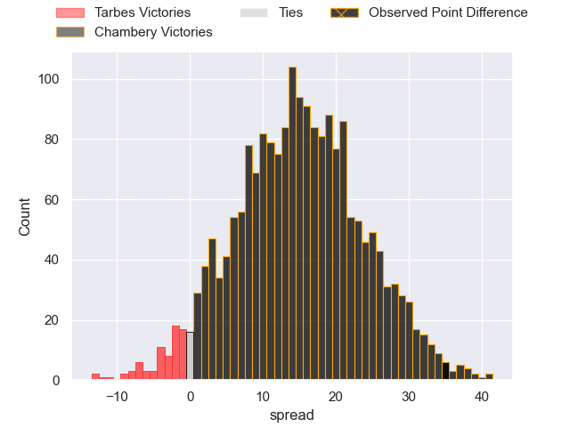
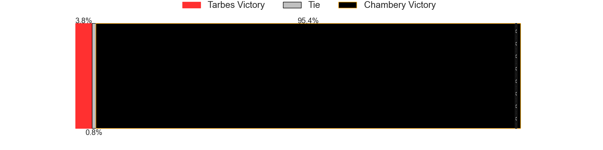

---  
layout: page  
title: Tarbes at Chambery; 10-45  
date: 2024-11-09 18:00:00 -0500  
categories: "Nationale 2024" match review  
---
# Tarbes at Chambery; 10-45

# Club Level Predictions

The first set of predictions treats a club as the smallest object, as the club develops its members, organizes a gameplan, and deploys its players as needed for each match. This club model has a prediction of 0.759, which translates to predicting Chambery to win by 10.2.

Our Over/Under is 56.5 - and combined with the spread above, we have a predicted scoreline of 23 to 33

Each club has a rating and a rating deviation (similar to a Glicko rating), and expected performances can be generated. This allows for simulated matches and spreads like the ones below.
## Projected Performances - Club Model

## Projected Spreads - Club Model

## Projected Results - Club Model

# Player Level Predictions

Treating teams instead as an entity made up of the currently active players, I have ratings for each player in an altogether different system. These can be combined to form team ratings once teamsheets are announced, weighting starters a bit higher than the reserves. After the match is played, players can be weighted by their minutes on the field, allowing for an accurate measure of the team's composition. With these compiled team ratings, we can make predictions, measure inaccuracy, and update the individual player ratings.
## Prediction without Player Minutes: Chambery by 19.6

Chambery by 16.2 on a neutral pitch

## Projected Performances - Player Model

## Projected Spreads - Player Model

## Projected Results - Player Model

|   Away Minutes | Away Player         |   Away Percentile |   Number |   Home Percentile | Home Player          |   Home Minutes |
|---------------:|:--------------------|------------------:|---------:|------------------:|:---------------------|---------------:|
|             80 | Ximun Bessonart     |             12.47 |        1 |             91.8  | Nugzar Somkhishvili  |             28 |
|             55 | Florian Lamothe     |             16.54 |        2 |             92.87 | Yan Tabarot          |             58 |
|             80 | Luka Vea            |             43.66 |        3 |             81.76 | Lasha Tabidze        |             80 |
|             64 | Léo Estaque         |             33.01 |        4 |             87.63 | Ahmed Tidiane Kane   |             59 |
|              8 | Baptiste Peytavi    |              6.32 |        5 |             55.69 | Fabien Witz          |             80 |
|             80 | Jules Bousquet      |             45.47 |        6 |             93.53 | Jean-Baptiste Grenod |             23 |
|             30 | Spike Salman        |             12.68 |        7 |             61.26 | Colin Lebian         |             80 |
|             69 | Filipe Manu         |              0.19 |        8 |             17.29 | Taniela Matakaiongo  |             80 |
|             22 | Thomas Millet       |             10.19 |        9 |              8.12 | Sonatane Takulua     |             26 |
|             22 | Alexandre Perez     |             20.63 |       10 |             26.59 | Thibault Moreno      |             22 |
|             42 | Jonathan Duffau     |             23.94 |       11 |             66.86 | Mateo Guerret        |             32 |
|             52 | Savenaca Rawaca     |              1.56 |       12 |             53.52 | Youenn Floch         |             30 |
|             50 | Johan Paulet        |             87.01 |       13 |             91.03 | Emmanuel Vaitulukina |             15 |
|             48 | Clement Latorre     |             22.15 |       14 |             52.77 | Martin Bonnet        |             80 |
|             63 | Amona Artaud        |             38.61 |       15 |             71.04 | Thomas Hecquet       |             48 |
|             50 | Lasha Mirtskhulava  |            nan    |       16 |             51.53 | Gela Murusidze       |             50 |
|             80 | Vincent Dolier      |             78.15 |       17 |             57.06 | Quentin Beaudaux     |             48 |
|             22 | Irakli Mirtskhulava |             86.58 |       18 |             96    | Baptiste Collet      |             80 |
|             80 | Mathieu Soufflet    |             38.26 |       19 |             55.13 | Pierre-Nicolas Dance |             42 |
|             52 | Jean Guicherd       |             14.41 |       20 |             24.9  | Enzo Marzocca        |             80 |
|             80 | Maile Mamao         |             15.46 |       21 |             37.7  | Arwel Robson         |             80 |
|             61 | Matias Brocal       |             57.65 |       22 |             34.96 | Corentin Astier      |             80 |
|             80 | Matheo Guyon        |             36.11 |       23 |             63.49 | Mickael Blanc        |             48 |

