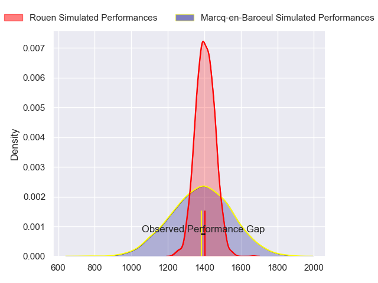
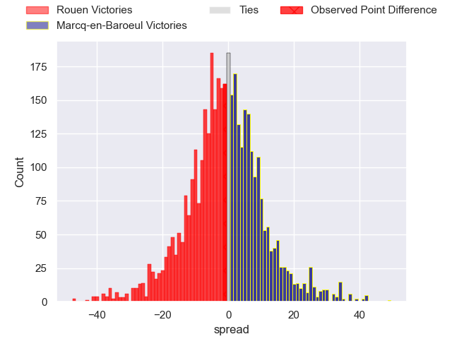
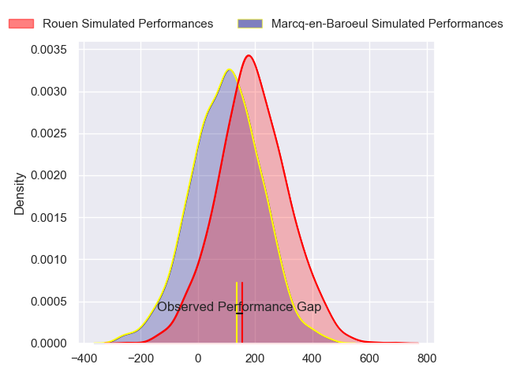
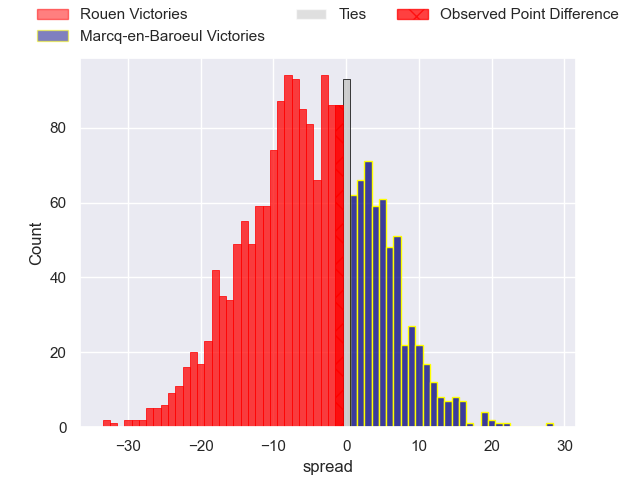
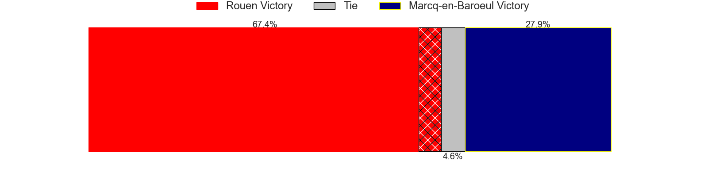

---  
layout: page  
title: Rouen at Marcq-en-Baroeul; 28-27  
date: 2024-11-09 18:00:00 -0500  
categories: "Nationale 2024" match review  
---
# Rouen at Marcq-en-Baroeul; 28-27

# Club Level Predictions

The first set of predictions treats a club as the smallest object, as the club develops its members, organizes a gameplan, and deploys its players as needed for each match. This club model has a prediction of 0.473, which translates to predicting Rouen to win by 1.0.

Our Over/Under is 30.5 - and combined with the spread above, we have a predicted scoreline of 16 to 15

Each club has a rating and a rating deviation (similar to a Glicko rating), and expected performances can be generated. This allows for simulated matches and spreads like the ones below.
## Projected Performances - Club Model

## Projected Spreads - Club Model

## Projected Results - Club Model

# Player Level Predictions

Treating teams instead as an entity made up of the currently active players, I have ratings for each player in an altogether different system. These can be combined to form team ratings once teamsheets are announced, weighting starters a bit higher than the reserves. After the match is played, players can be weighted by their minutes on the field, allowing for an accurate measure of the team's composition. With these compiled team ratings, we can make predictions, measure inaccuracy, and update the individual player ratings.
## Prediction without Player Minutes: Rouen by 6.5

Rouen by 8.7 on a neutral pitch

## Projected Performances - Player Model

## Projected Spreads - Player Model

## Projected Results - Player Model

|   Away Minutes | Away Player           |   Away Percentile |   Number |   Home Percentile | Home Player                  |   Home Minutes |
|---------------:|:----------------------|------------------:|---------:|------------------:|:-----------------------------|---------------:|
|             59 | Ewan Clément          |             42.78 |        1 |             22.03 | Eli Serra-Miglietti          |             80 |
|             80 | Mathieu Bonnot        |             81.49 |        2 |             65.4  | Joseph Reynaud               |             80 |
|             72 | Khvicha Tsopurashvili |             47.8  |        3 |             87.19 | Sive Mazosiwe                |             50 |
|             80 | Corentin Vernet       |             41.37 |        4 |             40.57 | Lucio Anconetani             |             30 |
|             80 | Will Witty            |             49.56 |        5 |             33.63 | Jean-Baptiste Rende          |             14 |
|             80 | Manolo Laffond        |             53.67 |        6 |             81.71 | Joachim Beaumont             |             52 |
|             15 | Tienie Burger         |             92.67 |        7 |             67.47 | Arthur Bruges                |             64 |
|             62 | Willy N'Diaye         |             10.22 |        8 |              6.88 | Otilo Kafotamaki             |             80 |
|             80 | Ilan El Khattabi      |             15.13 |        9 |             51.59 | Dylan Nocete                 |             25 |
|             34 | Benjamin Pehau        |             91.87 |       10 |             44.44 | Paul Decavel                 |             80 |
|             22 | Benito Masilevu       |             86.89 |       11 |             65.72 | Jeannick Ouassiero           |             33 |
|             80 | Nicolas Nieto         |             67.34 |       12 |             56.18 | Louis Decavel                |             80 |
|             68 | Joaquin Riera         |             81.88 |       13 |              9.24 | Hugo Detre                   |             33 |
|             49 | Benjamin Descamps     |             82.57 |       14 |             15.96 | Ervin Muric                  |             80 |
|             25 | Benjamin Debetz       |             61.39 |       15 |             15.64 | Dany Antunes                 |             80 |
|             13 | John-Charles Astle    |             80.34 |       16 |             34.78 | Charles-Édouard Ekwah Elimby |             62 |
|             18 | Soso Bekoshvili       |             87.39 |       17 |             37.01 | Nino Maso                    |             61 |
|             68 | Soulemane Camara      |            nan    |       18 |             45.04 | Cedric Yonkeu                |             47 |
|             58 | Florent Campeggia     |             84.24 |       19 |             37.1  | Antoine Delaporte            |             33 |
|             12 | German Kessler        |             26.25 |       20 |             34.39 | Geoffrey Cazanave            |             45 |
|             23 | Maxime Javaux         |             71.03 |       21 |             42.82 | Mark Erasmus                 |             80 |
|             45 | Axel Malaret          |             47.49 |       22 |             57.97 | Lewys Jones                  |             36 |
|             64 | Soig Mingant          |            nan    |       23 |             20.79 | Santiago Iglesias Valdez     |             80 |

