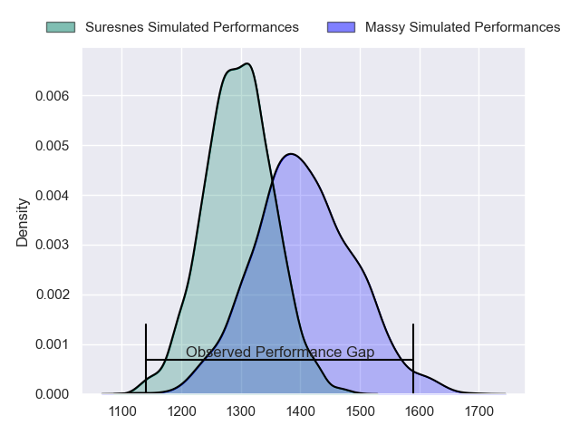
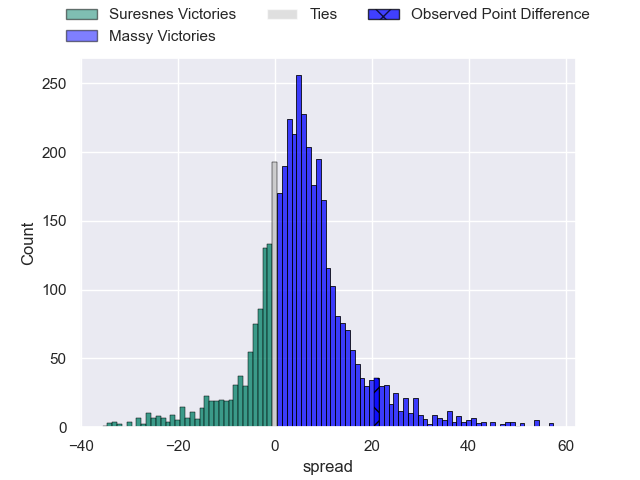
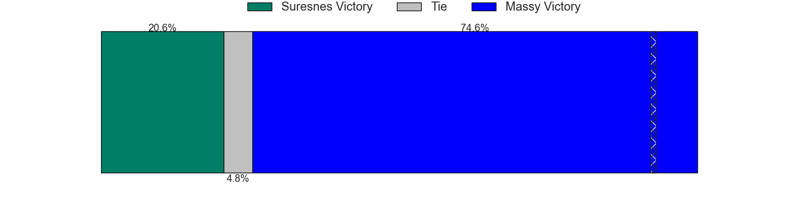
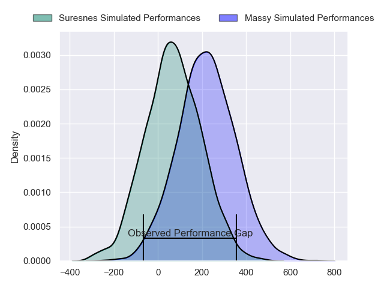
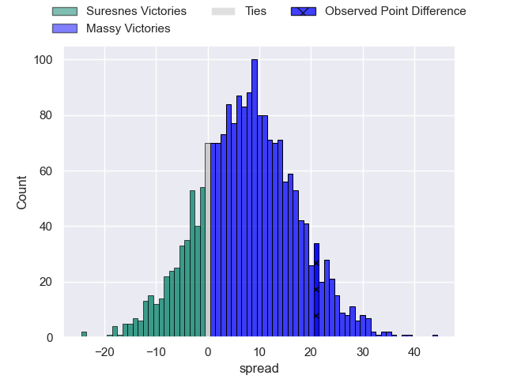
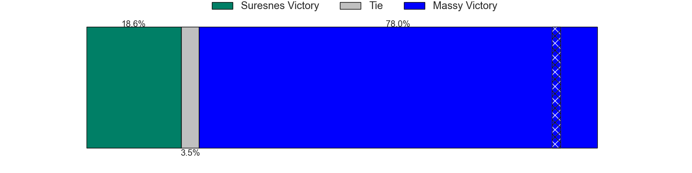

---  
layout: page  
title: Suresnes at Massy; 18-39  
date: 2024-11-09 18:00:00 -0500  
categories: "Nationale 2024" match review  
---
# Suresnes at Massy; 18-39

# Club Level Predictions

The first set of predictions treats a club as the smallest object, as the club develops its members, organizes a gameplan, and deploys its players as needed for each match. This club model has a prediction of 0.648, which translates to predicting Massy to win by 5.4.

Our Over/Under is 45.5 - and combined with the spread above, we have a predicted scoreline of 20 to 25

Each club has a rating and a rating deviation (similar to a Glicko rating), and expected performances can be generated. This allows for simulated matches and spreads like the ones below.
## Projected Performances - Club Model

## Projected Spreads - Club Model

## Projected Results - Club Model

# Player Level Predictions

Treating teams instead as an entity made up of the currently active players, I have ratings for each player in an altogether different system. These can be combined to form team ratings once teamsheets are announced, weighting starters a bit higher than the reserves. After the match is played, players can be weighted by their minutes on the field, allowing for an accurate measure of the team's composition. With these compiled team ratings, we can make predictions, measure inaccuracy, and update the individual player ratings.
## Prediction without Player Minutes: Massy by 7.2

Massy by 1.1 on a neutral pitch

## Projected Performances - Player Model

## Projected Spreads - Player Model

## Projected Results - Player Model

|   Away Minutes | Away Player                 |   Away Percentile |   Number |   Home Percentile | Home Player            |   Home Minutes |
|---------------:|:----------------------------|------------------:|---------:|------------------:|:-----------------------|---------------:|
|             57 | Elias Coulibaly             |             83.19 |        1 |             24.61 | Siegfried Fisi'ihoi    |             56 |
|             31 | Jean-Étienne Lesueur        |             11.68 |        2 |             89.07 | Pierre Trassoudaine    |             80 |
|             16 | Guiterembi Vickos           |             33.49 |        3 |             65.02 | Nicolas Ferrer         |             56 |
|             80 | Nikita Bekov                |             54.09 |        4 |             78.83 | Saba Pesvianidze       |             80 |
|             16 | Marvin Woki                 |             76.69 |        5 |             24.02 | Andrei Mahu            |             80 |
|             30 | Florian Desbordes           |             21.23 |        6 |             50.39 | Tony Tissot            |             64 |
|             55 | Damien Bozic                |             56.86 |        7 |             79.47 | Alexandre Loubiere     |             80 |
|             68 | Boaventura Resende Da cunha |             31.78 |        8 |             45.72 | Simon Cowley           |             80 |
|             80 | Thomas Lacroix              |             24.2  |        9 |             56.69 | Julien Blanc           |             56 |
|             68 | Tanguy Lacoste              |             64.68 |       10 |              7.54 | Christian Lacombe      |             80 |
|             66 | Yohan Fournier              |             13.68 |       11 |             53.42 | Alfred Mouandjo        |             60 |
|             16 | Petero Tuwai                |             70.36 |       12 |             65.97 | Luca Mignot            |             18 |
|             80 | JJ Taulagi                  |              5.58 |       13 |             79.32 | Arthur Seigneuret      |             80 |
|             58 | Alexis Clement              |             16.61 |       14 |             20.2  | Giorgi Gogoladze       |             46 |
|             65 | Goulwen Gueho               |             11    |       15 |             79.73 | Martin Carre           |             64 |
|             19 | Simon Veyrac                |             82.48 |       16 |             31.71 | Adrien Sonzogni        |             19 |
|             80 | Thibaud Sebire              |             70.37 |       17 |             67.66 | Tijde Visser           |             47 |
|             80 | Ismael Martin               |            nan    |       18 |              8.81 | Fernandez Correa       |             16 |
|             12 | Nail Audoire                |             19.86 |       19 |             22.61 | Hugo Boutin            |             80 |
|             12 | Thomas Baudy                |             11.78 |       20 |             82.82 | Alex Preira            |             80 |
|             12 | Théo Bachiri                |             17.83 |       21 |              3.02 | Gonzalo Lopez Bontempo |             16 |
|             80 | Victor Barnier              |             71.18 |       22 |             31.05 | Lilian Rousset         |             80 |
|             80 | Sacha Yahi                  |             40.93 |       23 |             28.18 | Lucas Rubio            |             80 |

