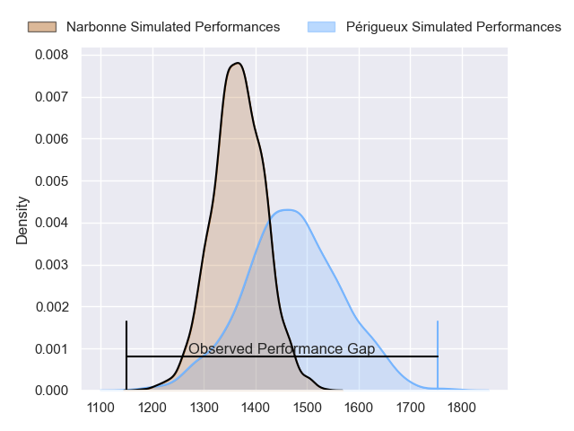
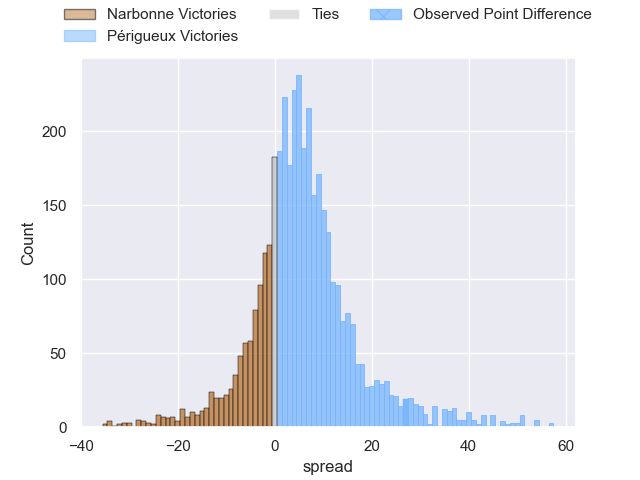
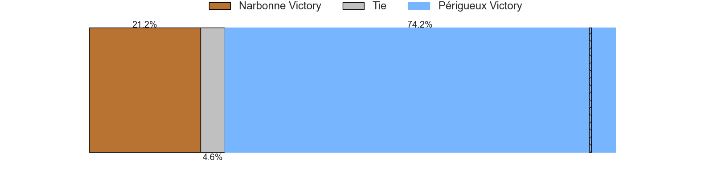
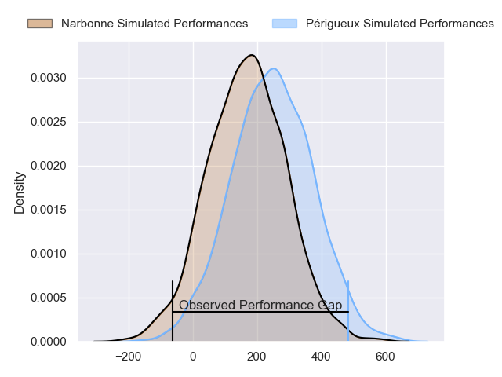
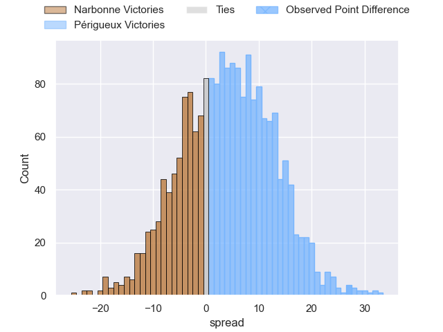
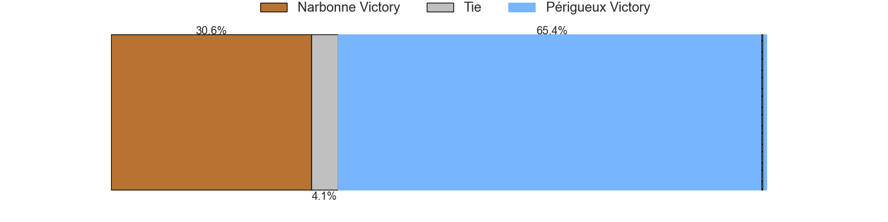

---  
layout: page  
title: Narbonne at Perigueux; 13-40  
date: 2024-11-09 18:00:00 -0500  
categories: "Nationale 2024" match review  
---
# Narbonne at Perigueux; 13-40

# Club Level Predictions

The first set of predictions treats a club as the smallest object, as the club develops its members, organizes a gameplan, and deploys its players as needed for each match. This club model has a prediction of 0.642, which translates to predicting Périgueux to win by 5.2.

Our Over/Under is 45.5 - and combined with the spread above, we have a predicted scoreline of 20 to 25

Each club has a rating and a rating deviation (similar to a Glicko rating), and expected performances can be generated. This allows for simulated matches and spreads like the ones below.
## Projected Performances - Club Model

## Projected Spreads - Club Model

## Projected Results - Club Model

# Player Level Predictions

Treating teams instead as an entity made up of the currently active players, I have ratings for each player in an altogether different system. These can be combined to form team ratings once teamsheets are announced, weighting starters a bit higher than the reserves. After the match is played, players can be weighted by their minutes on the field, allowing for an accurate measure of the team's composition. With these compiled team ratings, we can make predictions, measure inaccuracy, and update the individual player ratings.
## Prediction without Player Minutes: Périgueux by 6.7

Périgueux by 3.8 on a neutral pitch

## Projected Performances - Player Model

## Projected Spreads - Player Model

## Projected Results - Player Model

|   Away Minutes | Away Player        |   Away Percentile |   Number |   Home Percentile | Home Player       |   Home Minutes |
|---------------:|:-------------------|------------------:|---------:|------------------:|:------------------|---------------:|
|             54 | Geoffrey Moise     |             67.91 |        1 |             81.72 | Emilien Borges    |             48 |
|             16 | Clément Esteriola  |              5.61 |        2 |              2.73 | Manu Leiataua     |             61 |
|             21 | Chris Talakai      |             32.77 |        3 |             79.21 | Anthony Pelmard   |             80 |
|             25 | Marius Antonescu   |             13.66 |        4 |             48.45 | Clement Lanen     |             38 |
|             16 | Leva Fifita        |             10.29 |        5 |             76.04 | Mathieu Pace      |             40 |
|             36 | Darrell Dyer       |             93.61 |        6 |             28.41 | Madioke Konate    |             28 |
|             28 | Paul Belzons       |             13.82 |        7 |             96.29 | Afaesetiti Amosa  |             28 |
|             80 | Lopeti Timani      |             78.46 |        8 |             74.08 | Karl Lambert      |             80 |
|             42 | Pierrick Nova      |             36.31 |        9 |             40.13 | Matteo Bordenave  |             35 |
|             80 | Tom Chauvet        |             42.77 |       10 |             74.06 | Greg Hutley       |             80 |
|             42 | Clément Clavières  |             50.94 |       11 |             89.91 | Vincent Fouillade |             13 |
|             80 | Peter Betham       |             98.45 |       12 |             76.44 | Cyril Couturier   |             64 |
|             57 | Pierre-Hugo Ducom  |              4.57 |       13 |             85.66 | Fred Hickes       |             59 |
|             80 | Étienne Ducom      |             87.31 |       14 |             88.93 | Axel Muller       |             80 |
|             80 | Boris Goutard      |              4.63 |       15 |             72.39 | Anderson Neisen   |             80 |
|             38 | Benito Delacruz    |             49.42 |       16 |             67.16 | Thomas Vidal      |             80 |
|             54 | Jamie Hagan        |             37.44 |       17 |             86.52 | Louis Martin      |             55 |
|             80 | Morgan Maga        |             38.69 |       18 |             37.1  | Martin Augeix     |             64 |
|             58 | Thibault Clauzade  |             83.07 |       19 |             41.17 | Richard Fourcade  |             80 |
|             48 | Erwan Nicolas      |             69.75 |       20 |             48.68 | Damien Lavergne   |             44 |
|             80 | Taqele Naiyaravoro |             23.35 |       21 |             29.77 | Nahum Merigan     |             30 |
|             80 | Théo Mias          |             13.24 |       22 |             61.78 | Max Green         |             80 |
|            nan | nan                |            nan    |       23 |             38.42 | Yon Camou         |             80 |

