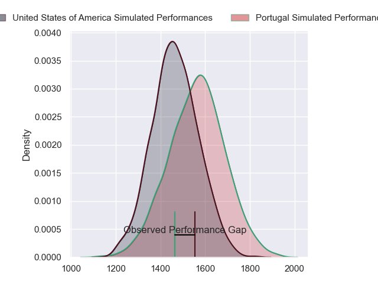
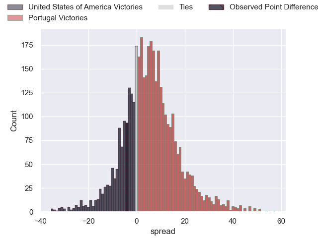
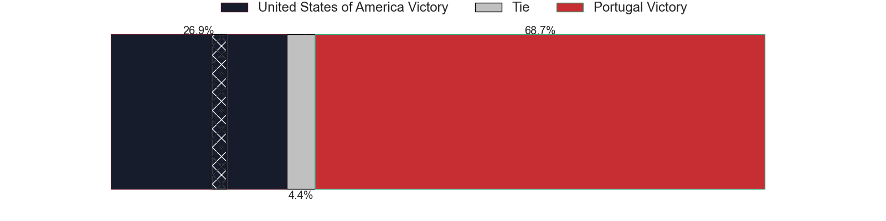
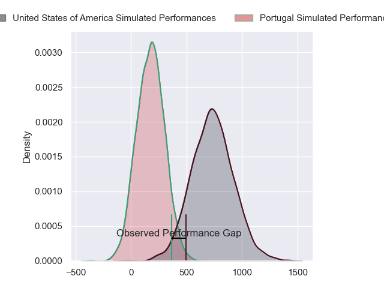
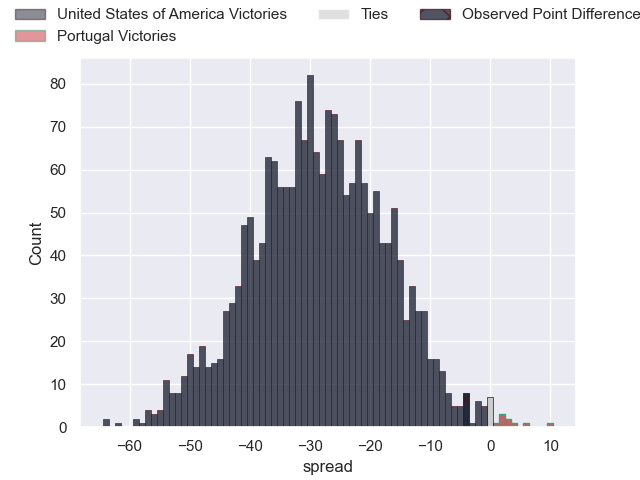
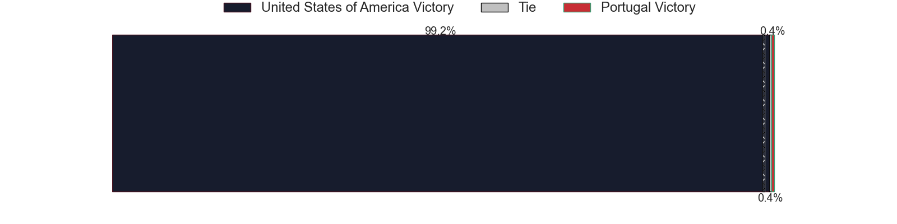

---  
layout: page  
title: United States of America at Portugal; 21-17  
date: 2024-11-09 18:00:00 -0500  
categories: "International Test Match 2024" match review  
---
# United States of America at Portugal; 21-17

# Club Level Predictions

The first set of predictions treats a club as the smallest object, as the club develops its members, organizes a gameplan, and deploys its players as needed for each match. This club model has a prediction of 0.633, which translates to predicting Portugal to win by 5.0.

Our Over/Under is 61.5 - and combined with the spread above, we have a predicted scoreline of 28 to 33

Each club has a rating and a rating deviation (similar to a Glicko rating), and expected performances can be generated. This allows for simulated matches and spreads like the ones below.
## Projected Performances - Club Model

## Projected Spreads - Club Model

## Projected Results - Club Model

# Player Level Predictions

Treating teams instead as an entity made up of the currently active players, I have ratings for each player in an altogether different system. These can be combined to form team ratings once teamsheets are announced, weighting starters a bit higher than the reserves. After the match is played, players can be weighted by their minutes on the field, allowing for an accurate measure of the team's composition. With these compiled team ratings, we can make predictions, measure inaccuracy, and update the individual player ratings.
## Prediction without Player Minutes: United States of America by 9.1

United States of America by 12.9 on a neutral pitch

## Projected Performances - Player Model

## Projected Spreads - Player Model

## Projected Results - Player Model

|   Away Minutes | Away Player      |   Away Percentile |   Number |   Home Percentile | Home Player               |   Home Minutes |
|---------------:|:-----------------|------------------:|---------:|------------------:|:--------------------------|---------------:|
|             23 | Jack Iscaro      |             43.87 |        1 |             63.37 | David Costa               |             83 |
|             64 | Shilo Klein      |             82.12 |        2 |              9.7  | Luka Begic                |             64 |
|             81 | Alex Maughan     |             33.92 |        3 |             55.38 | Cody Thomas               |             32 |
|             64 | Jason Damm       |             36.38 |        4 |             60.16 | Steevy Cerqueira          |             59 |
|             38 | Greg Peterson    |             12.16 |        5 |             64.15 | Antonio Rebelo de Andrade |             87 |
|             81 | Vili Helu        |             73.32 |        6 |             96.72 | Jose Madeira              |             24 |
|             87 | Cory Daniel      |             33.59 |        7 |             63.13 | Nicolas Martins           |             87 |
|             69 | Paddy Ryan       |             73.91 |        8 |             51.49 | Joao Granate              |             57 |
|             42 | Paddy Ryan       |             73.91 |        8 |             51.49 | Joao Granate              |             57 |
|             81 | Paddy Ryan       |             73.91 |        8 |             51.49 | Joao Granate              |             57 |
|             66 | Paddy Ryan       |             73.91 |        8 |             51.49 | Joao Granate              |             57 |
|             33 | Paddy Ryan       |             73.91 |        8 |             51.49 | Joao Granate              |             57 |
|              8 | Paddy Ryan       |             73.91 |        8 |             51.49 | Joao Granate              |             57 |
|             28 | Ruben de Haas    |             40.61 |        9 |             68.95 | Hugo Gomes Camacho        |             83 |
|             87 | AJ MacGinty      |             95.45 |       10 |             56.04 | Hugo Aubry                |             83 |
|             87 | Nate Augspurger  |             97.23 |       11 |             82.26 | Jose Paiva dos Santos     |             32 |
|             81 | Tavite Lopeti    |             68.77 |       12 |             79.91 | Tomas Appleton            |             32 |
|             63 | Dominic Besag    |             37.35 |       13 |             80.73 | Jose Lima                 |             23 |
|             58 | Conner Mooneyham |             73.88 |       14 |             54.68 | Raffaele Storti           |             38 |
|             38 | Mitch Wilson     |             95.95 |       15 |              8.69 | Simao Bento               |             87 |
|             76 | Kapeli Pifeleti  |              3.18 |       16 |            nan    | Antonio Machado Santos    |              0 |
|             81 | Jake Turnbull    |             52    |       17 |            nan    | Pedro Santiago Lopes      |             87 |
|             81 | Pono Davis       |            nan    |       18 |             16.79 | Diogo Hasse Ferreira      |             18 |
|             66 | Tomas Casares    |            nan    |       19 |            nan    | Jose Rebelo de Andrade    |             87 |
|             66 | Moni Tonga’uiha  |            nan    |       20 |             53.11 | Diego Pinheiro Ruiz       |             87 |
|             27 | Ethan McVeigh    |            nan    |       21 |            nan    | Antonio Campos            |             87 |
|             32 | Erich Storti     |            nan    |       22 |            nan    | Manuel Vareiro            |             87 |
|             83 | Luke Carty       |             52.87 |       23 |            nan    | Gabriel Aviragnet         |             38 |

