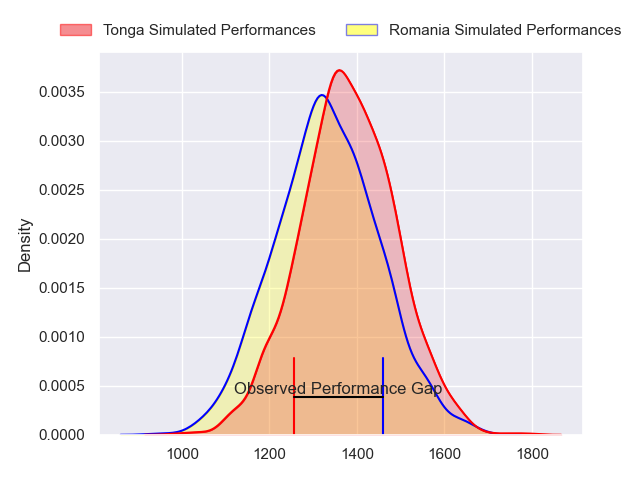
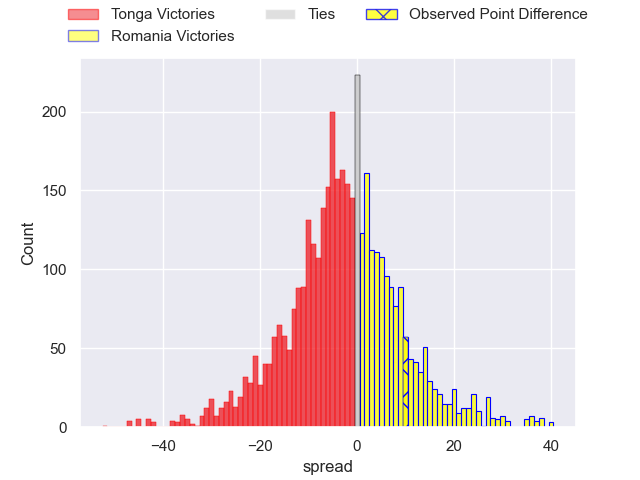
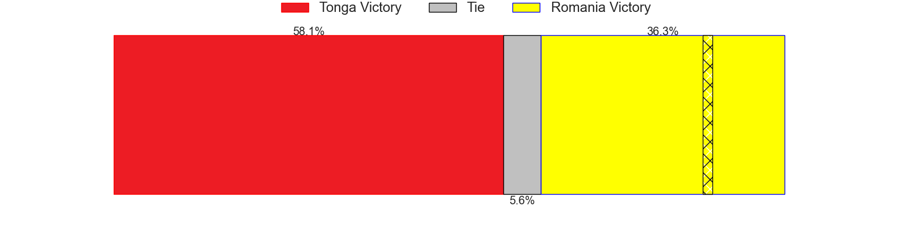
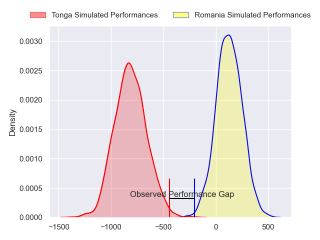
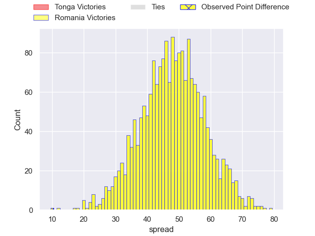
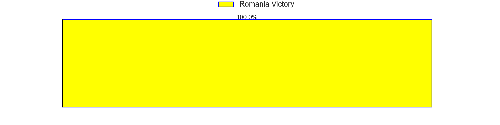

---  
layout: page  
title: Tonga at Romania; 15-25  
date: 2024-11-09 18:00:00 -0500  
categories: "International Test Match 2024" match review  
---
# Tonga at Romania; 15-25

# Club Level Predictions

The first set of predictions treats a club as the smallest object, as the club develops its members, organizes a gameplan, and deploys its players as needed for each match. This club model has a prediction of 0.435, which translates to predicting Tonga to win by 2.4.

Our Over/Under is 59.5 - and combined with the spread above, we have a predicted scoreline of 31 to 29

Each club has a rating and a rating deviation (similar to a Glicko rating), and expected performances can be generated. This allows for simulated matches and spreads like the ones below.
## Projected Performances - Club Model

## Projected Spreads - Club Model

## Projected Results - Club Model

# Player Level Predictions

Treating teams instead as an entity made up of the currently active players, I have ratings for each player in an altogether different system. These can be combined to form team ratings once teamsheets are announced, weighting starters a bit higher than the reserves. After the match is played, players can be weighted by their minutes on the field, allowing for an accurate measure of the team's composition. With these compiled team ratings, we can make predictions, measure inaccuracy, and update the individual player ratings.
## Prediction without Player Minutes: Romania by 24.2

Romania by 19.7 on a neutral pitch

## Projected Performances - Player Model

## Projected Spreads - Player Model

## Projected Results - Player Model

|   Away Minutes | Away Player          |   Away Percentile |   Number |   Home Percentile | Home Player       |   Home Minutes |
|---------------:|:---------------------|------------------:|---------:|------------------:|:------------------|---------------:|
|             87 | Jethro Felemi        |             60.93 |        1 |             30.81 | Alexandru Savin   |             22 |
|             30 | Samiuela Moli        |              4.09 |        2 |             43.33 | Tudor Butnariu    |              2 |
|             28 | Tau Koloamatangi     |             52.47 |        3 |             18.75 | Vasile Balan      |             40 |
|             87 | Kelemete Finau       |             59.8  |        4 |             81.19 | Nicolaas Immelman |              8 |
|             16 | Harrison Mataele     |             50.93 |        5 |             40.02 | Stefan Iancu      |             60 |
|             21 | Tupou Ma'afu-Afungia |             52.42 |        6 |             41.19 | Florian Rosu      |             53 |
|             21 | Sione Havili Talitui |              7.08 |        7 |             38.77 | Cristian Chirica  |             72 |
|             71 | Sione Havili Talitui |              7.08 |        7 |             38.77 | Cristian Chirica  |             72 |
|             69 | Sione Havili Talitui |              7.08 |        7 |             38.77 | Cristian Chirica  |             72 |
|             23 | Sione Havili Talitui |              7.08 |        7 |             38.77 | Cristian Chirica  |             72 |
|             15 | Lotu Inisi           |              8.58 |        8 |             32.92 | Cristi Boboc      |             87 |
|             81 | Aisea Halo           |             13.22 |        9 |             15.92 | Alin Conache      |             20 |
|             73 | Patrick Pellegrini   |             59.8  |       10 |             39.8  | Hinckley Vaovasa  |             12 |
|              5 | Patrick Pellegrini   |             59.8  |       10 |             39.8  | Hinckley Vaovasa  |             12 |
|             59 | John Tapueluelu      |             49.47 |       11 |              8.46 | Tevita Manumua    |             81 |
|             81 | Fetuli Paea          |             32.79 |       12 |             64.29 | Jason Tomane      |             81 |
|             87 | Fine Inisi           |              5.02 |       13 |             40.91 | Mihai Graure      |             81 |
|             87 | Taniela Filimone     |             83.73 |       14 |             34.74 | Corrado Stetco    |             81 |
|             69 | William Havili       |             25.68 |       15 |              5.21 | Marius Simionescu |             87 |
|             87 | Sekope Lopeti-Moli   |             37.88 |       16 |            nan    | Florin Bardasu    |             72 |
|              0 | Duane Aholelei       |            nan    |       17 |             11.71 | Iulian Hartig     |             87 |
|             14 | Paula Latu           |            nan    |       18 |            nan    | Cosmin Manole     |             54 |
|              8 | Tevita Ahokovi       |            nan    |       19 |            nan    | Virgil Ghenea     |             59 |
|             79 | Justin Mataele       |            nan    |       20 |            nan    | Kamil Sobota      |             64 |
|             61 | Semisi Paea          |             62.78 |       21 |             41.08 | Gabriel Rupanu    |             81 |
|             87 | Siaosi Nginingini    |             69.43 |       22 |            nan    | Daniel Plai       |             79 |
|             81 | Tima Fainga'anuku    |              7.57 |       23 |             27.31 | Fonovai Tangimana |             73 |

