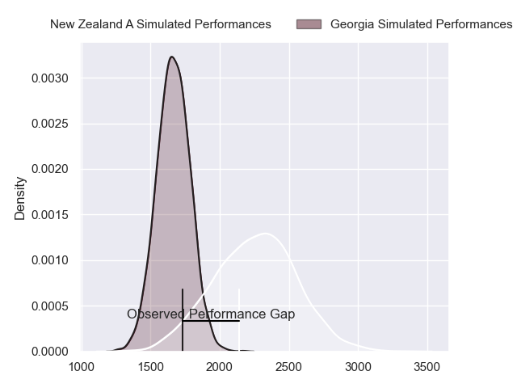
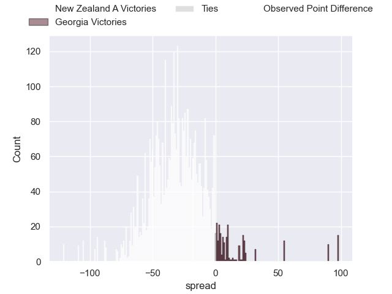
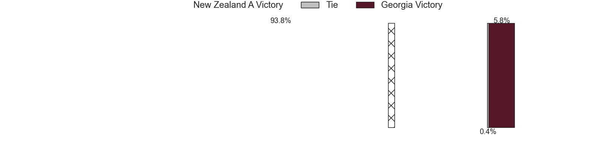
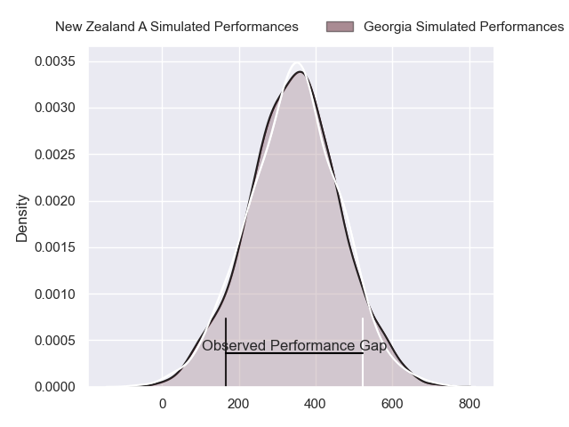
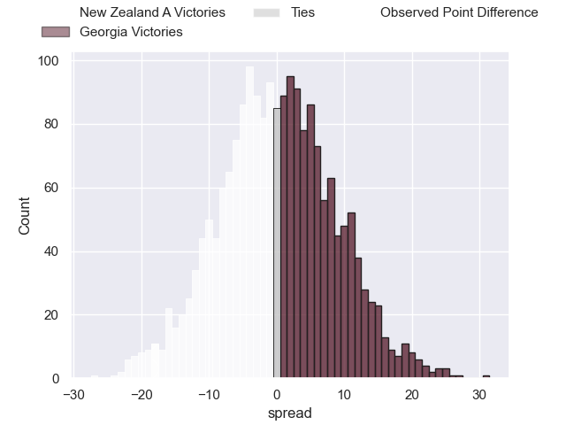
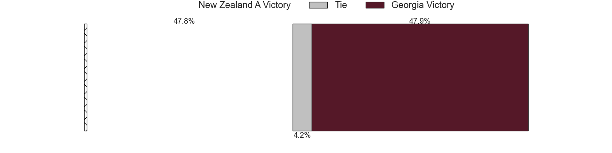

---  
layout: page  
title: New Zealand A at Georgia; 31-13  
date: 2024-11-10 18:00:00 -0500  
categories: "Tests Matchs 2024" match review  
---
# New Zealand A at Georgia; 31-13

# Club Level Predictions

The first set of predictions treats a club as the smallest object, as the club develops its members, organizes a gameplan, and deploys its players as needed for each match. This club model has a prediction of 0.075, which translates to predicting New Zealand A to win by 29.8.

Our Over/Under is 68.5 - and combined with the spread above, we have a predicted scoreline of 49 to 19

Each club has a rating and a rating deviation (similar to a Glicko rating), and expected performances can be generated. This allows for simulated matches and spreads like the ones below.
## Projected Performances - Club Model

## Projected Spreads - Club Model

## Projected Results - Club Model

# Player Level Predictions

Treating teams instead as an entity made up of the currently active players, I have ratings for each player in an altogether different system. These can be combined to form team ratings once teamsheets are announced, weighting starters a bit higher than the reserves. After the match is played, players can be weighted by their minutes on the field, allowing for an accurate measure of the team's composition. With these compiled team ratings, we can make predictions, measure inaccuracy, and update the individual player ratings.
## Prediction without Player Minutes: New Zealand A by 4.2

New Zealand A by 8.3 on a neutral pitch

## Projected Performances - Player Model

## Projected Spreads - Player Model

## Projected Results - Player Model

|   Away Minutes | Away Player          |   Away Percentile |   Number |   Home Percentile | Home Player          |   Home Minutes |
|---------------:|:---------------------|------------------:|---------:|------------------:|:---------------------|---------------:|
|             69 | George Bower         |             19.84 |        1 |             89.37 | Nika Abuladze        |             51 |
|             80 | Kurt Eklund          |             94.85 |        2 |             73.03 | Vano Karkadze        |             40 |
|             80 | Marcel Renata        |             76.91 |        3 |             27.22 | Aleksandre Kuntelia  |             65 |
|             80 | Isaia Walker-Leawere |             97.87 |        4 |             78.88 | Mikheil Babunashvili |             80 |
|             80 | Naitoa Ah Kuoi       |             97.6  |        5 |             80.57 | Giorgi Javakhia      |             26 |
|             20 | Caleb Delany         |             83.59 |        6 |             15.2  | Ilia Spanderashvili  |             40 |
|             35 | Du'Plessis Kirifi    |             96.46 |        7 |             86.1  | Giorgi Tsutskiridze  |             26 |
|             35 | Simon Parker         |             69.35 |        8 |              9.81 | Tornike Jalagonia    |             40 |
|             30 | Finlay Christie      |             78.03 |        9 |             12.26 | Vasil Lobzhanidze    |             27 |
|             27 | Josh Jacomb          |             87.72 |       10 |             80.2  | Luka Matkava         |             54 |
|              0 | Kini Naholo          |             97.48 |       11 |             89.59 | Sandro Todua         |             69 |
|             17 | Riley Higgins        |             87.49 |       12 |             29.41 | Tornike Kakhoidze    |             80 |
|             11 | Dallas McLeod        |             75.98 |       13 |             91.05 | Giorgi Kveseladze    |             80 |
|             22 | Quinn Tupaea         |             92.92 |       14 |             90.15 | Aka Tabutsadze       |             12 |
|             50 | Shaun Stevenson      |             82.24 |       15 |             72.01 | Davit Niniashvili    |             45 |
|             61 | Bradley Slater       |             89.24 |       16 |            nan    | Luka Nioradze        |             60 |
|             61 | Xavier Numia         |             97.02 |       17 |             26.2  | Giorgi Akhaladze     |             45 |
|             80 | Saula Ma'u           |             20.51 |       18 |             84.02 | Irakli Aptsiauri     |             58 |
|             50 | Fabian Holland       |             84.38 |       19 |             80.39 | Lasha Jaiani         |             53 |
|             80 | Corey Kellow         |             75.91 |       20 |             69.17 | Luka Ivanishvili     |             80 |
|             56 | Devan Flanders       |             89.32 |       21 |             56.37 | Tengiz Peranidze     |             50 |
|             66 | Noah Hotham          |             79.62 |       22 |             69.7  | Tedo Abzhandadze     |             80 |
|             80 | Chay Fihaki          |             20.83 |       23 |             85.11 | Demur Tapladze       |             63 |

