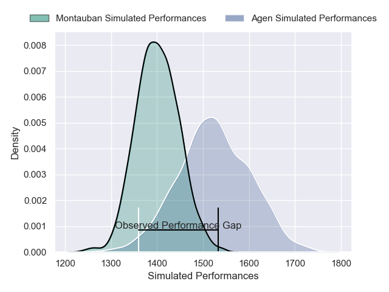
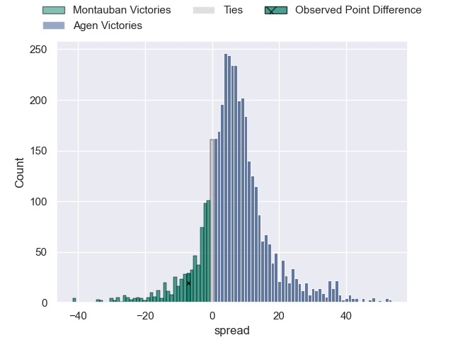
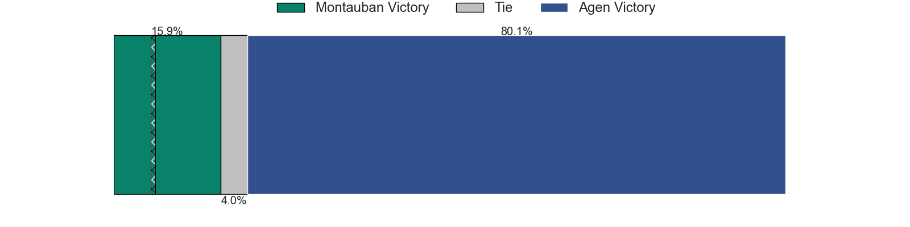
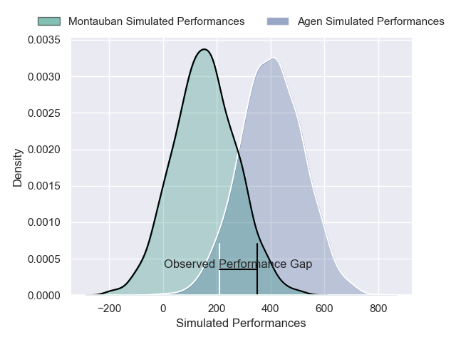
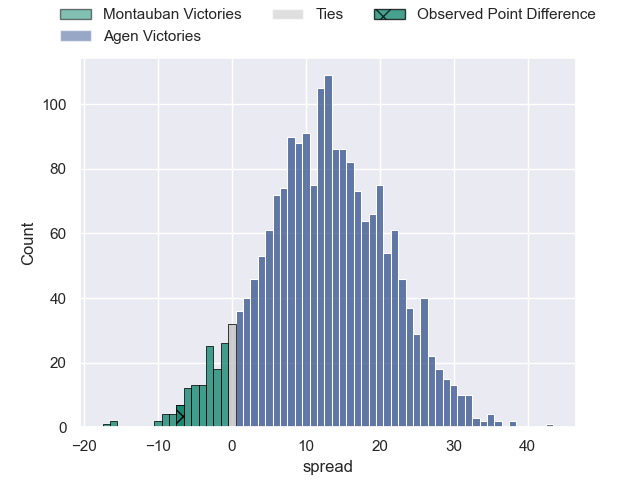
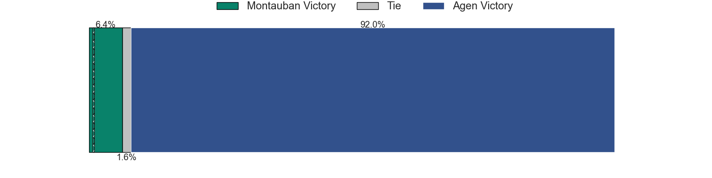

---  
layout: page  
title: Montauban at Agen; 25-18  
date: 2024-11-14 18:00:00 -0500  
categories: "Pro D2 2024" match review  
---
# Montauban at Agen; 25-18

# Club Level Predictions

The first set of predictions treats a club as the smallest object, as the club develops its members, organizes a gameplan, and deploys its players as needed for each match. This club model has a prediction of 0.663, which translates to predicting Agen to win by 5.9.

Our Over/Under is 51.5 - and combined with the spread above, we have a predicted scoreline of 23 to 29

Each club has a rating and a rating deviation (similar to a Glicko rating), and expected performances can be generated. This allows for simulated matches and spreads like the ones below.
## Projected Performances - Club Model

## Projected Spreads - Club Model

## Projected Results - Club Model

# Player Level Predictions

Treating teams instead as an entity made up of the currently active players, I have ratings for each player in an altogether different system. These can be combined to form team ratings once teamsheets are announced, weighting starters a bit higher than the reserves. After the match is played, players can be weighted by their minutes on the field, allowing for an accurate measure of the team's composition. With these compiled team ratings, we can make predictions, measure inaccuracy, and update the individual player ratings.
## Prediction without Player Minutes: Agen by 12.4

Montauban by 1.8 on a neutral pitch

## Projected Performances - Player Model

## Projected Spreads - Player Model

## Projected Results - Player Model

|   Away Minutes | Away Player       |   Away Percentile |   Number |   Home Percentile | Home Player         |   Home Minutes |
|---------------:|:------------------|------------------:|---------:|------------------:|:--------------------|---------------:|
|              9 | Lucas Seyrolle    |             48.61 |        1 |             21.16 | Hans Lombard-Buret  |             80 |
|             80 | Jérémie Maurouard |             69.36 |        2 |             88.34 | Santiago Socino     |             35 |
|             54 | Luka Azariashvili |             63.02 |        3 |             33.83 | Lasha Macharashvili |             70 |
|             26 | Frank Bradshaw    |             57.84 |        4 |             40.16 | Vincent Farré       |             26 |
|             80 | Victor Moreaux    |             70.17 |        5 |             40.44 | William Demotte     |             25 |
|             48 | Noa Kanika        |             60.54 |        6 |             35.2  | Julien Lebian       |             39 |
|             55 | Fred Quercy       |             62.78 |        7 |             35.2  | Valentin Gayraud    |             39 |
|             26 | Corentin Coularis |             48.84 |        8 |              2.71 | Fotu Lokotui        |             39 |
|             26 | Joe Powell        |             62.03 |        9 |             78.89 | Jack Maunder        |             41 |
|             32 | Jérôme Bosviel    |             53.18 |       10 |             24.23 | Billy Searle        |             69 |
|             54 | Josua Vici        |             64.6  |       11 |             35.65 | Iban Etcheverry     |             55 |
|             25 | Simon Renda       |             48.56 |       12 |             21.63 | Clément Garrigues   |             80 |
|             80 | Jt Jackson        |             62.21 |       13 |             28.85 | Kolinio Ramoka      |             45 |
|             71 | Stephane Ahmed    |             96.45 |       14 |             30.08 | Loris Tolot         |             80 |
|             63 | Baptiste Mouchous |             60.36 |       15 |             29.08 | Romain Darchen      |             48 |
|             80 | Ru-Hann Greyling  |            nan    |       16 |            nan    | Pierre Jouvin       |             78 |
|             70 | Malino Vanaï      |            nan    |       17 |            nan    | Mamuka Mstoiani     |             80 |
|             65 | Lewis Bean        |            nan    |       18 |            nan    | Evan Olmstead       |             80 |
|             41 | Kyllian Ringuet   |            nan    |       19 |            nan    | Matthieu Bonnet     |             80 |
|             51 | Sikhumbuzo Notshe |             78.12 |       20 |            nan    | Dorian Bellot       |             45 |
|             80 | Hugo Zabalza      |            nan    |       21 |            nan    | Franck Pourteau     |             48 |
|             32 | Romain Fonnicola  |            nan    |       22 |            nan    | Peyo Muscarditz     |             80 |
|             25 | Tietie Tuimauga   |             57.39 |       23 |            nan    | Beau Farrance       |             11 |

