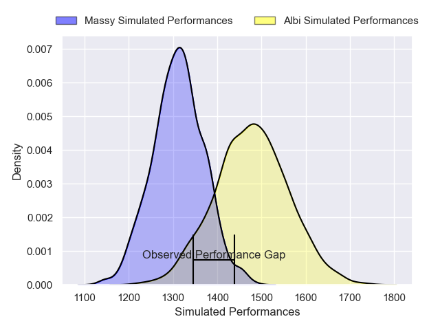
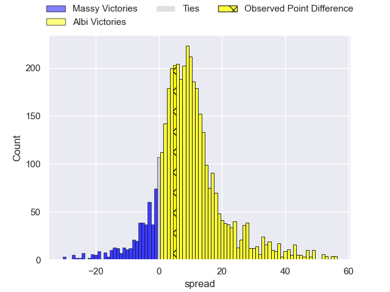
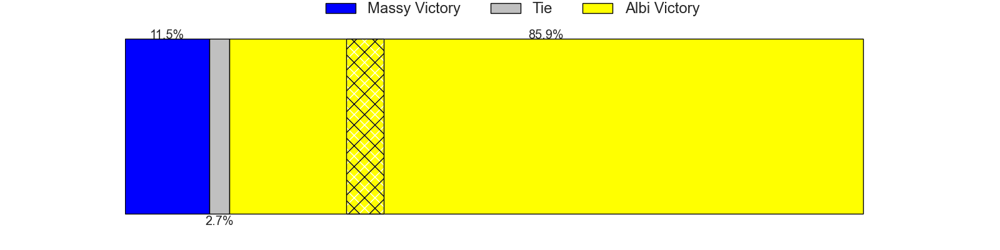
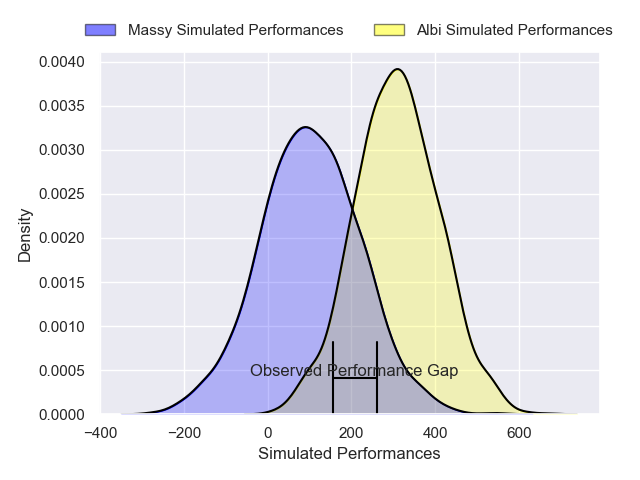
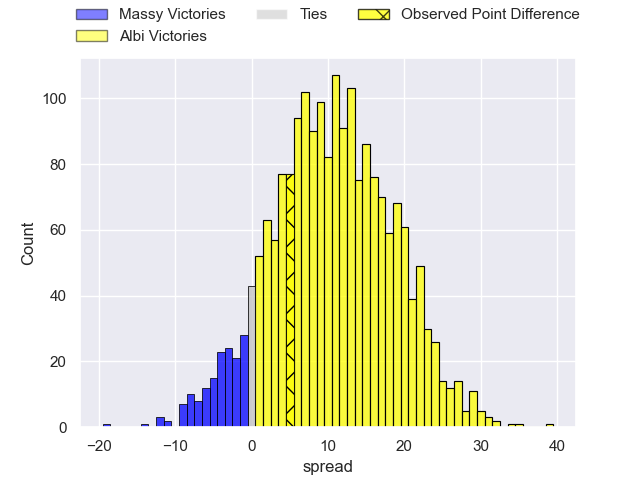
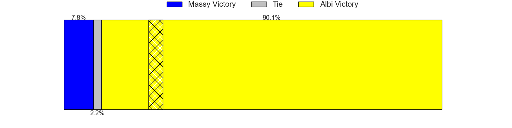

---  
layout: page  
title: Massy at Albi; 9-14  
date: 2024-11-15 18:00:00 -0500  
categories: "Nationale 2024" match review  
---
# Massy at Albi; 9-14

# Club Level Predictions

The first set of predictions treats a club as the smallest object, as the club develops its members, organizes a gameplan, and deploys its players as needed for each match. This club model has a prediction of 0.72, which translates to predicting Albi to win by 8.3.

Our Over/Under is 45.5 - and combined with the spread above, we have a predicted scoreline of 19 to 27

Each club has a rating and a rating deviation (similar to a Glicko rating), and expected performances can be generated. This allows for simulated matches and spreads like the ones below.
## Projected Performances - Club Model

## Projected Spreads - Club Model

## Projected Results - Club Model

# Player Level Predictions

Treating teams instead as an entity made up of the currently active players, I have ratings for each player in an altogether different system. These can be combined to form team ratings once teamsheets are announced, weighting starters a bit higher than the reserves. After the match is played, players can be weighted by their minutes on the field, allowing for an accurate measure of the team's composition. With these compiled team ratings, we can make predictions, measure inaccuracy, and update the individual player ratings.
## Prediction without Player Minutes: Albi by 11.3

Albi by 0.1 on a neutral pitch

## Projected Performances - Player Model

## Projected Spreads - Player Model

## Projected Results - Player Model

|   Away Minutes | Away Player         |   Away Percentile |   Number |   Home Percentile | Home Player             |   Home Minutes |
|---------------:|:--------------------|------------------:|---------:|------------------:|:------------------------|---------------:|
|             30 | Fernandez Corréa    |             48.42 |        1 |             42.46 | Antoine Soave           |             30 |
|             19 | Adrien Sonzogni     |             47.59 |        2 |             40.44 | Reinach Venter          |             61 |
|             30 | Tijde Visser        |             48.42 |        3 |             42.24 | Jean-Baptiste De Clercq |             31 |
|             21 | Saba Pesvianidze    |             51.41 |        4 |             47.87 | Jonathan Kpoku          |             13 |
|             30 | Louis Bruinsma      |             52.31 |        5 |             47.23 | Evrard Dion Oulai       |             20 |
|              0 | Hugo Boutin         |             47.4  |        6 |             42.42 | Mattéo Coustalat        |             60 |
|             80 | Giani Gamba         |             55.34 |        7 |             45.2  | Simon Meka              |             25 |
|             80 | Alexandre Loubière  |             48.06 |        8 |             40.12 | Camille Jarreau         |              9 |
|             22 | Lucas Rubio         |             48.61 |        9 |             44.03 | Théo Vidal              |             23 |
|             45 | Christian Lacombe   |             47.02 |       10 |             38.6  | Victor Pisano           |             47 |
|             56 | Alex Preira         |             55    |       11 |             47.42 | Théo Reinard            |             47 |
|             40 | Luca Mignot         |             44.13 |       12 |             36.92 | Léo Treilles            |             58 |
|             80 | Arthur Seigneuret   |             47.69 |       13 |             35.77 | Baptiste Couchinave     |             80 |
|             28 | Giorgi Gogoladze    |             53.55 |       14 |             46.21 | Simon Hartmann          |             64 |
|             80 | Martin Carré        |             49    |       15 |             40.84 | Téo Dospital            |             49 |
|             65 | Pierre Trassoudaine |            nan    |       16 |            nan    | Arthur Castant          |             80 |
|             60 | Siegfried Fisi'ihoi |             18.6  |       17 |            nan    | Lucas Pindor            |             61 |
|             66 | Hilan Delbois       |            nan    |       18 |            nan    | Vincent Mutel           |             70 |
|             56 | Tony Tissot         |            nan    |       19 |            nan    | Ianis Ponsole           |             40 |
|             80 | Julien Blanc        |            nan    |       20 |            nan    | Ruben Courtiès          |             24 |
|             64 | Antonin Vidalenc    |            nan    |       21 |            nan    | Thibault Olender        |             10 |
|             80 | Alfred Mouandjo     |            nan    |       22 |            nan    | Matis Pacchiana         |             25 |
|             47 | Nolan Pienaar       |            nan    |       23 |            nan    | Thomas Crétu            |             45 |

