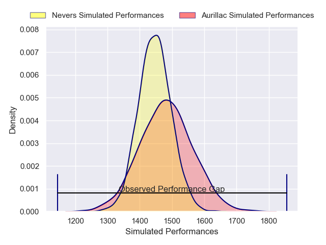
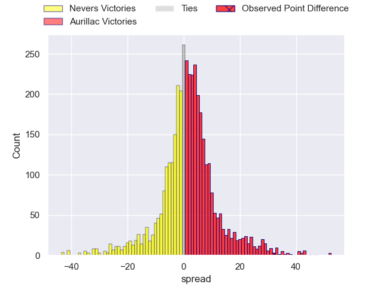
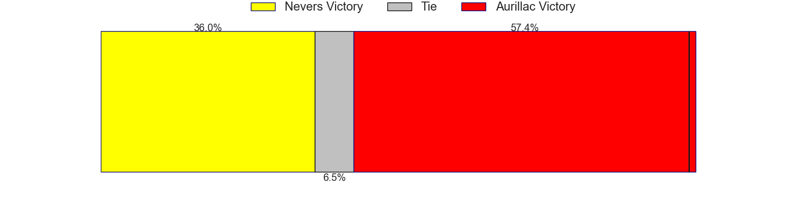
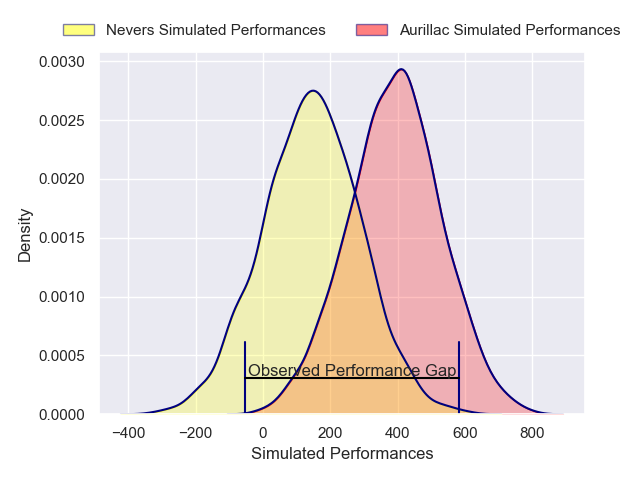
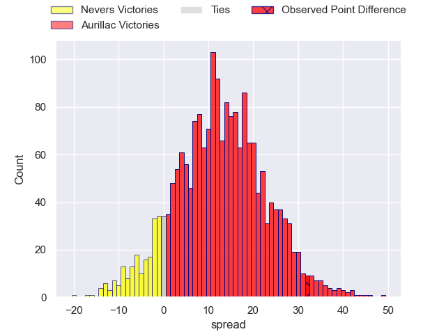
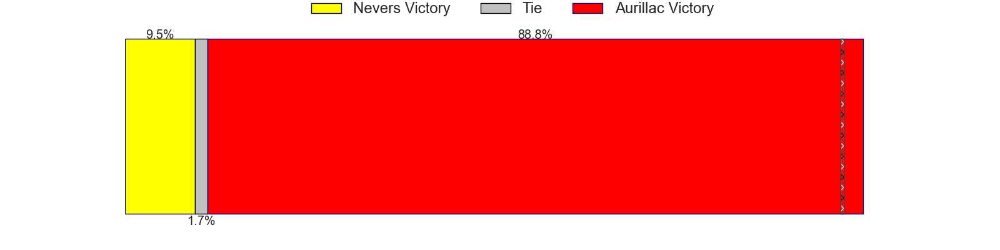

---  
layout: page  
title: Nevers at Aurillac; 10-42  
date: 2024-11-15 18:00:00 -0500  
categories: "Pro D2 2024" match review  
---
# Nevers at Aurillac; 10-42

# Club Level Predictions

The first set of predictions treats a club as the smallest object, as the club develops its members, organizes a gameplan, and deploys its players as needed for each match. This club model has a prediction of 0.546, which translates to predicting Aurillac to win by 1.6.

Our Over/Under is 45.5 - and combined with the spread above, we have a predicted scoreline of 22 to 23

Each club has a rating and a rating deviation (similar to a Glicko rating), and expected performances can be generated. This allows for simulated matches and spreads like the ones below.
## Projected Performances - Club Model

## Projected Spreads - Club Model

## Projected Results - Club Model

# Player Level Predictions

Treating teams instead as an entity made up of the currently active players, I have ratings for each player in an altogether different system. These can be combined to form team ratings once teamsheets are announced, weighting starters a bit higher than the reserves. After the match is played, players can be weighted by their minutes on the field, allowing for an accurate measure of the team's composition. With these compiled team ratings, we can make predictions, measure inaccuracy, and update the individual player ratings.
## Prediction without Player Minutes: Aurillac by 13.1

Aurillac by 0.1 on a neutral pitch

## Projected Performances - Player Model

## Projected Spreads - Player Model

## Projected Results - Player Model

|   Away Minutes | Away Player                |   Away Percentile |   Number |   Home Percentile | Home Player             |   Home Minutes |
|---------------:|:---------------------------|------------------:|---------:|------------------:|:------------------------|---------------:|
|             80 | Aitor Kitutu               |             36.61 |        1 |             53.34 | Irakli Mtchedlidze      |             63 |
|             59 | Efi Ma'Afu                 |             37.85 |        2 |             53.43 | Basa Khonelidze         |             61 |
|             68 | Cleopas Kundiona           |             37.73 |        3 |             58.29 | Giorgi Kartvelishvili   |             70 |
|             15 | Maxence Barjaud            |             47.51 |        4 |             55.21 | Martial Rolland         |             50 |
|             50 | Chris Gabriel              |             42.43 |        5 |             58.66 | Mehdi Slamani           |             80 |
|             80 | Rati Zazadze (2)           |             39.55 |        6 |             54.08 | Eoghan Masterson        |             54 |
|             74 | Steven David               |             40    |        7 |             54.62 | Lucas Oudard            |             63 |
|             80 | Jason Fraser               |             31.26 |        8 |             50.29 | Didier Tison            |             80 |
|             64 | Hugo Bouyssou              |             38.85 |        9 |             56.07 | David Delarue           |             80 |
|             80 | Shaun Reynolds             |             33.68 |       10 |             47.64 | Ugo Seunes              |             46 |
|             80 | Arthur Mathiron            |             43.42 |       11 |             56.54 | Aj Coertzen             |             60 |
|             79 | Rudy Derrieux              |             33.59 |       12 |             49.62 | Elijah Niko             |             80 |
|             57 | Paula Walisoliso           |             35.51 |       13 |             49.62 | Karl Martin             |             80 |
|             80 | Gabin Rocher               |             43.42 |       14 |             56.7  | Juun Pieters            |             61 |
|             64 | Dylan Jaminet              |             37.92 |       15 |             51.5  | Axel Bévia              |             80 |
|             63 | Jean-Maxence Jules-Rosette |            nan    |       16 |            nan    | Ronan Loughnane         |             52 |
|             80 | Kamaliele Tufele           |            nan    |       17 |            nan    | Robbie Rodgers          |             80 |
|             40 | Wesley Lindor              |            nan    |       18 |            nan    | Mosa'Ati Moala          |             52 |
|             21 | Kévin Noah                 |            nan    |       19 |             48.54 | Mael Perrin             |             80 |
|             80 | Luka Plataret              |            nan    |       20 |            nan    | Théo Cambon             |             80 |
|             52 | Simon Tarel                |            nan    |       21 |             44.92 | Mikheil Alania          |             80 |
|             61 | Lucas Blanc                |            nan    |       22 |            nan    | Hugo Bastard            |             59 |
|             80 | Lasha Pkhakadze (2)        |            nan    |       23 |             26.26 | Dominic Robertson-McCoy |             80 |

