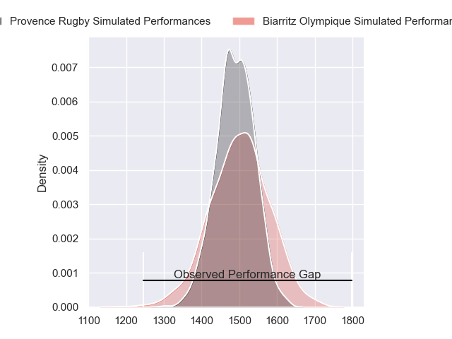
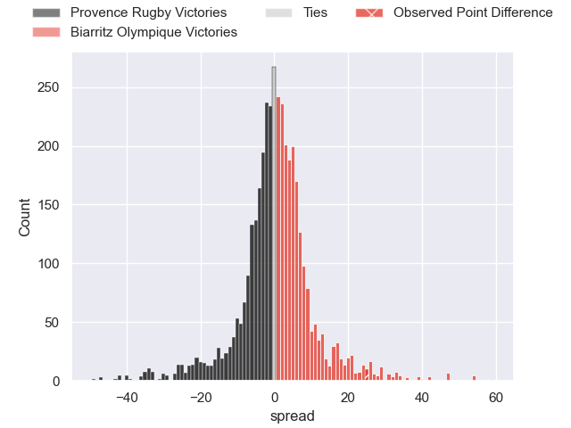
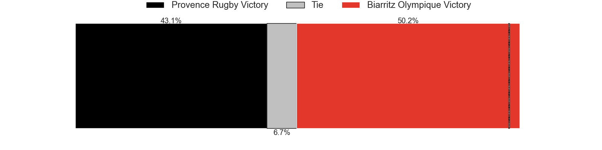
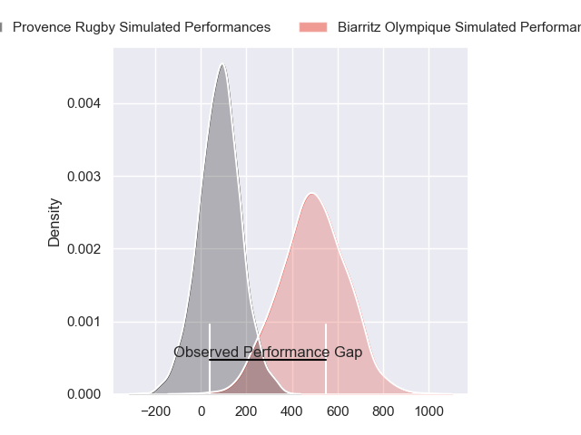
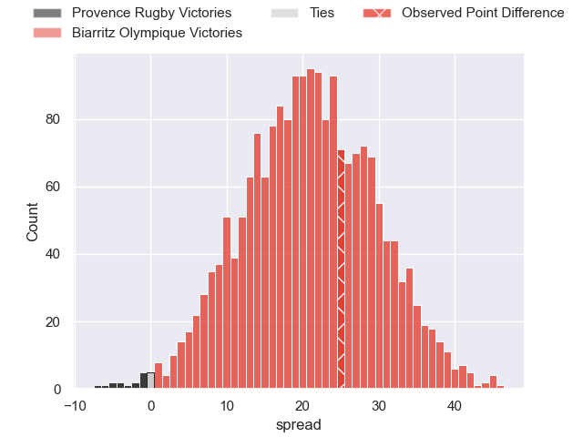
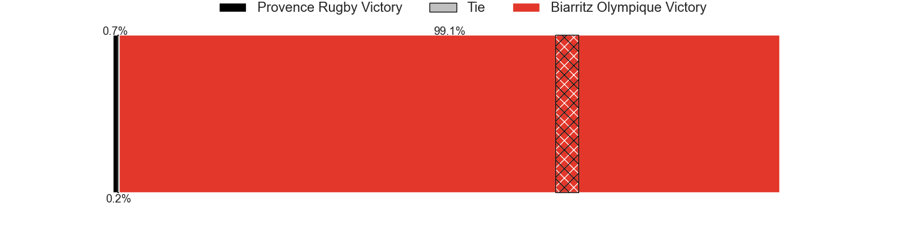

---  
layout: page  
title: Provence Rugby at Biarritz Olympique; 0-25  
date: 2024-11-15 18:00:00 -0500  
categories: "Pro D2 2024" match review  
---
# Provence Rugby at Biarritz Olympique; 0-25

# Club Level Predictions

The first set of predictions treats a club as the smallest object, as the club develops its members, organizes a gameplan, and deploys its players as needed for each match. This club model has a prediction of 0.519, which translates to predicting Biarritz Olympique to win by 0.7.

Our Over/Under is 50.5 - and combined with the spread above, we have a predicted scoreline of 25 to 26

Each club has a rating and a rating deviation (similar to a Glicko rating), and expected performances can be generated. This allows for simulated matches and spreads like the ones below.
## Projected Performances - Club Model

## Projected Spreads - Club Model

## Projected Results - Club Model

# Player Level Predictions

Treating teams instead as an entity made up of the currently active players, I have ratings for each player in an altogether different system. These can be combined to form team ratings once teamsheets are announced, weighting starters a bit higher than the reserves. After the match is played, players can be weighted by their minutes on the field, allowing for an accurate measure of the team's composition. With these compiled team ratings, we can make predictions, measure inaccuracy, and update the individual player ratings.
## Prediction without Player Minutes: Biarritz Olympique by 18.2

Biarritz Olympique by 2.8 on a neutral pitch

## Projected Performances - Player Model

## Projected Spreads - Player Model

## Projected Results - Player Model

|   Away Minutes | Away Player        |   Away Percentile |   Number |   Home Percentile | Home Player             |   Home Minutes |
|---------------:|:-------------------|------------------:|---------:|------------------:|:------------------------|---------------:|
|             49 | Thomas Vernet      |             43.73 |        1 |             48.13 | Giorgi Nutsubidze       |             78 |
|             19 | Loick Jammes       |             45.71 |        2 |             49.41 | Yohan Beheregaray       |             19 |
|             35 | Paul Mallez        |             44.16 |        3 |             71.11 | Solomone Tukuafu        |             45 |
|             35 | Andrés Zafra       |             49.78 |        4 |             53.76 | Charlie Matthews        |             80 |
|             35 | Izack Rodda        |             73.12 |        5 |             80.99 | Piula Fa'asalele        |              3 |
|              0 | Teimana Harrison   |             49.83 |        6 |             52.05 | Jessy Jegerlehner       |             61 |
|             29 | Bilel Taieb        |             48.73 |        7 |             52.49 | Thomas Hébert           |             73 |
|             28 | Josh Tyrell        |             41.15 |        8 |             44.13 | Nafi Ma'Afu             |             80 |
|             19 | Arthur Coville     |             46.3  |        9 |             49.69 | Imanol Biscay           |             75 |
|             28 | Jules Plisson      |             30.59 |       10 |             55.29 | Thomas Dolhagaray       |             80 |
|             59 | Léo Drouet         |             46.68 |       11 |             49.51 | Gervais Cordin          |             61 |
|             21 | Jimmy Gopperth     |             42.35 |       12 |             44.95 | François Vergnaud       |             80 |
|             40 | Inga Finau         |             41.98 |       13 |             92.4  | Mathieu Acebes          |             52 |
|             28 | Adrien Lapègue     |             47.89 |       14 |             50.49 | Zach Kibirige           |             80 |
|             28 | Mathias Colombet   |             44.38 |       15 |             46.32 | Kylian Jaminet          |             62 |
|             21 | Joseph Laget       |            nan    |       16 |             66.72 | Luteru Tolai            |             80 |
|              0 | Julius Nostadt     |            nan    |       17 |            nan    | Zakaria El Fakir        |             80 |
|             61 | Charly Gambini     |             71.53 |       18 |            nan    | Levi Douglas            |             80 |
|             61 | Guillaume Piazzoli |            nan    |       19 |            nan    | Ellande Sanderson       |             52 |
|             40 | Joris Cazenave     |            nan    |       20 |             83.18 | Kerman Aurrekoetxea     |             80 |
|             80 | Eto Bainivalu      |            nan    |       21 |            nan    | Tyler Morgan            |             80 |
|             80 | Sione Tui          |            nan    |       22 |            nan    | Ilian Perraux           |             80 |
|             30 | Eliott Yemsi       |            nan    |       23 |            nan    | Giorgi Dzmanashvili (2) |             80 |

