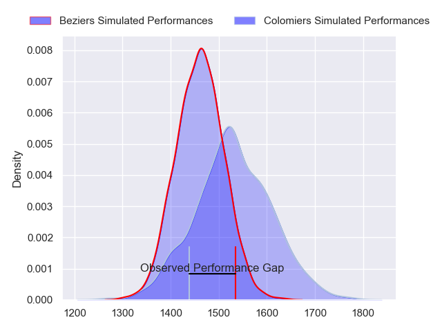
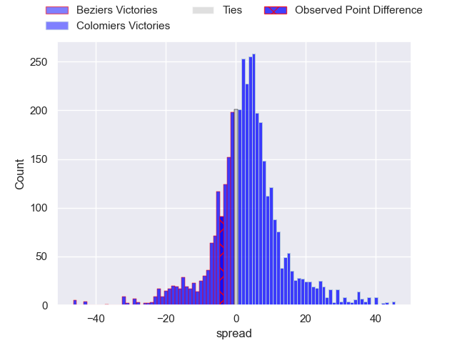
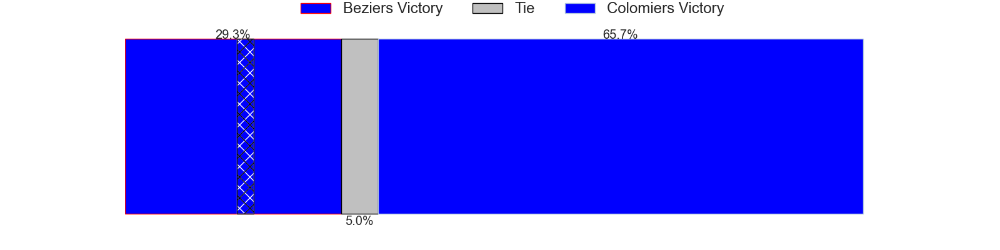
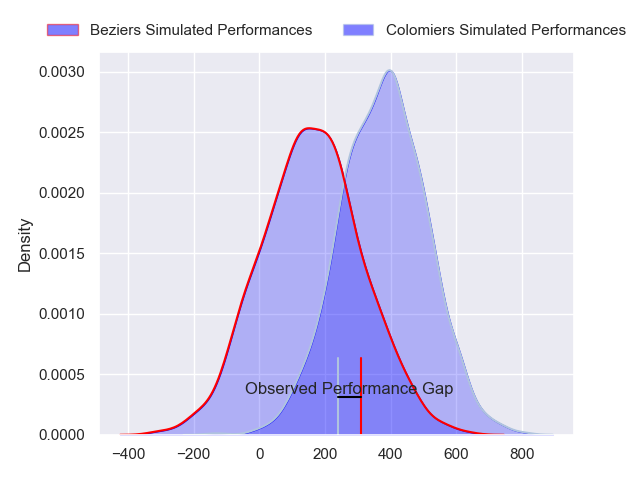
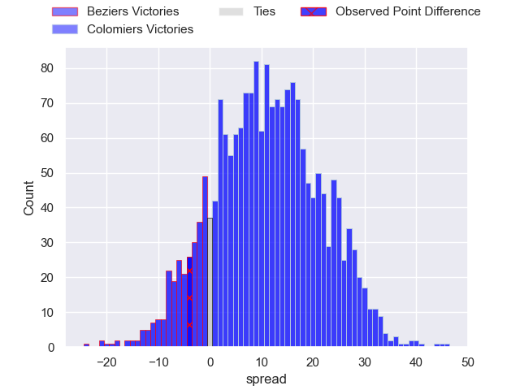
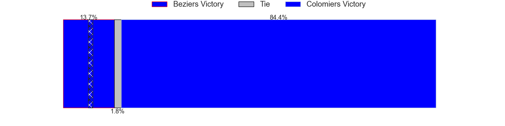

---  
layout: page  
title: Beziers at Colomiers; 44-40  
date: 2024-11-15 18:00:00 -0500  
categories: "Pro D2 2024" match review  
---
# Beziers at Colomiers; 44-40

# Club Level Predictions

The first set of predictions treats a club as the smallest object, as the club develops its members, organizes a gameplan, and deploys its players as needed for each match. This club model has a prediction of 0.596, which translates to predicting Colomiers to win by 3.4.

Our Over/Under is 45.5 - and combined with the spread above, we have a predicted scoreline of 21 to 24

Each club has a rating and a rating deviation (similar to a Glicko rating), and expected performances can be generated. This allows for simulated matches and spreads like the ones below.
## Projected Performances - Club Model

## Projected Spreads - Club Model

## Projected Results - Club Model

# Player Level Predictions

Treating teams instead as an entity made up of the currently active players, I have ratings for each player in an altogether different system. These can be combined to form team ratings once teamsheets are announced, weighting starters a bit higher than the reserves. After the match is played, players can be weighted by their minutes on the field, allowing for an accurate measure of the team's composition. With these compiled team ratings, we can make predictions, measure inaccuracy, and update the individual player ratings.
## Prediction without Player Minutes: Colomiers by 12.4

Beziers by 0.2 on a neutral pitch

## Projected Performances - Player Model

## Projected Spreads - Player Model

## Projected Results - Player Model

|   Away Minutes | Away Player        |   Away Percentile |   Number |   Home Percentile | Home Player        |   Home Minutes |
|---------------:|:-------------------|------------------:|---------:|------------------:|:-------------------|---------------:|
|              9 | Yahnis El Maslouhi |             49.76 |        1 |             35.85 | Guillaume Tartas   |             40 |
|             80 | Wilmar Arnoldi     |             65.82 |        2 |             33.43 | Thomas Larrieu     |             40 |
|             80 | Christian Judge    |             61.82 |        3 |             39.96 | Michaël Simutoga   |             25 |
|             80 | Cam Dodson         |             68.56 |        4 |             40.61 | Jack Whetton       |             29 |
|             80 | Pierre Gayraud     |             68.73 |        5 |             29.43 | Janse Roux         |             80 |
|             80 | William Van Bost   |             67.68 |        6 |             34.44 | Anthony Coletta    |             59 |
|             80 | Gillian Benoy      |             31.04 |        7 |             33.84 | Grégoire Bazin     |             62 |
|             80 | Baptiste Abescat   |             64.25 |        8 |             37.9  | Caleb Timu         |             59 |
|             80 | Damien Añon        |             65.85 |        9 |             29.71 | Mathis Galthié     |             80 |
|             30 | Charly Malié       |             50.58 |       10 |             57    | Joaquin De La Vega |             50 |
|             80 | Nicolas Plazy      |             66.56 |       11 |             36.76 | Anzelo Tuitavuki   |             61 |
|             19 | Taylor Gontineac   |             84.42 |       12 |             28.8  | Ray Nu'U           |             61 |
|              9 | Paul Recor         |             44.75 |       13 |             25.27 | Martin Dulon       |             80 |
|             75 | Pierre Courtaud    |             65.61 |       14 |             31.38 | Martin Alonso      |             80 |
|             80 | Gabin Lorre        |             62.55 |       15 |             31.09 | Ugo Pacome         |             64 |
|             66 | Yvann Lalevée      |            nan    |       16 |            nan    | Pablo Dimcheff     |             80 |
|             80 | Marco Trauth       |             72.86 |       17 |            nan    | Eliès El Ansari    |             57 |
|             61 | Sias Koen          |             49.61 |       18 |            nan    | Jean Thomas        |             79 |
|             62 | Clement Doumenc    |             79.64 |       19 |            nan    | Jérémy Béchu       |             80 |
|             80 | Hugo Gomes Camacho |             67.99 |       20 |            nan    | Brett Herron       |             62 |
|             71 | Victor Dreuille    |            nan    |       21 |            nan    | Ugo Séguéla        |             59 |
|             71 | Watisoni Votu      |            nan    |       22 |            nan    | Pablo Patilla      |             50 |
|             80 | Yannick Arroyo     |            nan    |       23 |            nan    | Robin Bellemand    |             80 |

