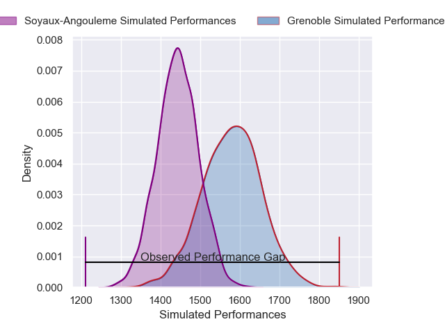
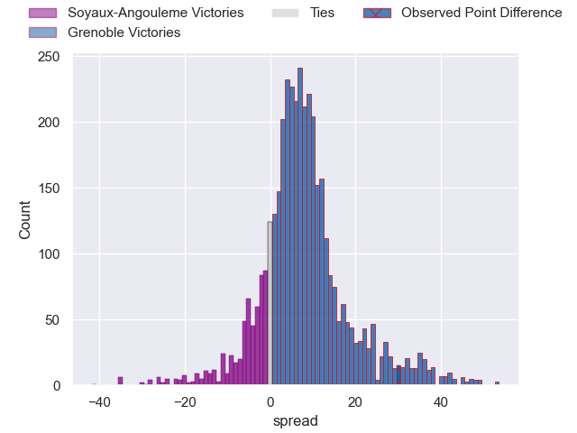
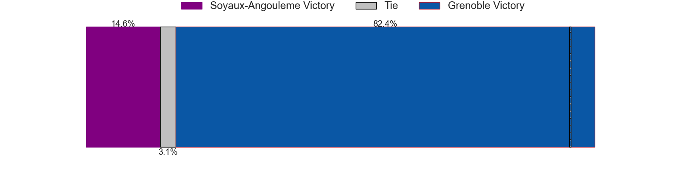
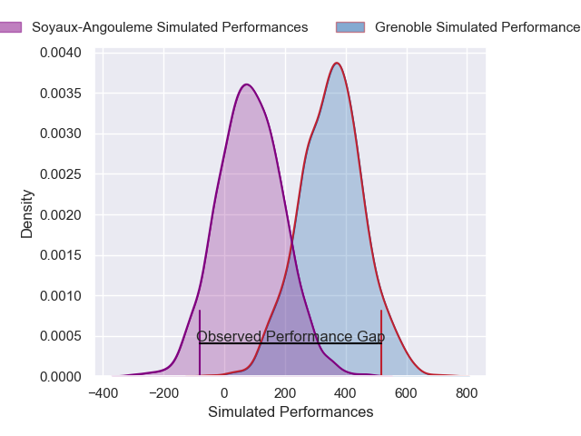
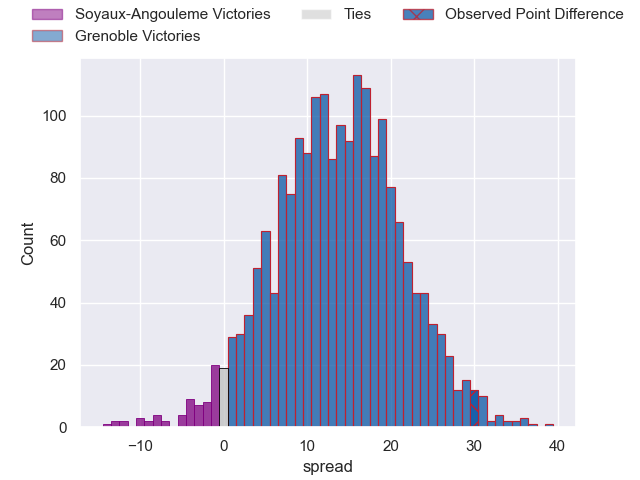
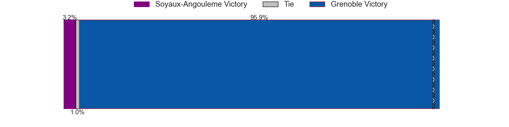

---  
layout: page  
title: Soyaux-Angouleme at Grenoble; 7-37  
date: 2024-11-15 18:00:00 -0500  
categories: "Pro D2 2024" match review  
---
# Soyaux-Angouleme at Grenoble; 7-37

# Club Level Predictions

The first set of predictions treats a club as the smallest object, as the club develops its members, organizes a gameplan, and deploys its players as needed for each match. This club model has a prediction of 0.685, which translates to predicting Grenoble to win by 6.8.

Our Over/Under is 47.5 - and combined with the spread above, we have a predicted scoreline of 20 to 27

Each club has a rating and a rating deviation (similar to a Glicko rating), and expected performances can be generated. This allows for simulated matches and spreads like the ones below.
## Projected Performances - Club Model

## Projected Spreads - Club Model

## Projected Results - Club Model

# Player Level Predictions

Treating teams instead as an entity made up of the currently active players, I have ratings for each player in an altogether different system. These can be combined to form team ratings once teamsheets are announced, weighting starters a bit higher than the reserves. After the match is played, players can be weighted by their minutes on the field, allowing for an accurate measure of the team's composition. With these compiled team ratings, we can make predictions, measure inaccuracy, and update the individual player ratings.
## Prediction without Player Minutes: Grenoble by 13.8

Grenoble by 0.7 on a neutral pitch

## Projected Performances - Player Model

## Projected Spreads - Player Model

## Projected Results - Player Model

|   Away Minutes | Away Player          |   Away Percentile |   Number |   Home Percentile | Home Player        |   Home Minutes |
|---------------:|:---------------------|------------------:|---------:|------------------:|:-------------------|---------------:|
|             10 | Sami Zouhaïr         |             43.96 |        1 |             45.2  | Zack Gauthier      |              0 |
|             10 | Motu Matu'U          |             43.3  |        2 |             45.64 | Mathis Sarragallet |              7 |
|             40 | Yassin Boutemanni    |             41.19 |        3 |             47.71 | Giorgi Pertaia     |             19 |
|             23 | Enzo Morand-Bruyat   |             46.69 |        4 |             56.66 | Thomas Ployet      |             18 |
|             35 | Matt Beukeboom       |             45.24 |        5 |             55.76 | Pierce Phillips    |             58 |
|             24 | Hubert Texier        |             45.16 |        6 |             53.81 | Antonin Berruyer   |             52 |
|             24 | Clément Sentubéry    |             45.16 |        7 |             55.7  | Thibaut Martel     |             80 |
|              0 | Samuel Nollet        |             40.29 |        8 |             72.23 | Richard Hardwick   |             80 |
|             35 | Alexis Levron        |             42.3  |        9 |             55.25 | Eric Escande       |             80 |
|             35 | Adrien Bau           |             38.81 |       10 |             48.46 | Sam Davies         |             61 |
|             24 | Nathan Farissier     |             48.22 |       11 |             50.08 | Geoffrey Cros      |              1 |
|             80 | George Tilsley       |             33.83 |       12 |             41    | Romain Fusier      |              6 |
|             80 | Ledua Mau            |             33.83 |       13 |             69.01 | Gerswin Mouton     |             16 |
|             40 | Jonny May            |             28.19 |       14 |             52.42 | Kaminieli Rasaku   |             19 |
|             70 | Jules Dubecq         |             38.12 |       15 |             48.7  | Julien Farnoux     |             59 |
|             40 | Patxi Bidart         |            nan    |       16 |            nan    | Lilian Rossi       |             62 |
|             57 | Georgy Balakarev (2) |            nan    |       17 |             77.57 | Tommy Raynaud      |             59 |
|             50 | Léo Labarthe         |            nan    |       18 |            nan    | Victor Guillaumond |             80 |
|             59 | Ian Kitwanga         |            nan    |       19 |            nan    | Camille Baz-Marcos |             75 |
|             71 | Rayne Barka          |            nan    |       20 |            nan    | Barnabé Couilloud  |             80 |
|             70 | Matthys Gratien      |            nan    |       21 |            nan    | Marc Palmier       |             66 |
|             73 | Arthur Proult        |            nan    |       22 |            nan    | Wilfried Hulleu    |             18 |
|             23 | Seydou Diakité       |            nan    |       23 |             35.48 | Cody Thomas        |             22 |

