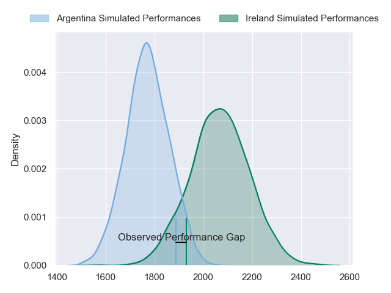
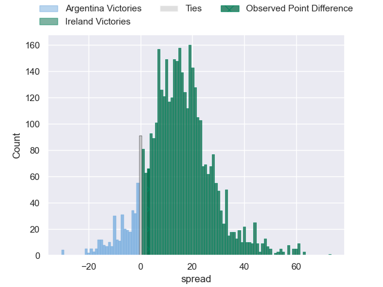
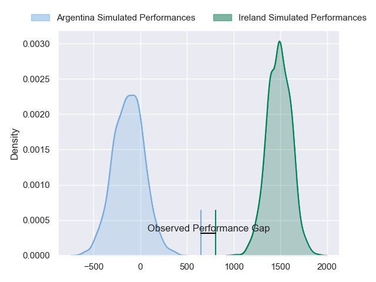
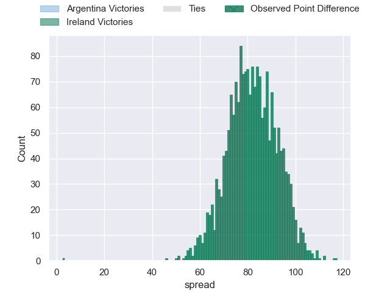

---  
layout: page  
title: Argentina at Ireland; 19-22  
date: 2024-11-15 18:00:00 -0500  
categories: "International Test Match 2024" match review  
---
# Argentina at Ireland; 19-22

# Club Level Predictions

The first set of predictions treats a club as the smallest object, as the club develops its members, organizes a gameplan, and deploys its players as needed for each match. This club model has a prediction of 0.835, which translates to predicting Ireland to win by 14.6.

Our Over/Under is 42.5 - and combined with the spread above, we have a predicted scoreline of 14 to 28

Each club has a rating and a rating deviation (similar to a Glicko rating), and expected performances can be generated. This allows for simulated matches and spreads like the ones below.
## Projected Performances - Club Model

## Projected Spreads - Club Model

## Projected Results - Club Model

# Player Level Predictions

Treating teams instead as an entity made up of the currently active players, I have ratings for each player in an altogether different system. These can be combined to form team ratings once teamsheets are announced, weighting starters a bit higher than the reserves. After the match is played, players can be weighted by their minutes on the field, allowing for an accurate measure of the team's composition. With these compiled team ratings, we can make predictions, measure inaccuracy, and update the individual player ratings.
## Prediction without Player Minutes: Ireland by 60.3

Ireland by 54.7 on a neutral pitch

## Projected Performances - Player Model

## Projected Spreads - Player Model

## Projected Results - Player Model

|   Away Minutes | Away Player            |   Away Percentile |   Number |   Home Percentile | Home Player         |   Home Minutes |
|---------------:|:-----------------------|------------------:|---------:|------------------:|:--------------------|---------------:|
|             63 | Thomas Gallo           |             90.2  |        1 |             90.47 | Andrew Porter       |             52 |
|             47 | Julian Montoya         |             76.52 |        2 |             91.98 | Ronan Kelleher      |             21 |
|             83 | Joel Sclavi            |             82.66 |        3 |             84.37 | Finlay Bealham      |             53 |
|             31 | Guido Petti            |             92.49 |        4 |             74.15 | Joe McCarthy        |             52 |
|             31 | Pedro Rubiolo          |             25.07 |        5 |             97.99 | James Ryan          |             83 |
|             83 | Pablo Matera           |             99.15 |        6 |             97.29 | Tadhg Beirne        |             83 |
|             83 | Juan Martin Gonzalez   |             92.03 |        7 |             98.98 | Josh van der Flier  |             59 |
|              2 | Joaquin Oviedo         |             89.52 |        8 |             95.69 | Caelan Doris        |             62 |
|             26 | Joaquin Oviedo         |             89.52 |        8 |             95.69 | Caelan Doris        |             62 |
|             30 | Gonzalo Bertranou      |             73.66 |        9 |             97.24 | Jamison Gibson-Park |             83 |
|             31 | Tomas Albornoz         |             83.46 |       10 |              7.78 | Jack Crowley        |              9 |
|             36 | Bautista Delguy        |             90.36 |       11 |            100    | James Lowe          |             18 |
|             36 | Bautista Delguy        |             90.36 |       11 |            100    | James Lowe          |              3 |
|             36 | Bautista Delguy        |             90.36 |       11 |            100    | James Lowe          |             35 |
|             36 | Bautista Delguy        |             90.36 |       11 |            100    | James Lowe          |             16 |
|             36 | Matias Moroni          |             92.57 |       12 |             88.86 | Robbie Henshaw      |             20 |
|             58 | Matias Moroni          |             92.57 |       12 |             88.86 | Robbie Henshaw      |             20 |
|             20 | Matias Moroni          |             92.57 |       12 |             88.86 | Robbie Henshaw      |             20 |
|             36 | Lucio Cinti            |             58.7  |       13 |             98.1  | Garry Ringrose      |             83 |
|             81 | Rodrigo Isgro          |             85.61 |       14 |             78.26 | Mack Hansen         |             78 |
|             83 | Juan Cruz Mallia       |             99.44 |       15 |             99.81 | Hugo Keenan         |             21 |
|             47 | Ignacio Ruiz           |             85.14 |       16 |             96.73 | Rob Herring         |             59 |
|             55 | Ignacio Calles         |             42.29 |       17 |             93.69 | Cian Healy          |             83 |
|             63 | Francisco Gomez Kodela |             91.5  |       18 |             89.17 | Thomas Clarkson     |             83 |
|             69 | Franco Molina          |             64.8  |       19 |             91.18 | Ryan Baird          |             83 |
|             26 | Franco Molina          |             64.8  |       19 |             91.18 | Ryan Baird          |             83 |
|             34 | Franco Molina          |             64.8  |       19 |             91.18 | Ryan Baird          |             83 |
|             67 | Franco Molina          |             64.8  |       19 |             91.18 | Ryan Baird          |             83 |
|             81 | Santiago Grondona      |             95.42 |       20 |             98.22 | Peter O'Mahony      |             83 |
|             31 | Gonzalo Garcia         |              3.98 |       21 |              9.8  | Craig Casey         |             83 |
|             79 | Gonzalo Garcia         |              3.98 |       21 |              9.8  | Craig Casey         |             83 |
|             81 | Gonzalo Garcia         |              3.98 |       21 |              9.8  | Craig Casey         |             83 |
|             24 | Santiago Carreras      |             72.1  |       22 |             15.95 | Sam Prendergast     |             25 |
|             31 | Justo Piccardo         |             90.75 |       23 |             96.65 | Jamie Osborne       |             24 |

