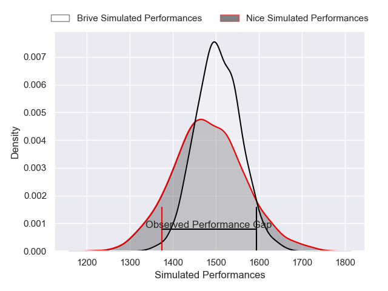
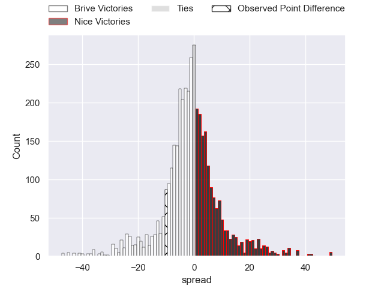
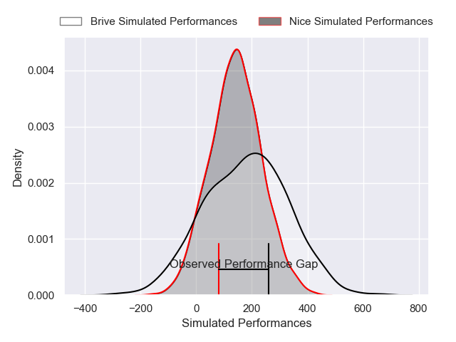
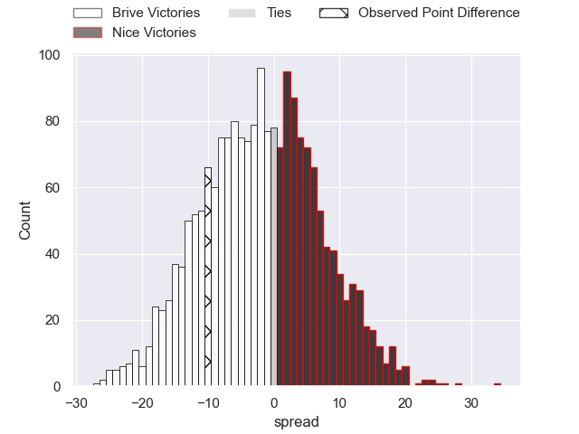

---  
layout: page  
title: Brive at Nice; 26-16  
date: 2024-11-15 18:00:00 -0500  
categories: "Pro D2 2024" match review  
---
# Brive at Nice; 26-16

# Club Level Predictions

The first set of predictions treats a club as the smallest object, as the club develops its members, organizes a gameplan, and deploys its players as needed for each match. This club model has a prediction of 0.469, which translates to predicting Brive to win by 1.1.

Our Over/Under is 37.5 - and combined with the spread above, we have a predicted scoreline of 19 to 18

Each club has a rating and a rating deviation (similar to a Glicko rating), and expected performances can be generated. This allows for simulated matches and spreads like the ones below.
## Projected Performances - Club Model

## Projected Spreads - Club Model

## Projected Results - Club Model

# Player Level Predictions

Treating teams instead as an entity made up of the currently active players, I have ratings for each player in an altogether different system. These can be combined to form team ratings once teamsheets are announced, weighting starters a bit higher than the reserves. After the match is played, players can be weighted by their minutes on the field, allowing for an accurate measure of the team's composition. With these compiled team ratings, we can make predictions, measure inaccuracy, and update the individual player ratings.
## Prediction without Player Minutes: Nice by 2.3

Brive by 1.0 on a neutral pitch

## Projected Performances - Player Model

## Projected Spreads - Player Model

## Projected Results - Player Model

|   Away Minutes | Away Player               |   Away Percentile |   Number |   Home Percentile | Home Player        |   Home Minutes |
|---------------:|:--------------------------|------------------:|---------:|------------------:|:-------------------|---------------:|
|             80 | Vakh Abdaladze            |             58.85 |        1 |             11.1  | Facundo Gigena     |             19 |
|             80 | Issam Hamel               |             60.03 |        2 |             42.15 | Sione Anga'Aelangi |             17 |
|             80 | Marcel Van Der Merwe      |             58.85 |        3 |             15    | Tom Ross           |             12 |
|             80 | Asier Usarraga Latierro   |             58.66 |        4 |             43.25 | Clément Chartier   |             30 |
|             71 | Konstantin Mikautadze     |              4.62 |        5 |             43.7  | Tom Murday         |             29 |
|             80 | Matthieu Voisin           |             58.74 |        6 |             43.14 | Arthur Vignolles   |             26 |
|             80 | Courtney Lawes            |             97.22 |        7 |             44.48 | Bastien Berenguel  |             17 |
|              0 | Taniela Sadrugu           |             40.41 |        8 |             92.05 | Jordan Taufua      |             34 |
|             29 | Hugo Verdu                |             52.05 |        9 |             43.37 | Jules Solinas      |             17 |
|             59 | Stuart Olding             |             52.16 |       10 |             35.93 | Tanguy Ménoret     |             51 |
|             59 | Erwan Dridi               |             58.95 |       11 |             44.35 | Simon Delas        |             51 |
|             59 | Sam Johnson               |             50.58 |       12 |             18.56 | Tom Daly           |             51 |
|             80 | Benjamin Lefranc          |             53.27 |       13 |             31.92 | Nathan Courtade    |             73 |
|             42 | Asaeli Tuivuaka           |             57.1  |       14 |             48.95 | David Odiete       |             14 |
|             52 | Mathis Ferté              |             57.97 |       15 |             31.87 | Paul Auradou       |             80 |
|             72 | Benjamin Boudou           |            nan    |       16 |             56.3  | Sacha Idoumi       |             80 |
|             67 | Nathan Fraissenon         |            nan    |       17 |            nan    | Jules Martinez     |             28 |
|             60 | Julien Delannoy           |            nan    |       18 |            nan    | Louis Suaud        |             28 |
|             59 | Retief Marais             |            nan    |       19 |            nan    | Martin Freytes     |             21 |
|             80 | Rahboni Warren-Vosayaco   |            nan    |       20 |            nan    | Ramiha Smiler      |              0 |
|             62 | Léo Carbonneau            |             52.21 |       21 |            nan    | Thibault Dufau     |             61 |
|             80 | Curwin Bosch              |             77.62 |       22 |            nan    | Alban Conduché     |             61 |
|             80 | Francisco Coria Marchetti |            nan    |       23 |            nan    | Nicolás Ciancio    |             52 |

