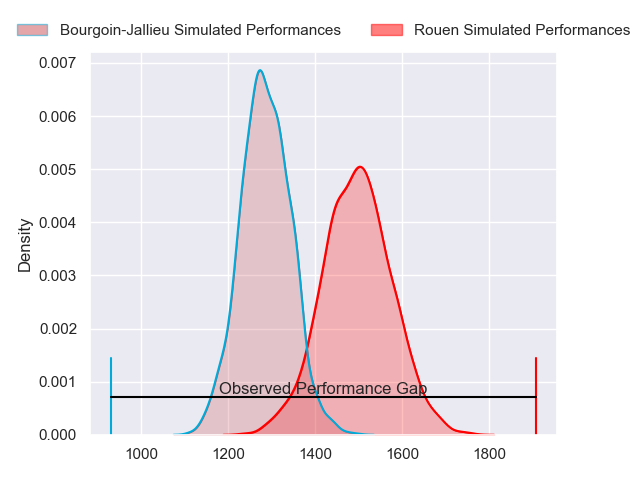
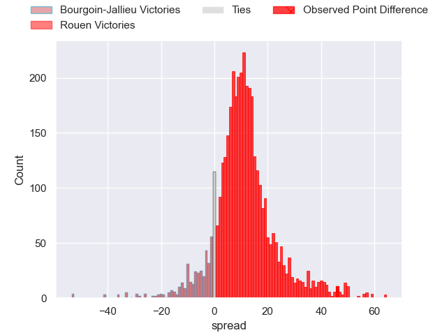
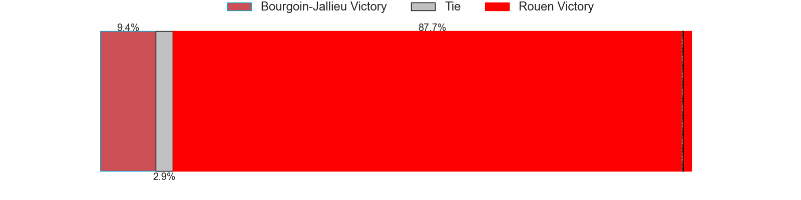
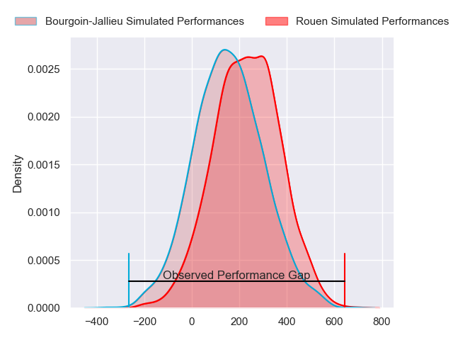
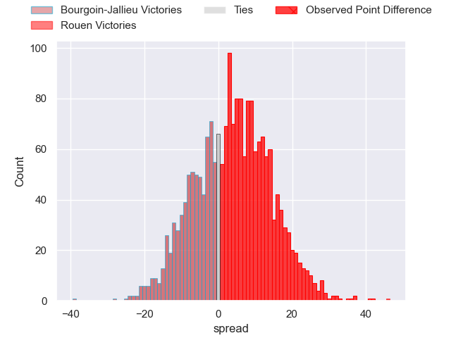

---  
layout: page  
title: Bourgoin-Jallieu at Rouen; 0-46  
date: 2024-11-15 18:00:00 -0500  
categories: "Nationale 2024" match review  
---
# Bourgoin-Jallieu at Rouen; 0-46

# Club Level Predictions

The first set of predictions treats a club as the smallest object, as the club develops its members, organizes a gameplan, and deploys its players as needed for each match. This club model has a prediction of 0.765, which translates to predicting Rouen to win by 10.4.

Our Over/Under is 50.5 - and combined with the spread above, we have a predicted scoreline of 20 to 30

Each club has a rating and a rating deviation (similar to a Glicko rating), and expected performances can be generated. This allows for simulated matches and spreads like the ones below.
## Projected Performances - Club Model

## Projected Spreads - Club Model

## Projected Results - Club Model

# Player Level Predictions

Treating teams instead as an entity made up of the currently active players, I have ratings for each player in an altogether different system. These can be combined to form team ratings once teamsheets are announced, weighting starters a bit higher than the reserves. After the match is played, players can be weighted by their minutes on the field, allowing for an accurate measure of the team's composition. With these compiled team ratings, we can make predictions, measure inaccuracy, and update the individual player ratings.
## Prediction without Player Minutes: Rouen by 4.4

Rouen by 0.3 on a neutral pitch

## Projected Performances - Player Model

## Projected Spreads - Player Model

## Projected Results - Player Model

|   Away Minutes | Away Player       |   Away Percentile |   Number |   Home Percentile | Home Player           |   Home Minutes |
|---------------:|:------------------|------------------:|---------:|------------------:|:----------------------|---------------:|
|             80 | Rémi Gaborit      |             28.99 |        1 |             67.51 | Ewan Clément          |             60 |
|             56 | Julien Ratajczak  |             25.11 |        2 |             51.41 | Mathieu Bonnot        |              0 |
|             80 | Julien Ratajczak  |             25.11 |        2 |             51.41 | Mathieu Bonnot        |              0 |
|             19 | Keynan Knox       |             32.01 |        3 |             70.73 | Soso Bekoshvili       |             80 |
|             16 | Keynan Knox       |             32.01 |        3 |             70.73 | Soso Bekoshvili       |             80 |
|              6 | Robin Gascou      |             35.9  |        4 |             63.93 | Will Witty            |             55 |
|              1 | Morgan Eames      |             38.43 |        5 |             69.61 | Jc Astle              |             71 |
|             16 | Kévin Chaudouard  |             35.88 |        6 |             66.92 | Manolo Laffond        |             80 |
|             23 | Merlin Bully      |             33.33 |        7 |             69.04 | Tienie Burger         |             80 |
|             30 | Sam Daly          |             36.36 |        8 |             62.25 | Abdelkarim Fofana     |             65 |
|             19 | Liam Rimet        |             22.36 |        9 |             91.58 | Florent Campeggia     |             21 |
|             19 | Liam Rimet        |             22.36 |        9 |             91.58 | Florent Campeggia     |             70 |
|             19 | Liam Rimet        |             22.36 |        9 |             91.58 | Florent Campeggia     |             40 |
|             80 | Tom Danovaro      |             17.51 |       10 |             50    | Maxime Javaux         |             24 |
|             74 | Rémy Bouet        |             31.46 |       11 |             59.84 | Benito Masilevu       |             33 |
|             61 | Aviata Silago     |             22.92 |       12 |             54.26 | Nicolas Nieto         |             29 |
|             80 | Christopher Bosch |             20.92 |       13 |             61.23 | Ope Peleseuma         |             80 |
|             57 | Paul Champ        |             27.91 |       14 |             63.72 | Sakiusa Bureitakiyaca |             55 |
|             80 | Nicolas Cachet    |             25.28 |       15 |             57.87 | Joaquin Riera         |             40 |
|             55 | Maxime Castant    |            nan    |       16 |             26.45 | German Kessler        |             70 |
|             51 | Maxime Castant    |            nan    |       16 |             26.45 | German Kessler        |             70 |
|             40 | Lucas Dycke       |             37.9  |       17 |             51.34 | Alexis Decaux         |             69 |
|             80 | Poutasi Luafutu   |             42.06 |       18 |             53.97 | Ernest Eudier         |             61 |
|             80 | Théophile Cotte   |            nan    |       19 |            nan    | Willy N'Diaye         |             50 |
|             10 | Martin Doan       |             34.61 |       20 |            nan    | Ilan El Khattabi      |             50 |
|             10 | Martin Doan       |             34.61 |       20 |            nan    | Ilan El Khattabi      |             57 |
|             80 | Adrian Fugit      |            nan    |       21 |            nan    | Benjamin Péhau        |             62 |
|             40 | Hugo Desgrange    |            nan    |       22 |            nan    | Benjamin Descamps     |             10 |
|             47 | Oktay Yilmaz      |            nan    |       23 |            nan    | Khvicha Tsopurashvili |             80 |
|             35 | Oktay Yilmaz      |            nan    |       23 |            nan    | Khvicha Tsopurashvili |             80 |
|            nan | nan               |            nan    |       24 |            nan    | Paddy Ryan            |             51 |

